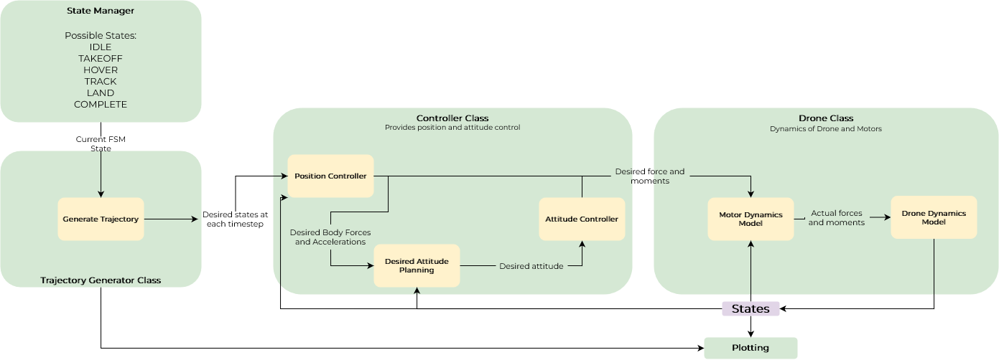

### Question 1

The system architecture is as follows:

Brief description of each block:
- State manager:
    - Has 6 possible states - IDLE, TAKEOFF, HOVER, TRACK, LAND, COMPLETE
    - The statemanager handles everything that is to do with the state of the finite state machine. It also handles whenever a given FSM state is complete and goes to the next state using an error based threshold on the desired trajectory location.

- Trajectory Generator class:
    - The trajectory generator generates the trajectory for each part of the flight phase and defines the state vector of the drone at each timestep in the duration of flight of the drone. 

- Controller Class:
    - The controller handles both the position and attitude control laws of the drone. 

- Drone Class:
    - This class encapsulates the dynamics of the motors and the drone itself. The state of the drone is also saved in this class.

Disclaimer:
- The entire codebase has been significantly altered and organized into classes and separate files as to make the project easy to execute and develop.
- The execution method is retained so that the TA's can execute the code in the same manner as was provided.
- When running the code, the written program automatically generates all plots and saves the flight parameters to the `outputs/` directory that will be created in the root folder for ease of access.

