# 16-665 Robot Mobility, Air Mobility Project
##### Praveen Venkatesh (pvenkat2)

### Question 1

The system architecture is as follows:


Brief description of each block:
- State manager:
    - Has 6 possible states - IDLE, TAKEOFF, HOVER, TRACK, LAND, COMPLETE
    - The statemanager handles everything that is to do with the state of the finite state machine. It also handles whenever a given FSM state is complete and goes to the next state using an error based threshold on the desired trajectory location.

- Trajectory Generator class:
    - The trajectory generator generates the trajectory for each part of the flight phase and defines the state vector of the drone at each timestep in the duration of flight of the drone. 

- Controller Class:
    - The controller handles both the position and attitude control laws of the drone. 

- Drone Class:
    - This class encapsulates the dynamics of the motors and the drone itself. The state of the drone is also saved in this class.


Some notes:
- The entire codebase has been significantly altered and organized into classes and separate files as to make the project easy to execute and develop.
- The execution method is retained so that the TA's can execute the code in the same manner as was provided
	-  The execution method is `python main_q.py <question_number>`
- When running the code, the written program automatically generates all plots and saves the flight parameters to the `outputs/` directory that will be created in the root folder for ease of access.


### Question 2

```
Gains: 
kXatt = [Kp_phi, Kp_theta, Kp_psi]
kXpos = [Kp_x, Kp_y, Kp_z]
"kpatt": [  190,    190,    70],
"kdatt": [    30,    30,    18],
"kppos": [    20,    20,    18],
"kdpos": [    8,    8,    9],
```
The actual poses of the drone are as follows:


The error plots for the requested scenario are as follows:


- We can see that the drone converges to each waypoint sufficiently before the next waypoint is fed into the system. The new waypoints are fed into the system at $t = 2s, 4s, 6s, 8s$. 

- The system oscillates about the given waypoints since we are using a PD controller and damping is not sufficient to completely remove all oscillations (underdamped system).

Ensuring that the performance is physically plausible using the thrust to weight plot for this scenario:
 


We can see that the performance is well within physical limits.

The trajectory in 3D can be seen like this:

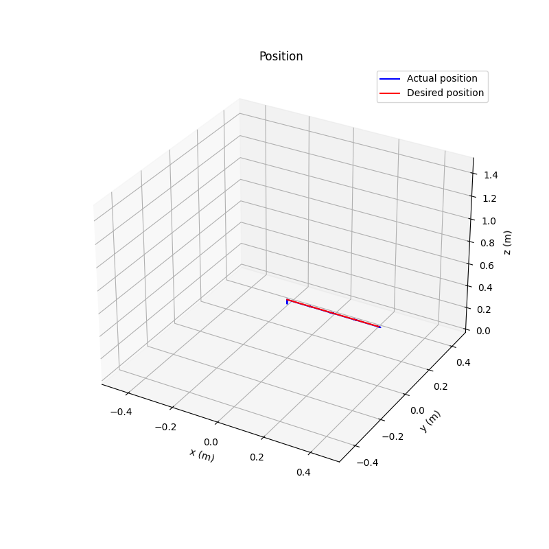


Disclaimer: I have changed the initial state of the drone such that it starts at hover. Previously the drone was given the starting location of z = 0 which causes a sudden jerk in the desired trajectory which I have removed. 

#### Variational study on PD Controller gains

##### Modifying Kd_positions (Outer Loop)
Here the Kd of the outer loop has been increased.

```
Gains: 
kXatt = [Kp_phi, Kp_theta, Kp_psi]
kXpos = [Kp_x, Kp_y, Kp_z]
params['kpatt'] = [190, 190, 70]
params['kdatt'] = [30, 30, 18]
params['kppos'] = [20, 20, 10]
params['kdpos'] = [12, 12, 12]
```

The actual poses of the drone are as follows:


The error plots for the requested scenario are as follows:


- We can see that the overshoot has been significantly reduced and the drone reaches the desired x-location slowly compared to the previous case.
- We can also notice that the convergence time for z coordinate is slightly worse as the damping has been increased.


Ensuring that the performance is physically plausible using the thrust to weight plot for this scenario:
 


We can see that the performance is well within physical limits.

<p style="page-break-after: always;">&nbsp;</p>


##### Modifying Kp_positions (Outer Loop)

Here, the Kp of the outer loop has been increased.

```
Gains: 
kXatt = [Kp_phi, Kp_theta, Kp_psi]
kXpos = [Kp_x, Kp_y, Kp_z]
params['kpatt'] = [190, 190, 20]
params['kdatt'] = [30, 30, 18]
params['kppos'] = [25, 25, 10]
params['kdpos'] = [8, 8, 9]
```
The actual poses of the drone are as follows:


The error plots for the requested scenario are as follows:


- We can see that the overshoot has been increased and the drone reaches the desired x-location much quicker than previously. This is because the proportional gain has been increased. This behaviour is as expected. 

Ensuring that the performance is physically plausible using the thrust to weight plot for this scenario:
 


We can see that the performance is well within physical limits.


##### Modifying Kp_attitude (Inner Loop)

Here the Kp of the attitude controller has been increased

```
Gains: 
kXatt = [Kp_phi, Kp_theta, Kp_psi]
kXpos = [Kp_x, Kp_y, Kp_z]
params['kpatt'] = [220, 220, 20]
params['kdatt'] = [30, 30, 18]
params['kppos'] = [25, 25, 10]
params['kdpos'] = [8, 8, 9]
        
```
The actual poses of the drone are as follows:


The error plots for the requested scenario are as follows:


- We can see that the overshoot in the attitude has been increased significantly. However, we also notice that the drone reaches its desired attitude in a quicker fashion. 

Ensuring that the performance is physically plausible using the thrust to weight plot for this scenario:
 


We can see that the performance is well within physical limits.

<p style="page-break-after: always;">&nbsp;</p>


##### Modifying Kd_attitude (Inner Loop)

Here the Kd of the attitude controller has been increased

```
Gains: 
kXatt = [Kp_phi, Kp_theta, Kp_psi]
kXpos = [Kp_x, Kp_y, Kp_z]
params['kpatt'] = [190, 190, 20]
params['kdatt'] = [35, 35, 20]
params['kppos'] = [25, 25, 10]
params['kdpos'] = [8, 8, 9]
        
```
The actual poses of the drone are as follows:


The error plots for the requested scenario are as follows:

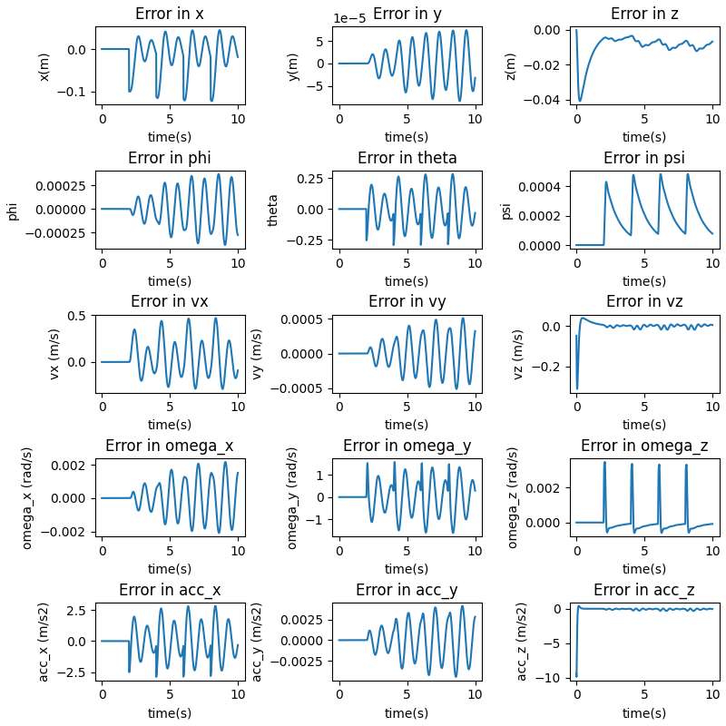

- We can see that the overshoot in the attitude has been decreased, and the drone is smoother in its response. It takes more time for the drone to reach its desired attitude.

Ensuring that the performance is physically plausible using the thrust to weight plot for this scenario:
 


We can see that the performance is well within physical limits.


### Question 3

```
Gains: 
KXatt = [Kp_phi, Kp_theta, Kp_psi]
KXpos = [Kp_x, Kp_y, Kp_z]
"kpatt": [  190,    190,    70],
"kdatt": [    30,    30,    18],
"kppos": [    20,    20,    18],
"kdpos": [    8,    8,    9],
```
The actual poses of the drone are as follows:


<p style="page-break-after: always;">&nbsp;</p>

The error plots for the requested scenario are as follows:


- The notion of convergence to a waypoint gets tricky in this scenario as the waypoints are provided in an extremely dense manner. The robot sufficiently converges to the desired trajectory as can be seen in the error plots.
- There is no oscillation between waypoints as the provided trajectory is extremely smooth and dense (timestep level trajectory). This means that there is no room for oscillation except at sudden jumps in the input trajectory.


Ensuring that the performance is physically plausible using the thrust to weight plot for this scenario:
 


We can see that the performance is well within physical limits.

The trajectory in 3D can be seen like this:

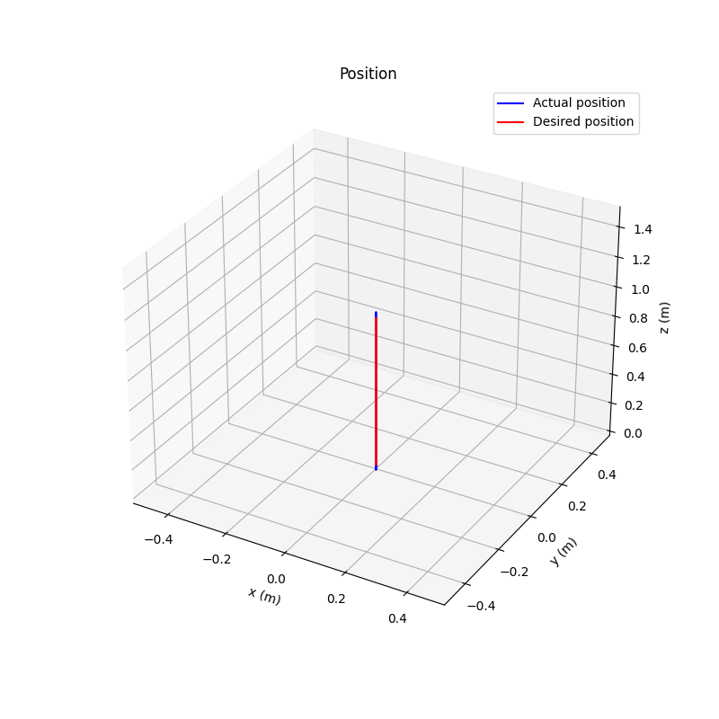

<p style="page-break-after: always;">&nbsp;</p>

#### Ablation study 

##### Modifying Kd_positions (Outer Loop)
Here the Kd of the outer loop has been increased.

```
Gains: 
KXatt = [Kp_phi, Kp_theta, Kp_psi]
KXpos = [Kp_x, Kp_y, Kp_z]
params['kpatt'] = [190, 190, 70]
params['kdatt'] = [30, 30, 18]
params['kppos'] = [20, 20, 10]
params['kdpos'] = [12, 12, 12]
```

The actual poses of the drone are as follows:
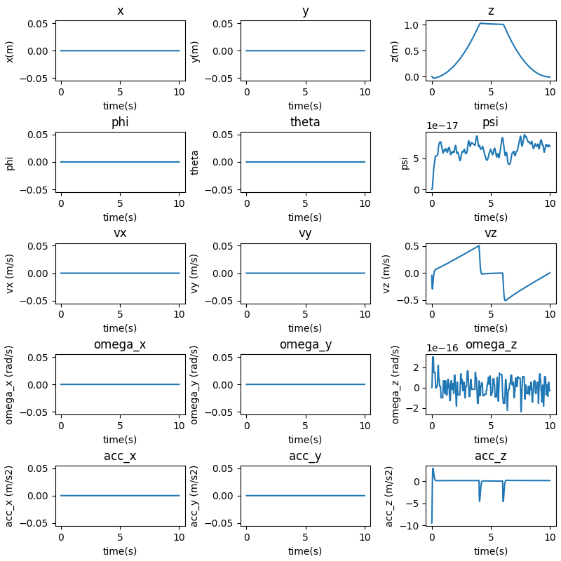


The error plots for the requested scenario are as follows:


- We can see that the system reaches the steady state value in a much more delayed fashion - it takes a lot more time for the drone to converge to the desired height. This can more readily be seen in the error plots. 


Ensuring that the performance is physically plausible using the thrust to weight plot for this scenario:
 


We can see that the performance is well within physical limits.

<p style="page-break-after: always;">&nbsp;</p>


##### Modifying Kp_positions (Outer Loop)

Here, the Kp of the outer loop has been increased.

```
Gains: 
KXatt = [Kp_phi, Kp_theta, Kp_psi]
KXpos = [Kp_x, Kp_y, Kp_z]
params['kpatt'] = [190, 190, 20]
params['kdatt'] = [30, 30, 18]
params['kppos'] = [25, 25, 20]
params['kdpos'] = [8, 8, 9]
```
The actual poses of the drone are as follows:


The error plots for the requested scenario are as follows:

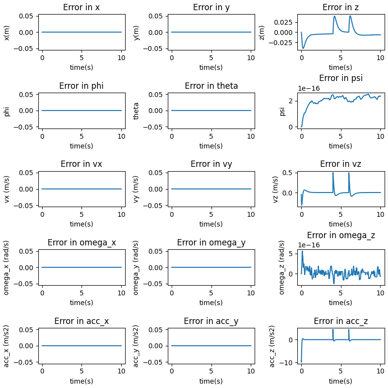

- We can see that the overshoot has been increased and the drone reaches the desired x-location much quicker than previously. This is as expected when we increased the Positional Kp value.

Ensuring that the performance is physically plausible using the thrust to weight plot for this scenario:
 


We can see that the performance is well within physical limits.


<p style="page-break-after: always;">&nbsp;</p>


### Question 4

In this question, we develop a state machine using the following method:

- A separate class called StateManger manages the state for the entire drone mission.
- The StateManager maintains 1 of 7 possible states that is:
    - IDLE: The system begins in this state generating no control inputs.
    - TAKEOFF: The system begins to takeoff and goes to a desired hover location at 0.5m height.
    - HOVER1: The system maintains its location for a short duration of 3 seconds.
    - TRACK: The system tracks a given trajectory.
    - HOVER2: The system maintains its location for a short duration of 3 seconds.
    - LAND: The system begins its descent from its current location and reaches the ground.
    - COMPLETE: The mission has been executed successfully.
- The StateManager maintains an internal Finite State Machine architecture that allows the system to go to the next state only if the trajectory has been completely tracked for a given state and the drone has converged to the given location of the trajectory.
- The StateManager moves the state of the system by incrementing the current state to the next state once the current state has completed execution.

![[Pasted image 20221120223444.png]]
The trajectory for a simple line track is shown below:

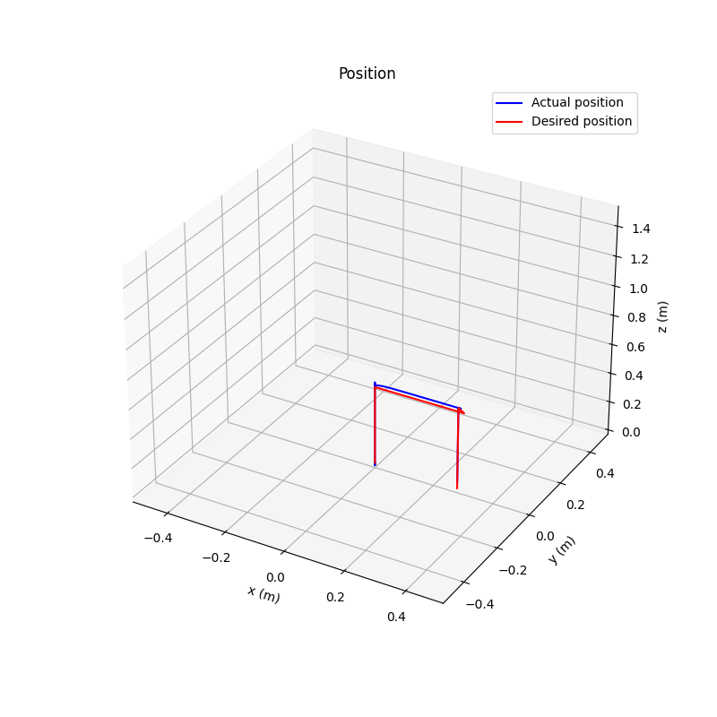

The state plots for the entire duration are:


Error plots for the entire duration:


The state plots for the given duration of the tracking phase are:


Error plots for the tracking duration:

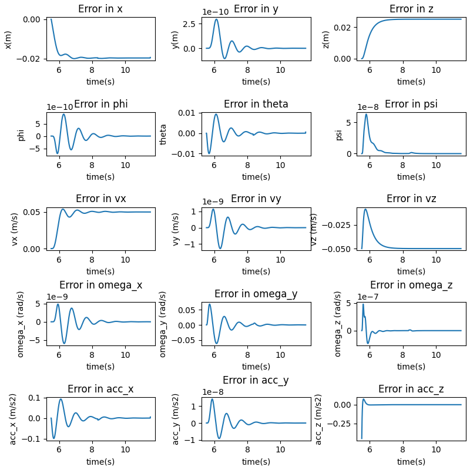

### Question 5
```
Gains: 
KXatt = [Kp_phi, Kp_theta, Kp_psi]
KXpos = [Kp_x, Kp_y, Kp_z]
"kpatt": [  190,    190,    70],
"kdatt": [    30,    30,    18],
"kppos": [    20,    20,    18],
"kdpos": [    8,    8,    9],
```
The actual poses of the drone are as follows:


<p style="page-break-after: always;">&nbsp;</p>

The error plots for the requested scenario are as follows:


The rise and settling times are shown:


```
-------System Statistics--------
[Z] Settling time =  0.9999999999999787
[Z] Rise time =  0.9099999999999806
[Z] Steady State values =  0.10000003323214719
[Vz] Settling time =  0.8949999999999809
[Vz] Rise time =  0.794999999999983
[Vz] Steady State values =  0.10000003323214719
[psi] Settling time =  0.0
[psi] Rise time =  0.0
[psi] Steady State values =  4.002280801119769e-15
```
- From the plots it is evident that all the overshoots are 0% as the system is overdamped.
The code automatically saves these values to the output folder.

Note: Since the starting and ending velocities of the drone is set as the same value of 0, the notions of settling and rise time do not have much meaning. Here, the start duration is computed from the peak value of the velocity as it is a measure of the performance of the drone.

<p style="page-break-after: always;">&nbsp;</p>


Ensuring that the performance is physically plausible using the thrust to weight plot for this scenario:
 


We can see that the performance is well within physical limits.

<p style="page-break-after: always;">&nbsp;</p>

The trajectory in 3D can be seen like this:

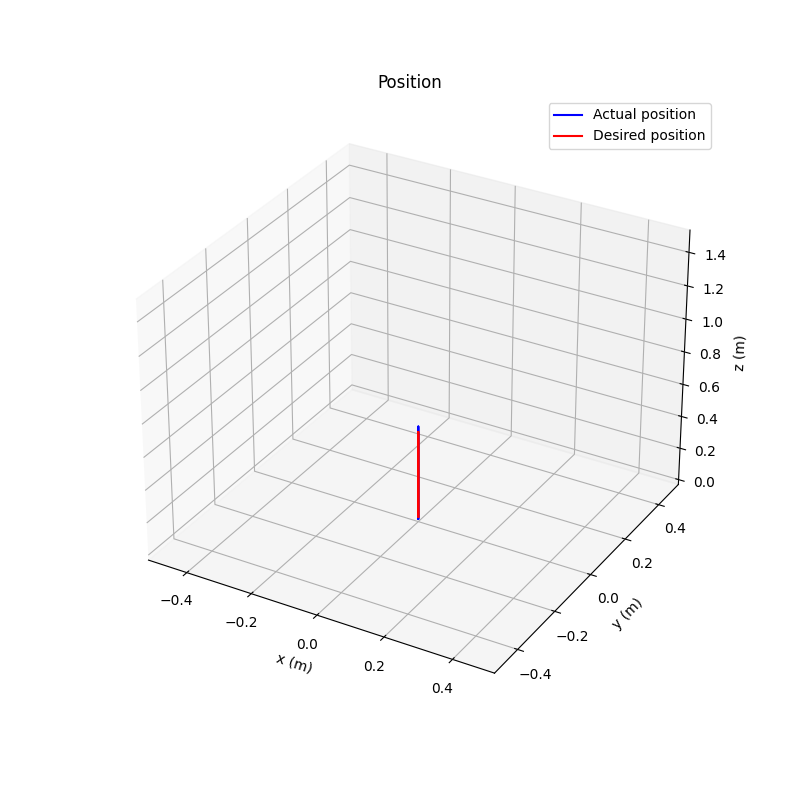

<p style="page-break-after: always;">&nbsp;</p>

#### Including Variation in yaw.

The actual poses of the drone are as follows:
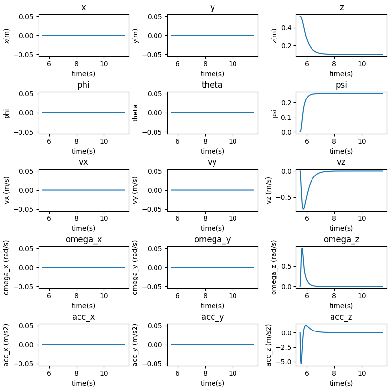

<p style="page-break-after: always;">&nbsp;</p>

The error plots for the requested scenario are as follows:


The rise and settling times are shown:

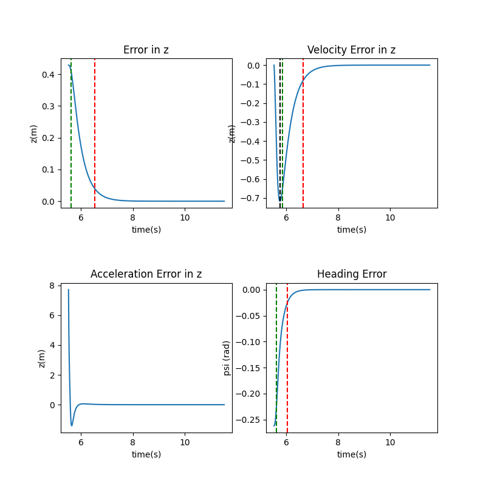


```
-------System Statistics--------
[Z] Settling time =  1.0099999999999785
[Z] Rise time =  0.9099999999999806
[Z] Steady State values =  0.1000000342445711
[Vz] Settling time =  0.889999999999981
[Vz] Rise time =  0.794999999999983
[Vz] Steady State values =  0.1000000342445711
[psi] Settling time =  0.5099999999999891
[psi] Rise time =  0.42499999999999094
[psi] Steady State values =  14.999999999999153
```
- From the plots it is evident that all the overshoots are 0% as the system is overdamped.

- When including yaw, the settling time increases by an extremely small margin (this can be attributed to numerical precision). This does make sense since the drone is simply altering the moments in the z direction which does not affect the upward thrust. This makes the two motions independent meaning that the settling and rise times will be the same.


#### Modifying Gains

```
Gains: 
KXatt = [Kp_phi, Kp_theta, Kp_psi]
KXpos = [Kp_x, Kp_y, Kp_z]
params['kpatt'] = [190, 190, 20]
params['kdatt'] = [30, 30, 18]
params['kppos'] = [20, 20, 10]
params['kdpos'] = [8, 8, 19]
```

The actual poses of the drone are as follows:


The error plots for the requested scenario are as follows:


<p style="page-break-after: always;">&nbsp;</p>

The rise and settling times are shown:


```
-------System Statistics--------
[Z] Settling time =  4.495000000000703
[Z] Rise time =  4.300000000000672
[Z] Steady State values =  0.11766625984130827
[Vz] Settling time =  3.4900000000005456
[Vz] Rise time =  3.430000000000536
[Vz] Steady State values =  0.11766625984130827
[psi] Settling time =  1.990000000000311
[psi] Rise time =  1.8500000000002892
[psi] Steady State values =  14.987203888210878
```
- From the plots it is evident that all the overshoots are 0% as the system is overdamped.

- With the new set of gains, we note that the settling time and rise time has increased drastically for yaw, the z-position and the velocity in the z-direction. This is to be expected as :
    - The Kp for yaw has been reduced significantly causing the drone to respond slower in yaw.
    - The Kp_z has also been decreased significantly causing the drone to respond slowly in velocity and position in the z-direction.

Ensuring that the performance is physically plausible using the thrust to weight plot for this scenario:
 


We can see that the performance is well within physical limits.

<p style="page-break-after: always;">&nbsp;</p>


### Question 8


As seen in the above graph, the drone is able to track the trajectory appropriately.


The states are plotted here:

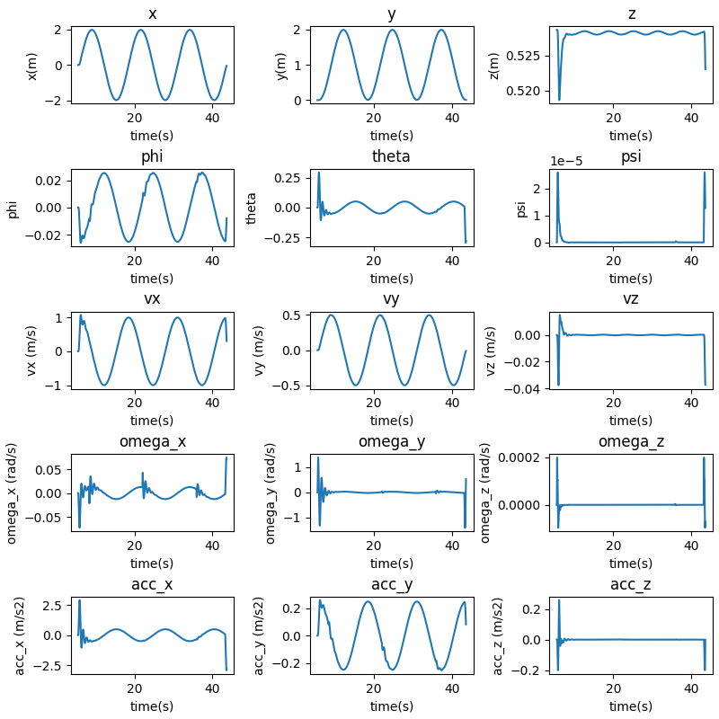


The error response is plotted here:


### Question 9


As seen in the above graph, the drone is able to track the trajectory appropriately.


The states are plotted here:

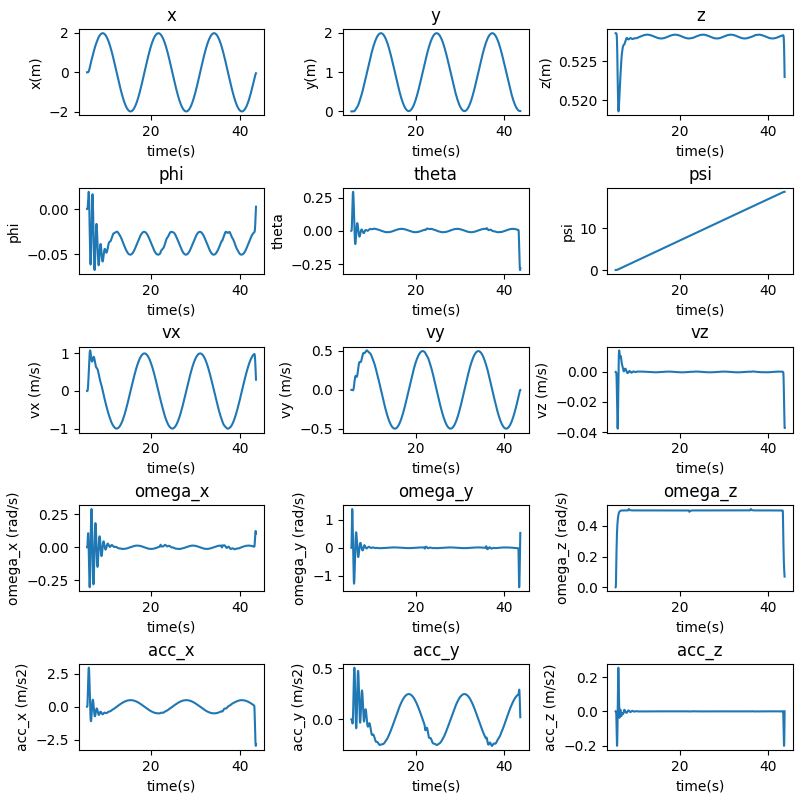


The error response is plotted here:

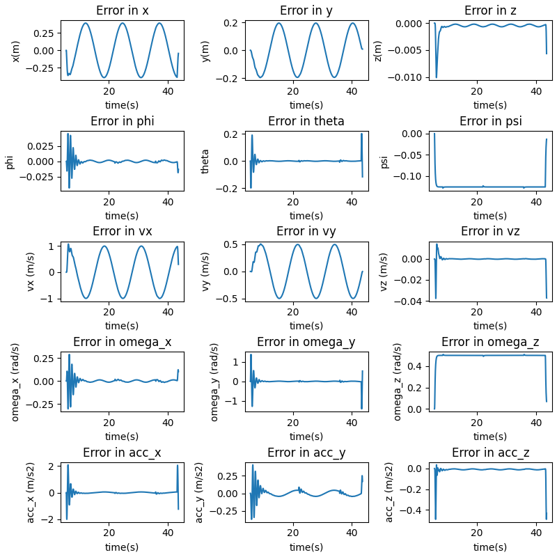

Here, we can see that the performance becomes slightly worse with higher errors in all plots. Although the tracking is still completely successful with the heading changing with time such that the drone always points at the center of the ellipse.


# Code

### `controller.py`

```python
import numpy as np

class Controller():
    def __init__ (self, params):
        self.params = params

    def attitude_by_flatness(self, desired_state):
        '''
        Input parameters:
            desired_state: The desired states are:
                desired_state["pos"] = [x, y, z]
                desired_state["vel"] = [x_dot, y_dot, z_dot]
                desired_state["rot"] = [phi, theta, psi]
                desired_state["omega"] = [phidot, thetadot, psidot]
                desired_state["acc"] = [xdotdot, ydotdot, zdotdot]

            params: Quadcopter parameters
            
        Output parameters:
            rot: will be stored as desired_state["rot"] = [phi, theta, psi]
            omega: will be stored as desired_state["omega"] = [phidot, thetadot, psidot]
        
        '''
        params = self.params
        psi = desired_state['rot'][2]
        arr = np.array(
            [
                [np.sin(psi), -np.cos(psi)],
                [np.cos(psi), np.sin(psi)],
            ]
        )
        g = params['gravity']


        desired_state['rot'][:2] = (1/g)*np.dot(arr, desired_state['acc'][:2])

        arr1 = np.array(
            [
                [np.cos(psi), np.sin(psi)],
                [-np.sin(psi), np.cos(psi)],
            ]
        )
        desired_state['omega'][:2] = (1/g)*np.dot(arr1, (desired_state['acc'][:2])*desired_state['omega'][2])
        return desired_state['rot'], desired_state["omega"]


    def attitude_controller(self, current_state,desired_state):
        '''
        Input parameters
        
            current_state: The current state of the robot with the following fields:
                current_state["pos"] = [x, y, z]
                current_state["vel"] = [x_dot, y_dot, z_dot]
                current_state["rot"] = [phi, theta, psi]
                current_state["omega"] = [phidot, thetadot, psidot]
                current_state["rpm"] = [w1, w2, w3, w4]

            desired_state: The desired states are:
                desired_state["pos"] = [x, y, z] 
                desired_state["vel"] = [x_dot, y_dot, z_dot]
                desired_state["rot"] = [phi, theta, psi]
                desired_state["omega"] = [phidot, thetadot, psidot]
                desired_state["acc"] = [xdotdot, ydotdot, zdotdot]

            params: Quadcopter parameters

            question: Question number

        Output parameters:
            M: u2 or moment [M1, M2, M3]
        '''
        params = self.params

        Kp = params['kpatt']
        Kd = params['kdatt']


        terror = desired_state['rot'] - current_state['rot']
        terrordot = desired_state['omega'] - current_state['omega']


        errorheadddot = [0, 0, 0]
        for i in range(3):
            errorheadddot[i] = (terror[i] * Kp[i] + terrordot[i] * Kd[i])
        
        errorheadddot = np.array(errorheadddot)
        M = np.dot(params['inertia'], errorheadddot)

        return M


    def position_controller(self, current_state,desired_state):
        '''
        Input parameters:
            current_state: The current state of the robot with the following fields:
                current_state["pos"] = [x, y, z],
                current_state["vel"] = [x_dot, y_dot, z_dot]
                current_state["rot"] = [phi, theta, psi]
                current_state["omega"] = [phidot, thetadot, psidot]
                current_state["rpm"] = [w1, w2, w3, w4]
            desired_state: The desired states are:
                desired_state["pos"] = [x, y, z] 
                desired_state["vel"] = [x_dot, y_dot, z_dot]
                desired_state["rot"] = [phi, theta, psi]
                desired_state["omega"] = [phidot, thetadot, psidot]
                desired_state["acc"] = [xdotdot, ydotdot, zdotdot]
            params: Quadcopter parameters
            question: Question number
    
        Output parameters
            F: u1 or thrust
            acc: will be stored as desired_state["acc"] = [xdotdot, ydotdot, zdotdot]
        '''
        params = self.params

        Kp = params['kppos']
        Kd = params['kdpos']


        xerror = desired_state['pos'] - current_state['pos']
        xerrordot = desired_state['vel'] - current_state['vel']
        accs = [0, 0, 0]

        for i in range(3):
            accs[i] = (xerror[i] * Kp[i] + xerrordot[i] * Kd[i])

        accs = np.array(accs)   
        # print(current_state['pos'], current_state['vel'], desired_state['vel'])


        g = params['gravity']
        F = params['mass'] * (accs + desired_state["acc"] + np.array([0, 0, g]))
        return F, accs
```

### `drone.py`

```python
import numpy as np
from scipy.integrate import solve_ivp


class Drone:

    def __init__(self, params, initState = np.zeros((16,))):
        self.params = params
        self.state = initState
        self.thrust = 0

    @staticmethod
    def dynamics(t,state,params,F_actual,M_actual,rpm_motor_dot):

        '''
        Input parameters:
            state: current state, will be using RK45 to update
        
            F, M: actual force and moment from motor model
        
            rpm_motor_dot: actual change in RPM from motor model
        
            params: Quadcopter parameters
        
            question: Question number
    
        Output parameters:
    
        state_dot: change in state
        '''
        phi, theta, psi = state[6:9]

        m = params['mass']
        g = params['gravity']

        f = F_actual
        F = np.array(
            [
                [f*(np.cos(phi) * np.cos(psi) * np.sin(theta) + np.sin(phi)*np.sin(psi))],
                [f*(np.cos(phi) * np.sin(psi) * np.sin(theta) - np.cos(psi)*np.sin(phi))],
                [f*np.cos(theta)*np.cos(phi) - m*g]
            ]
        )
        accs = (F/m).flatten()
        omegas = state[9:12]
        sub =  np.dot(params['inertia'] , omegas)
        alphas = np.dot(np.linalg.inv(params['inertia']), (M_actual))

        # state: [
            # x,
            # y,
            # z,
            # xdot,
            # ydot,
            # zdot,
            # phi,
            # theta,
            # psi,
            # phidot,
            # thetadot,
            # psidot,
            # rpm
        # ]
        statedot = [
            state[3], 
            state[4], 
            state[5], 
            accs[0],
            accs[1], 
            accs[2],
            state[9],
            state[10],
            state[11],
            alphas[0],
            alphas[1],
            alphas[2],
            rpm_motor_dot[0],
            rpm_motor_dot[1],
            rpm_motor_dot[2],
            rpm_motor_dot[3],
        ]
        statedot = np.array(statedot)
        return statedot

    
    def motor_model(self, F,M):

        '''
        Input parameters"

        F,M: required force and moment

        motor_rpm: current motor RPM

        params: Quadcopter parameters

        Output parameters:

        F_motor: Actual thrust generated by Quadcopter's Motors

        M_motor: Actual Moment generated by the Quadcopter's Motors

        rpm_dot: Derivative of the RPM
        '''
        params = self.params
        rpm = self.state[12:]
        ct = params['thrust_coefficient']
        cq = params['moment_scale']
        d = params['arm_length']

        rpm = np.array(rpm)
        
        A = np.array(
            [
                [ct, ct, ct, ct],
                [0, d*ct, 0, -d*ct],
                [-d*ct, 0, d*ct, 0],
                [-cq, cq, -cq, cq],
            ]
        )
        rpmd = (np.dot(np.linalg.inv(A), np.array([F[2], M[0], M[1], M[2]])))
        rpmd = np.clip(rpmd, params['rpm_min'] ** 2, params['rpm_max'] ** 2)
        rpmd = np.sqrt(rpmd)
        rpm = np.clip(rpm,  params['rpm_min'], params['rpm_max'])
        vals = np.dot(A, np.square(rpm))
        rpm_dot = params['motor_constant'] *(rpmd - rpm)
        F_motor = vals[0]
        M_motor = vals[1:]

        return F_motor, M_motor, rpm_dot


    def step(self, F_desired, M_desired ):
        [F_actual,M_actual,rpm_motor_dot] = self.motor_model(F_desired,M_desired)
        self.thrust = np.linalg.norm(F_actual)

        sol = solve_ivp(
            self.dynamics, 
            (0, self.params['dt']), 
            self.state,
            args=(self.params,F_actual,M_actual,rpm_motor_dot),)
        self.state = sol.y[:,-1]

        return sol
```

### `main_q.py`

```python
#!/usr/bin/env python3

import numpy as np
import sys
import matplotlib.pyplot as plt
from controller import Controller
from drone import Drone
from plot import *
from stateManager import StateManager
from utils import NumpyEncoder, State

def execute(params : dict, stateManager : StateManager = None):

    dt = params['dt'] # in secs


    desired_states = []
    actual_states = []
    initState = np.zeros((16,))
    if params['question'] == 2:
        initState[2] = 0.5
    drone = Drone(params, initState =initState)
    controller = Controller(params)

    i = 0

    t = 0
    times = []

    stateManager.setNextState(t, drone.state)
    
    thrustToMassPlot = []

    trackingIntervalPlot = {
        'actualstates': [],
        'desiredstates' : [],
        'times' : []
    }
    velocities = []
    while not stateManager.isComplete():

        i += 1
        t += dt
        
        desired_state_dic = stateManager.getDesiredState(t, drone.state)

        if stateManager.isComplete():
            break

        current_state_dic = {
            "pos":drone.state[0:3].squeeze(),
            "vel":drone.state[3:6].squeeze(),
            "rot":drone.state[6:9].squeeze(), 
            "omega":drone.state[9:12].squeeze(),
            "rpm":drone.state[12:16].squeeze()
        }


        F_desired, desired_state_dic['acc'] = controller.position_controller(current_state_dic, desired_state_dic)
        desired_state_dic["rot"],desired_state_dic["omega"] = controller.attitude_by_flatness(desired_state_dic)        

        M_desired = controller.attitude_controller(current_state_dic,desired_state_dic)
        # print(M_desired)
        sol = drone.step(F_desired, M_desired)

        # we need to set the accelerations ourselves because we are setting our snap to be zero.
        # use first order approximations

        state_list = sol.y[:,-1].copy()
        acc = (sol.y[3:6,-1]-sol.y[3:6,-2])/(sol.t[-1]-sol.t[-2])

        state_list[12:15] = acc
        actual_states.append(state_list[:15].copy())

        temp  = np.zeros((15, 1))
        temp[0:3] = desired_state_dic["pos"].reshape(-1, 1)
        temp[3:6] = desired_state_dic["vel"].reshape(-1, 1)
        temp[6:9] = desired_state_dic["rot"].reshape(-1, 1)
        temp[9:12] = desired_state_dic["omega"].reshape(-1, 1)
        temp[12:15] = desired_state_dic["acc"].reshape(-1, 1)
        
        desired_states.append(temp.copy())
        if stateManager.state == State.TRACK:
            trackingIntervalPlot['actualstates'].append(state_list[:15].copy())
            trackingIntervalPlot['desiredstates'].append(temp.copy())
            trackingIntervalPlot['times'].append(t)

        times.append(t)
        thrustToMassPlot.append((drone.thrust) / (params['mass'] * params['gravity']))
        velocities.append(np.linalg.norm(state_list[3:6]))
        # if stateManager.state != State.TAKEOFF:
        #     break

    print("Statemanager isComplete", stateManager.isComplete())
    trackingIntervalPlot['desiredstates'] = np.array(trackingIntervalPlot['desiredstates']).T.squeeze()
    trackingIntervalPlot['actualstates'] = np.array(trackingIntervalPlot['actualstates']).T.squeeze()
    trackingIntervalPlot['times'] = np.array(trackingIntervalPlot['times'])

    desired_states = np.array(desired_states).T.squeeze()
    actual_states = np.array(actual_states).T.squeeze()
    time_vec = np.array(times)
    plotDic = {
        'FbyW' : thrustToMassPlot,
        'velocities' : velocities,
        'actual_states' : actual_states,
        'desired_states' : desired_states,
        'time_vec' : time_vec,
        'trackingintervals' : trackingIntervalPlot
    }
    return plotDic


def plot(plotDic, params):

    plt.figure()
    plt.plot(plotDic['time_vec'], plotDic['FbyW'])
    plt.title("Thrust to Weight ratio")
    plt.xlabel("Time (s)")
    plt.ylabel("Amplitude")
    plt.savefig(f'outputs/{params["question"]}/{params["plotprefix"]}_fbyw.png')

    plt.figure()
    plt.plot(plotDic['time_vec'], plotDic['velocities'])
    plt.title("Velocity over time")
    plt.xlabel("Time (s)")
    plt.ylabel("Velocity (m/s)")
    plt.savefig(f'outputs/{params["question"]}/{params["plotprefix"]}_velocities.png')

    plot_state_error(plotDic["actual_states"],plotDic["desired_states"],plotDic["time_vec"], params)
    plot_state_error(plotDic["trackingintervals"]['actualstates'],plotDic["trackingintervals"]['desiredstates'],plotDic['trackingintervals']["times"], params, isTrack = True)
    plot_position_3d(plotDic["actual_states"],plotDic["desired_states"], params)
    if question == 5:
        plotq5(plotDic, params)


        
def main(params):
    manager = StateManager(params)
    plotDic = execute(params, manager)
    print("Execution complete...")

    print("Plotting...")
    plot(plotDic, params)
    plt.close("all")

        
if __name__ == '__main__':
    '''
    Usage: main takes in a question number and executes all necessary code to
    construct a trajectory, plan a path, simulate a quadrotor, and control
    the model. Possible arguments: 2, 3, 5, 6.2, 6.3, 6.5, 7, 9. THE
    TAS WILL BE RUNNING YOUR CODE SO PLEASE KEEP THIS MAIN FUNCTION CALL 
    STRUCTURE AT A MINIMUM.
    '''
    # run the file with command "python3 main.py question_number" in the terminal
    import os
    question = int(sys.argv[1])
    os.makedirs(f'outputs/{question}/', exist_ok= True)
    params = {
        "mass": 0.770, 
        "gravity": 9.80665, 
        "arm_length": 0.1103, 
        "motor_spread_angle": 0.925, 
        "thrust_coefficient": 8.07e-9, 
        "moment_scale": 1.3719e-10, 
        "motor_constant": 36.5, 
        "rpm_min": 3000,             
        "rpm_max": 20000, 
        "inertia": np.diag([0.0033,0.0033,0.005]), 
        "COM_vertical_offset": 0.05,            
        'kpatt': [190, 190, 70], 
        'kdatt' : [30,30, 18], 
        'kppos':[20, 20, 18], 
        'kdpos': [8, 8, 9], 
        'question' : question,
        'q5trackpsi' : 0,
        'dt' : 0.005,
        'plotprefix' : 'a'      
    }
    import json
    with open(f'outputs/{question}/params.json', 'w') as f:
        json.dump(params, f,indent=4,  cls=NumpyEncoder)

    main(params)   

    if question == 5:
        

        params['q5trackpsi'] = 15 * np.pi / 180
        params['plotprefix'] = 'b'
        main(params)

        params['q5trackpsi'] = 15 * np.pi / 180
        params['plotprefix'] = 'gains2'
        params['kpatt'] = [190, 190, 20]
        params['kdatt'] = [30, 30, 18]
        params['kppos'] = [20, 20, 10]
        params['kdpos'] = [8, 8, 19]
        
        main(params)
    
    if question in [2, 3]:
        
        params['plotprefix'] = 'gains2_kdpos'
        params['kpatt'] = [190, 190, 70]
        params['kdatt'] = [30, 30, 18]
        params['kppos'] = [20, 20, 10]
        params['kdpos'] = [12, 12, 12]
        
        main(params)

        params['plotprefix'] = 'gains3_kppos'
        params['kpatt'] = [190, 190, 20]
        params['kdatt'] = [30, 30, 18]
        params['kppos'] = [25, 25, 10]
        params['kdpos'] = [8, 8, 9]
        
        main(params)


        params['plotprefix'] = 'gains4_kpatt'
        params['kpatt'] = [220, 220, 20]
        params['kdatt'] = [30, 30, 18]
        params['kppos'] = [25, 25, 10]
        params['kdpos'] = [8, 8, 9]
        
        main(params)

        params['plotprefix'] = 'gains4_kdatt'
        params['kpatt'] = [190, 190, 20]
        params['kdatt'] = [35, 35, 20]
        params['kppos'] = [25, 25, 10]
        params['kdpos'] = [8, 8, 9]
        
        main(params)
    if question == 3:

        params['plotprefix'] = 'gains2_kdpos'
        params['kpatt'] = [190, 190, 70]
        params['kdatt'] = [30, 30, 18]
        params['kppos'] = [20, 20, 10]
        params['kdpos'] = [12, 12, 12]
        
        main(params)

        params['plotprefix'] = 'gains3_kppos'
        params['kpatt'] = [190, 190, 20]
        params['kdatt'] = [30, 30, 18]
        params['kppos'] = [25, 25, 10]
        params['kdpos'] = [8, 8, 9]
        
        main(params)
```


### `stateManager.py`

```python
from enum import Enum
from utils import State

from traj import TrajectoryGenerator

import numpy as np


class StateManager():

    def __init__(self, params):
        self.state = State.IDLE
        self.prevstate = State.IDLE
        self.params = params
        self.question = params['question']
        self.planner : TrajectoryGenerator = TrajectoryGenerator(params)

    def isComplete(self):
        if self.state == State.COMPLETE:
            self.state = State.COMPLETE
            return True
        return False


    def setNextState(self, t, curstatevec):

        
        if self.question  == 1:
            if self.state == State.IDLE:
                self.state = State.HOVER1
            elif self.state == State.HOVER1:
                self.state = State.COMPLETE

        if self.question in [2, 3]:
            if self.state == State.IDLE:
                self.state = State.TRACK
            elif self.state == State.TRACK:
                self.state = State.COMPLETE

        if self.question in [4, 5, 8, 9]:
            self.prevstate = self.state
            self.state = State((self.state.value + 1) % 7)
        

        
        print("State Change |", self.prevstate, '->', self.state)
        self.planner.planTrajectory(t, curstatevec, self.state, )
        # print(self.planner.trajectory)


    def getDesiredState(self, t, curstatevec):
        err = np.linalg.norm(self.planner.trajectory[-1][:3] - curstatevec[:3])
        print( curstatevec[:3])
        if self.planner.complete and  err < 0.045:
            print("REACHED")
            self.setNextState(t, curstatevec)
        a = None        
        if not self.isComplete():
            a = self.planner.getDesiredState(t)
            

        return a
```

### `traj.py`

```python
import numpy as np
from stateManager import State

class TrajectoryGenerator():

    def __init__(self, params):
        self.question = params['question']
        self.dt = params['dt']
        self.params = params
        
        self.trajectory = []
        self.times = []

        self.curtrackpoint = 0
        self.starttime = 0
        self.endtime = 0
        self.complete = False

    def getDesiredState(self, t):
        ind = max(0, min(len(self.trajectory) - 1, int((t - self.starttime)/self.dt)))
        print(self.trajectory[ind][:3], end = ' | ')
        if int((t - self.starttime)/self.dt) > len(self.trajectory) - 1:
        

            self.complete = True

        traj = self.trajectory[ind]
        desired_state_dic = {
            "pos":  traj[0:3],
            "vel":  traj[3:6],
            "rot":  traj[6:9], 
            "omega":traj[9:12],
            "rpm":  traj[12:16],
            'acc' : np.array([0, 0, 0])
        }
        
        
        return desired_state_dic

    def planTrajectory(self, curtime, curstatevec = None, state = None):
        '''
        Input parameters:
            curtime (float): current time stamp
            curstatevec (np.ndarray): current state vector of the drone
            state (State(Enum)) : current state in state machine.

        Stores generated trajectories in class.
        '''

        print("Planning Trajectory for", state,)
        self.complete = False

        self.trajectory = []
        self.times = []

        desstatevec = np.zeros_like(curstatevec)
        desstatevec[:3] = curstatevec[:3]

        desstatevec[8] = curstatevec[8]

        if state == State.IDLE:
            for i in np.arange(0, 2, self.dt):
                self.trajectory.append(desstatevec.copy())
                self.times.append(curtime + i)

        elif state in [State.HOVER1, State.HOVER2]:
            for i in np.arange(0, 3, self.dt):
                self.trajectory.append(desstatevec.copy())
                self.times.append(curtime + i)

        elif state == State.TAKEOFF:
            duration = 2.0
            for i in np.arange(0, duration, self.dt):
                vec = desstatevec.copy() 
                vec[2] = 0.4*(i/duration)
                vec[5] = 1.0/duration
                self.trajectory.append(vec.copy())
                self.times.append(curtime + i)
            for i in np.arange(0, 0.5, self.dt):
                vec = desstatevec.copy() 
                vec[2] = 0.5
                vec[5] = 0
                self.trajectory.append(vec.copy())
                self.times.append(duration + curtime + i)

        elif state == State.TRACK:
            question = self.question
            if question == 4:
                duration = 6.
                for i in np.arange(0, duration, self.dt):
                    vec = desstatevec.copy() 
                    vec[0] = 0.3 * (i/duration)
                    # omega = 2*np.pi * i/duration
                    # vec[0] = vec[0] + 0.3 * np.cos(omega)
                    # vec[1] = vec[1] + 0.3 * np.sin(omega)

                    vec[5] = 0.3/duration
                    self.trajectory.append(vec.copy())
                    self.times.append(curtime + i)
            if question == 5:
                duration = 6.
                for i in np.arange(0, duration, self.dt):
                    vec = desstatevec.copy() 
                    vec[2] = 0.1
                    vec[8] = self.params['q5trackpsi']
                    
                    self.trajectory.append(vec.copy())
                    self.times.append(curtime + i)
            if question == 2:
                duration = 2
                for loc in [0.0, 0.1, 0.2, 0.3, 0.4]:
                    for i in np.arange(0, duration, self.dt):
                        vec = desstatevec.copy() 
                        vec[0] = loc
                        self.trajectory.append(vec.copy())
                        self.times.append(curtime + i)
                
            if question == 3:
                duration = 4
                a = 2 * 1.0 /  (duration**2)
                for i in np.arange(0, duration, self.dt):
                    vec = desstatevec.copy() 
                    vec[2] = 0.5 * a * (i**2)
                    vec[5] = a * i
                    self.trajectory.append(vec.copy())
                    self.times.append(curtime + i)
                for i in np.arange(duration, duration + 2, self.dt):
                    vec = desstatevec.copy() 
                    vec[2] = 1.0
                    vec[5] = 0
                    self.trajectory.append(vec.copy())
                    self.times.append(curtime + i)

                for i in np.arange(duration + 2, 2*duration + 2, self.dt):
                    vec = desstatevec.copy() 
                    vec[2] = 0.5 * a * ((2*duration + 2 - i)**2)
                    vec[5] = -a * (2*duration + 2 - i )
                    self.trajectory.append(vec.copy())
                    self.times.append(curtime + i)
            if question == 8:
                omega = 0.5
                i = 0
                for i in np.arange(0, 24 * np.pi * omega, self.dt):
                    vec = desstatevec.copy() 
                    theta = omega * i

                    vec[0] = 2 * np.cos(theta - np.pi/2)
                    vec[1] = 1 * np.sin(theta - np.pi/2) + 1
                    i += self.dt 
                    self.trajectory.append(vec.copy())
                    self.times.append(curtime + i)

            if question == 9:
                omega = 0.5
                i = 0
                for i in np.arange(0, 24 * np.pi * omega, self.dt):
                    vec = desstatevec.copy() 
                    theta = omega * i

                    vec[0] = 2 * np.cos(theta - np.pi/2)
                    vec[1] = 1 * np.sin(theta - np.pi/2) + 1
                    vec[8] = theta
                    i += self.dt 
                    self.trajectory.append(vec.copy())
                    self.times.append(curtime + i)
                


        elif state == State.LAND:
            height = desstatevec[2]
            duration = 4.0
            for i in np.arange(0, duration, self.dt):
                vec = desstatevec.copy() 
                vec[2] = height*(1 - i/duration)
                # vec[5] = -1/duration
                self.trajectory.append(vec.copy())
                self.times.append(curtime + i)

        self.trajectory = np.array(self.trajectory).squeeze()
        self.times = np.array(self.times)
        self.starttime = curtime


        # height of 15 for: [x, y, z, xdot, ydot, zdot, phi, theta, psi, phidot, thetadot, psidot, xacc, yacc, zacc]
```

### `utils.py`

```python
from enum import Enum
import json
import numpy as np

class State(Enum):

    COMPLETE = 0
    IDLE = 1
    TAKEOFF = 2
    HOVER1 = 3
    TRACK = 4
    HOVER2 = 5
    LAND = 6


class NumpyEncoder(json.JSONEncoder):
    def default(self, obj):
        if isinstance(obj, np.ndarray):
            return obj.tolist()
        return json.JSONEncoder.default(self, obj)
```