# 16-665 Robot Mobility, Air Mobility Project
##### Praveen Venkatesh (pvenkat2)

### Question 1

The system architecture is as follows:


Brief description of each block:
- State manager:
    - Has 6 possible states - IDLE, TAKEOFF, HOVER, TRACK, LAND, COMPLETE
    - The statemanager handles everything that is to do with the state of the finite state machine. It also handles whenever a given FSM state is complete and goes to the next state using an error based threshold on the desired trajectory location.

- Trajectory Generator class:
    - The trajectory generator generates the trajectory for each part of the flight phase and defines the state vector of the drone at each timestep in the duration of flight of the drone. 

- Controller Class:
    - The controller handles both the position and attitude control laws of the drone. 

- Drone Class:
    - This class encapsulates the dynamics of the motors and the drone itself. The state of the drone is also saved in this class.


Some notes:
- The entire codebase has been significantly altered and organized into classes and separate files as to make the project easy to execute and develop.
- The execution method is retained so that the TA's can execute the code in the same manner as was provided
	-  The execution method is `python main_q.py <question_number>`
- When running the code, the written program automatically generates all plots and saves the flight parameters to the `outputs/` directory that will be created in the root folder for ease of access.


### Question 2

```
Gains: 
kXatt = [Kp_phi, Kp_theta, Kp_psi]
kXpos = [Kp_x, Kp_y, Kp_z]
"kpatt": [  190,    190,    70],
"kdatt": [    30,    30,    18],
"kppos": [    20,    20,    18],
"kdpos": [    8,    8,    9],
```
The actual poses of the drone are as follows:


The error plots for the requested scenario are as follows:

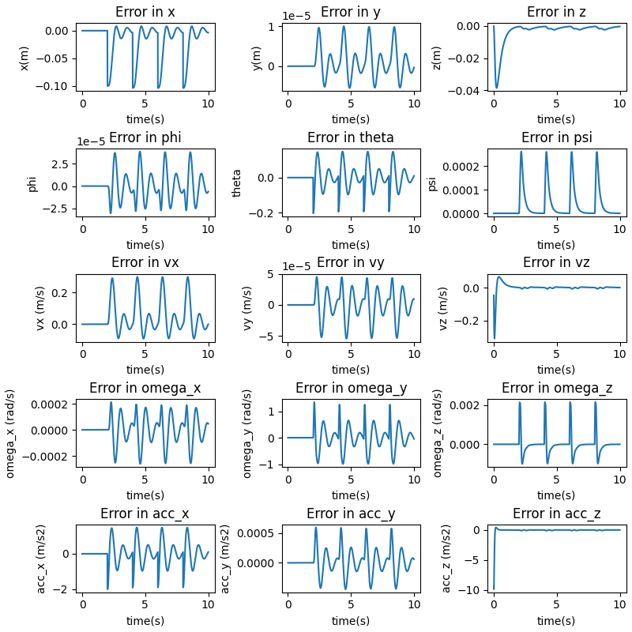

- We can see that the drone converges to each waypoint sufficiently before the next waypoint is fed into the system. The new waypoints are fed into the system at $t = 2s, 4s, 6s, 8s$. 

- The system oscillates about the given waypoints since we are using a PD controller and damping is not sufficient to completely remove all oscillations (underdamped system).

Ensuring that the performance is physically plausible using the thrust to weight plot for this scenario:
 
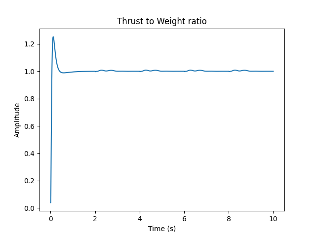

We can see that the performance is well within physical limits.

The trajectory in 3D can be seen like this:


Disclaimer: I have changed the initial state of the drone such that it starts at hover. Previously the drone was given the starting location of z = 0 which causes a sudden jerk in the desired trajectory which I have removed. 

#### Variational study on PD Controller gains

##### Modifying Kd_positions (Outer Loop)
Here the Kd of the outer loop has been increased.

```
Gains: 
kXatt = [Kp_phi, Kp_theta, Kp_psi]
kXpos = [Kp_x, Kp_y, Kp_z]
params['kpatt'] = [190, 190, 70]
params['kdatt'] = [30, 30, 18]
params['kppos'] = [20, 20, 10]
params['kdpos'] = [12, 12, 12]
```

The actual poses of the drone are as follows:


The error plots for the requested scenario are as follows:

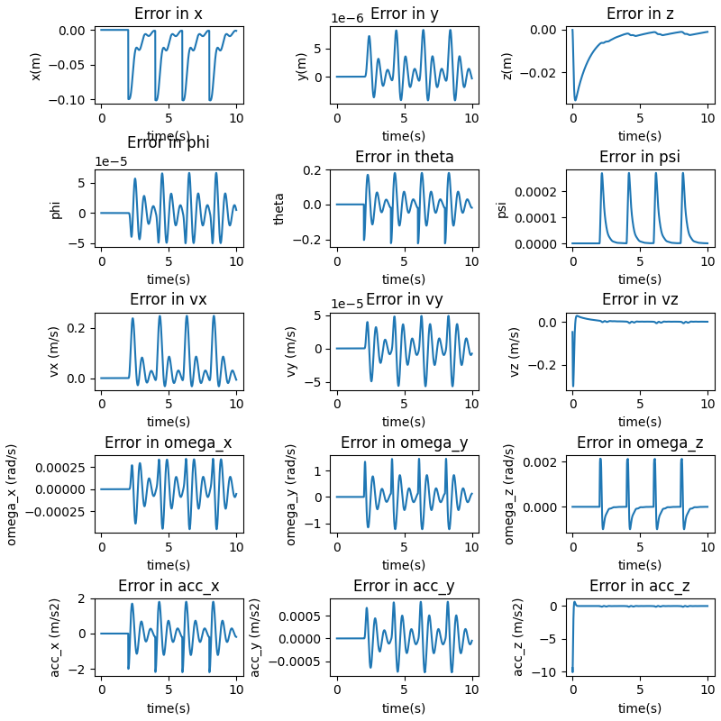

- We can see that the overshoot has been significantly reduced and the drone reaches the desired x-location slowly compared to the previous case.
- We can also notice that the convergence time for z coordinate is slightly worse as the damping has been increased.


Ensuring that the performance is physically plausible using the thrust to weight plot for this scenario:
 


We can see that the performance is well within physical limits.

<p style="page-break-after: always;">&nbsp;</p>


##### Modifying Kp_positions (Outer Loop)

Here, the Kp of the outer loop has been increased.

```
Gains: 
kXatt = [Kp_phi, Kp_theta, Kp_psi]
kXpos = [Kp_x, Kp_y, Kp_z]
params['kpatt'] = [190, 190, 20]
params['kdatt'] = [30, 30, 18]
params['kppos'] = [25, 25, 10]
params['kdpos'] = [8, 8, 9]
```
The actual poses of the drone are as follows:


The error plots for the requested scenario are as follows:

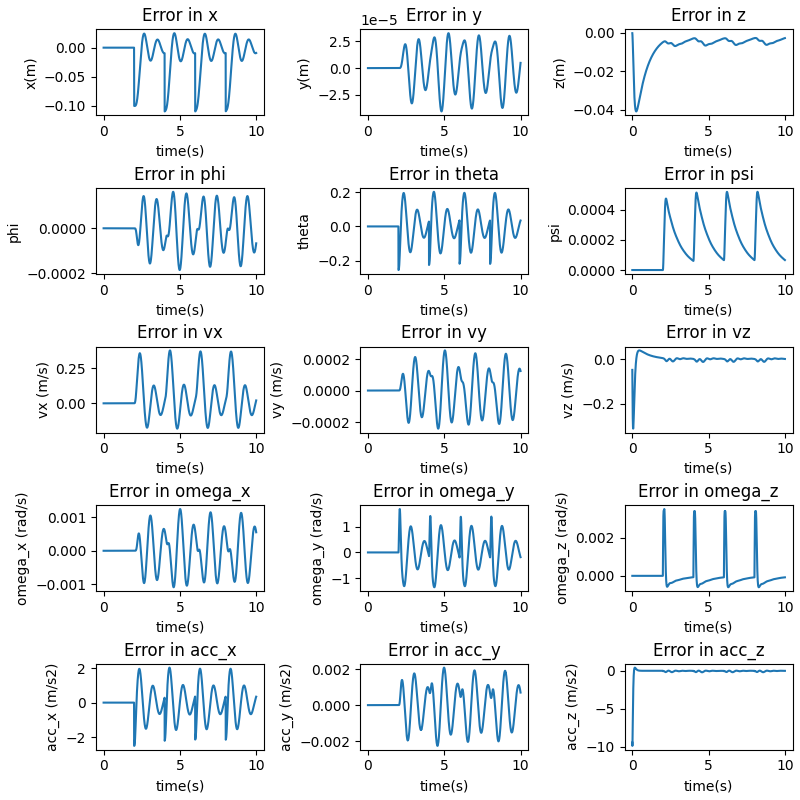

- We can see that the overshoot has been increased and the drone reaches the desired x-location much quicker than previously. This is because the proportional gain has been increased. This behaviour is as expected. 

Ensuring that the performance is physically plausible using the thrust to weight plot for this scenario:
 


We can see that the performance is well within physical limits.


##### Modifying Kp_attitude (Inner Loop)

Here the Kp of the attitude controller has been increased

```
Gains: 
kXatt = [Kp_phi, Kp_theta, Kp_psi]
kXpos = [Kp_x, Kp_y, Kp_z]
params['kpatt'] = [220, 220, 20]
params['kdatt'] = [30, 30, 18]
params['kppos'] = [25, 25, 10]
params['kdpos'] = [8, 8, 9]
        
```
The actual poses of the drone are as follows:
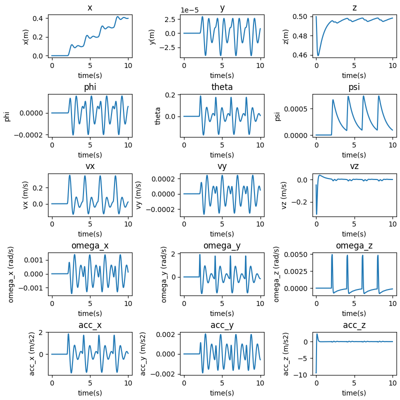

The error plots for the requested scenario are as follows:

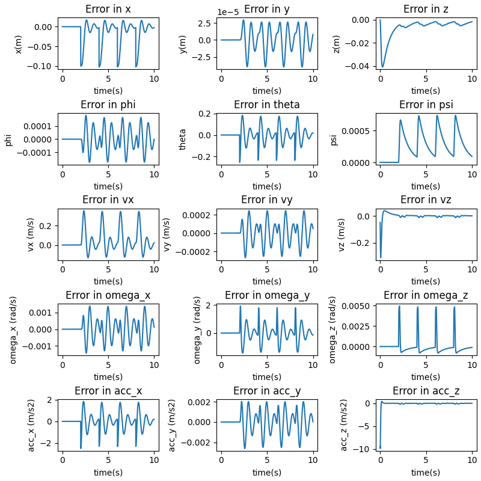

- We can see that the overshoot in the attitude has been increased significantly. However, we also notice that the drone reaches its desired attitude in a quicker fashion. 

Ensuring that the performance is physically plausible using the thrust to weight plot for this scenario:
 
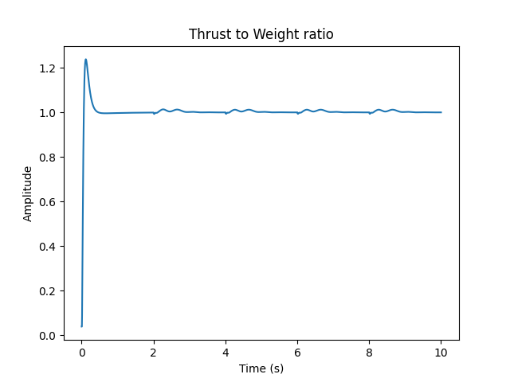

We can see that the performance is well within physical limits.

<p style="page-break-after: always;">&nbsp;</p>


##### Modifying Kd_attitude (Inner Loop)

Here the Kd of the attitude controller has been increased

```
Gains: 
kXatt = [Kp_phi, Kp_theta, Kp_psi]
kXpos = [Kp_x, Kp_y, Kp_z]
params['kpatt'] = [190, 190, 20]
params['kdatt'] = [35, 35, 20]
params['kppos'] = [25, 25, 10]
params['kdpos'] = [8, 8, 9]
        
```
The actual poses of the drone are as follows:
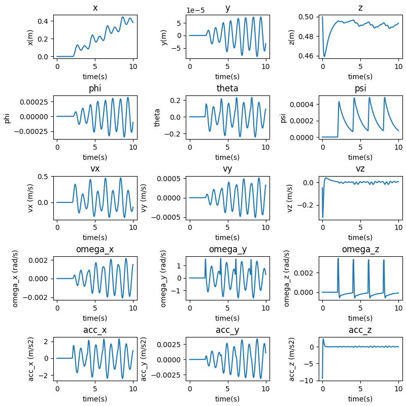

The error plots for the requested scenario are as follows:


- We can see that the overshoot in the attitude has been decreased, and the drone is smoother in its response. It takes more time for the drone to reach its desired attitude.

Ensuring that the performance is physically plausible using the thrust to weight plot for this scenario:
 


We can see that the performance is well within physical limits.


### Question 3

```
Gains: 
KXatt = [Kp_phi, Kp_theta, Kp_psi]
KXpos = [Kp_x, Kp_y, Kp_z]
"kpatt": [  190,    190,    70],
"kdatt": [    30,    30,    18],
"kppos": [    20,    20,    18],
"kdpos": [    8,    8,    9],
```
The actual poses of the drone are as follows:
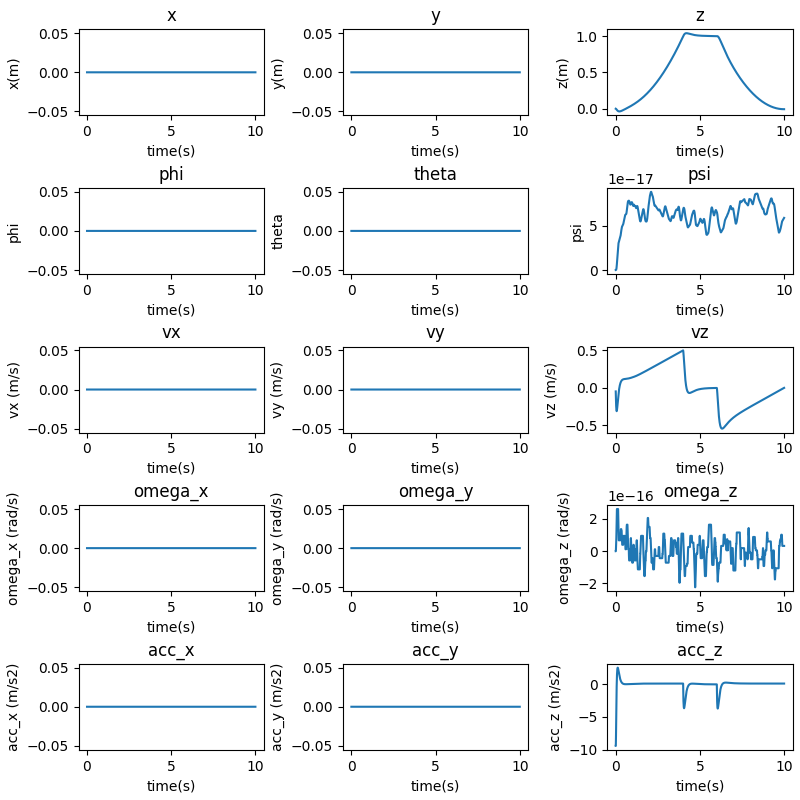

<p style="page-break-after: always;">&nbsp;</p>

The error plots for the requested scenario are as follows:

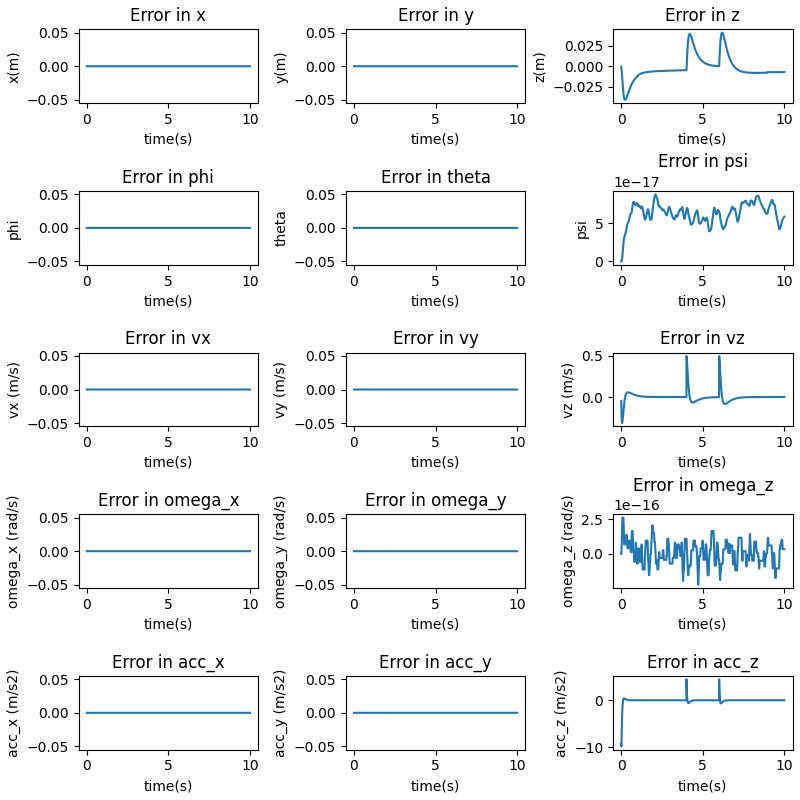

- The notion of convergence to a waypoint gets tricky in this scenario as the waypoints are provided in an extremely dense manner. The robot sufficiently converges to the desired trajectory as can be seen in the error plots.
- There is no oscillation between waypoints as the provided trajectory is extremely smooth and dense (timestep level trajectory). This means that there is no room for oscillation except at sudden jumps in the input trajectory.


Ensuring that the performance is physically plausible using the thrust to weight plot for this scenario:
 


We can see that the performance is well within physical limits.

The trajectory in 3D can be seen like this:


<p style="page-break-after: always;">&nbsp;</p>

#### Ablation study 

##### Modifying Kd_positions (Outer Loop)
Here the Kd of the outer loop has been increased.

```
Gains: 
KXatt = [Kp_phi, Kp_theta, Kp_psi]
KXpos = [Kp_x, Kp_y, Kp_z]
params['kpatt'] = [190, 190, 70]
params['kdatt'] = [30, 30, 18]
params['kppos'] = [20, 20, 10]
params['kdpos'] = [12, 12, 12]
```

The actual poses of the drone are as follows:


The error plots for the requested scenario are as follows:


- We can see that the system reaches the steady state value in a much more delayed fashion - it takes a lot more time for the drone to converge to the desired height. This can more readily be seen in the error plots. 


Ensuring that the performance is physically plausible using the thrust to weight plot for this scenario:
 


We can see that the performance is well within physical limits.

<p style="page-break-after: always;">&nbsp;</p>


##### Modifying Kp_positions (Outer Loop)

Here, the Kp of the outer loop has been increased.

```
Gains: 
KXatt = [Kp_phi, Kp_theta, Kp_psi]
KXpos = [Kp_x, Kp_y, Kp_z]
params['kpatt'] = [190, 190, 20]
params['kdatt'] = [30, 30, 18]
params['kppos'] = [25, 25, 20]
params['kdpos'] = [8, 8, 9]
```
The actual poses of the drone are as follows:


The error plots for the requested scenario are as follows:


- We can see that the overshoot has been increased and the drone reaches the desired x-location much quicker than previously. This is as expected when we increased the Positional Kp value.

Ensuring that the performance is physically plausible using the thrust to weight plot for this scenario:
 
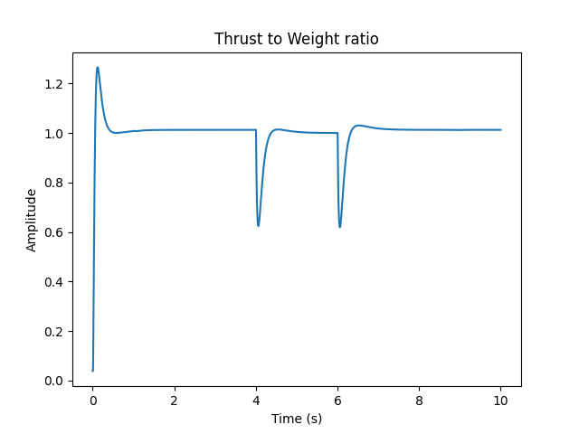

We can see that the performance is well within physical limits.


<p style="page-break-after: always;">&nbsp;</p>


### Question 4

In this question, we develop a state machine using the following method:

- A separate class called StateManger manages the state for the entire drone mission.
- The StateManager maintains 1 of 7 possible states that is:
    - IDLE: The system begins in this state generating no control inputs.
    - TAKEOFF: The system begins to takeoff and goes to a desired hover location at 0.5m height.
    - HOVER1: The system maintains its location for a short duration of 3 seconds.
    - TRACK: The system tracks a given trajectory.
    - HOVER2: The system maintains its location for a short duration of 3 seconds.
    - LAND: The system begins its descent from its current location and reaches the ground.
    - COMPLETE: The mission has been executed successfully.
- The StateManager maintains an internal Finite State Machine architecture that allows the system to go to the next state only if the trajectory has been completely tracked for a given state and the drone has converged to the given location of the trajectory.
- The StateManager moves the state of the system by incrementing the current state to the next state once the current state has completed execution.

![[Pasted image 20221120223444.png]]
The trajectory for a simple line track is shown below:


The state plots for the entire duration are:

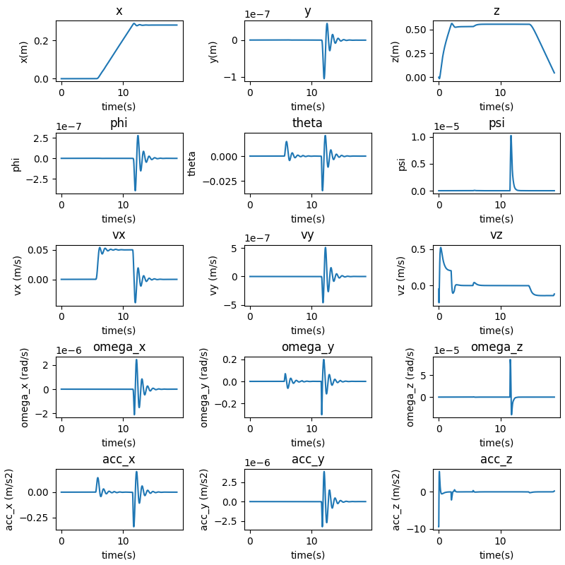

Error plots for the entire duration:


The state plots for the given duration of the tracking phase are:

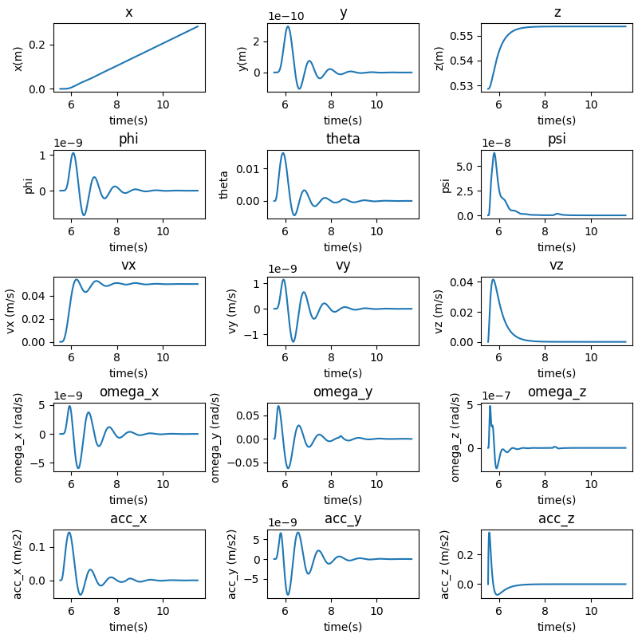

Error plots for the tracking duration:


### Question 5
```
Gains: 
KXatt = [Kp_phi, Kp_theta, Kp_psi]
KXpos = [Kp_x, Kp_y, Kp_z]
"kpatt": [  190,    190,    70],
"kdatt": [    30,    30,    18],
"kppos": [    20,    20,    18],
"kdpos": [    8,    8,    9],
```
The actual poses of the drone are as follows:


<p style="page-break-after: always;">&nbsp;</p>

The error plots for the requested scenario are as follows:


The rise and settling times are shown:


```
-------System Statistics--------
[Z] Settling time =  0.9999999999999787
[Z] Rise time =  0.9099999999999806
[Z] Steady State values =  0.10000003323214719
[Vz] Settling time =  0.8949999999999809
[Vz] Rise time =  0.794999999999983
[Vz] Steady State values =  0.10000003323214719
[psi] Settling time =  0.0
[psi] Rise time =  0.0
[psi] Steady State values =  4.002280801119769e-15
```
- From the plots it is evident that all the overshoots are 0% as the system is overdamped.
The code automatically saves these values to the output folder.

Note: Since the starting and ending velocities of the drone is set as the same value of 0, the notions of settling and rise time do not have much meaning. Here, the start duration is computed from the peak value of the velocity as it is a measure of the performance of the drone.

<p style="page-break-after: always;">&nbsp;</p>


Ensuring that the performance is physically plausible using the thrust to weight plot for this scenario:
 


We can see that the performance is well within physical limits.

<p style="page-break-after: always;">&nbsp;</p>

The trajectory in 3D can be seen like this:


<p style="page-break-after: always;">&nbsp;</p>

#### Including Variation in yaw.

The actual poses of the drone are as follows:


<p style="page-break-after: always;">&nbsp;</p>

The error plots for the requested scenario are as follows:


The rise and settling times are shown:


```
-------System Statistics--------
[Z] Settling time =  1.0099999999999785
[Z] Rise time =  0.9099999999999806
[Z] Steady State values =  0.1000000342445711
[Vz] Settling time =  0.889999999999981
[Vz] Rise time =  0.794999999999983
[Vz] Steady State values =  0.1000000342445711
[psi] Settling time =  0.5099999999999891
[psi] Rise time =  0.42499999999999094
[psi] Steady State values =  14.999999999999153
```
- From the plots it is evident that all the overshoots are 0% as the system is overdamped.

- When including yaw, the settling time increases by an extremely small margin (this can be attributed to numerical precision). This does make sense since the drone is simply altering the moments in the z direction which does not affect the upward thrust. This makes the two motions independent meaning that the settling and rise times will be the same.


#### Modifying Gains

```
Gains: 
KXatt = [Kp_phi, Kp_theta, Kp_psi]
KXpos = [Kp_x, Kp_y, Kp_z]
params['kpatt'] = [190, 190, 20]
params['kdatt'] = [30, 30, 18]
params['kppos'] = [20, 20, 10]
params['kdpos'] = [8, 8, 19]
```

The actual poses of the drone are as follows:
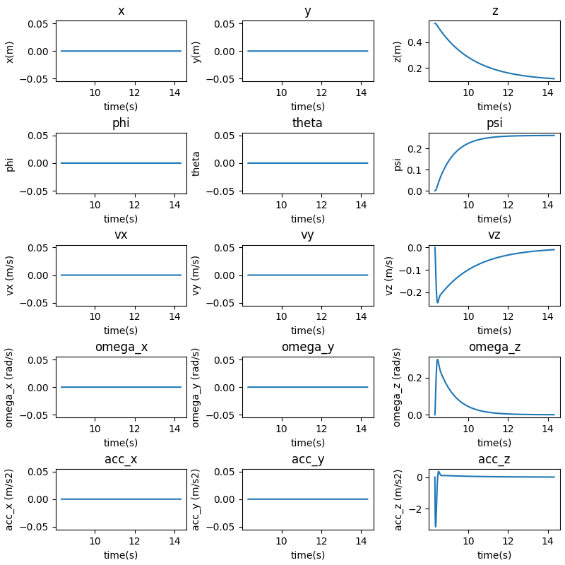


The error plots for the requested scenario are as follows:

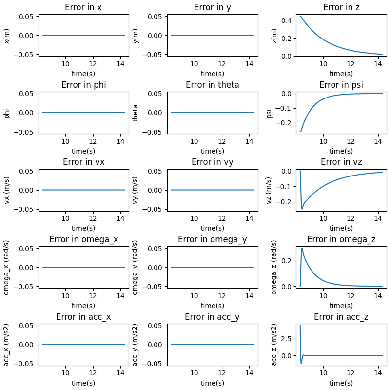


<p style="page-break-after: always;">&nbsp;</p>

The rise and settling times are shown:


```
-------System Statistics--------
[Z] Settling time =  4.495000000000703
[Z] Rise time =  4.300000000000672
[Z] Steady State values =  0.11766625984130827
[Vz] Settling time =  3.4900000000005456
[Vz] Rise time =  3.430000000000536
[Vz] Steady State values =  0.11766625984130827
[psi] Settling time =  1.990000000000311
[psi] Rise time =  1.8500000000002892
[psi] Steady State values =  14.987203888210878
```
- From the plots it is evident that all the overshoots are 0% as the system is overdamped.

- With the new set of gains, we note that the settling time and rise time has increased drastically for yaw, the z-position and the velocity in the z-direction. This is to be expected as :
    - The Kp for yaw has been reduced significantly causing the drone to respond slower in yaw.
    - The Kp_z has also been decreased significantly causing the drone to respond slowly in velocity and position in the z-direction.

Ensuring that the performance is physically plausible using the thrust to weight plot for this scenario:
 
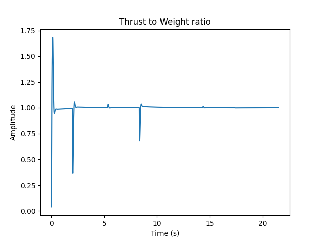

We can see that the performance is well within physical limits.

<p style="page-break-after: always;">&nbsp;</p>


### Question 8


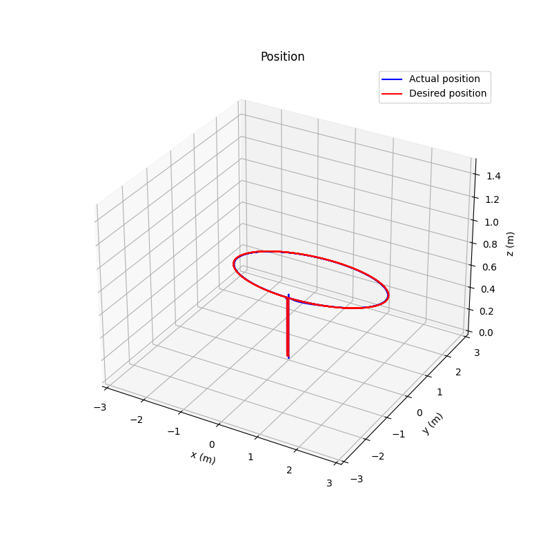

As seen in the above graph, the drone is able to track the trajectory appropriately.


The states are plotted here:


The error response is plotted here:


### Question 9


As seen in the above graph, the drone is able to track the trajectory appropriately.


The states are plotted here:


The error response is plotted here:


Here, we can see that the performance becomes slightly worse with higher errors in all plots. Although the tracking is still completely successful with the heading changing with time such that the drone always points at the center of the ellipse.


%PDF-1.4
%����
1 0 obj
<</Creator (Mozilla/5.0 \(Windows NT 10.0; Win64; x64\) AppleWebKit/537.36 \(KHTML, like Gecko\) obsidian/1.0.3 Chrome/100.0.4896.160 Electron/18.3.5 Safari/537.36)
/Producer (Skia/PDF m100)
/CreationDate (D:20221121032716+00'00')
/ModDate (D:20221121032716+00'00')>>
endobj
3 0 obj
<</ca 1
/BM /Normal>>
endobj
6 0 obj
<</Filter /FlateDecode
/Length 3461>> stream
x��\K��
�ׯ�9@<�[Lu���C�r^�>��g�l6@~~H�"��r[�VO���E[��#EQI��i����א�����'��9c��ĥ6J�nY�d�^���鯿�~�1fVH@�y��������ߟ���ů?��}g���u���.���3��ӟ��WkVV�I���,��S0�����|2j���3���y?=�E�49='��Q���ڨ�Oi���0��w��Y�K��) �Y�-�E�r�"-_�`So���:
�֩����B���m�L�'��v2�(`�6�*���/f��]�y���Ñ��H;/z	AH�4��Br�E��*��g��-�f�vJ�i �k��Ę"�^@ҥ�x�����
&k��2Y�Eq�\��z�-�"^pE��`QhYq/�^h�Z�X&�<$��-�<�gS	EPE�������4�e�j�M!#��o�0��b|�d�$ɖ1��16Y�Ԙ�ζ�`rIkS��W8�{%f?���e�*b�_!��O�w��4�8=�,�P���������D�az��I-�V�Z�=�0���6�,�w��{�O�$�h6�X��Nغs!�Q�as�޼s�w>=���GpvN�)4�7��a�@�H�@Xfߔ��s�3̒E��D�B�H�
��n�o2yL�"�
�>4@�i�6��W�7�XBȆ���3^d8㷰8�;(ˣ����|���=F�OU"�ii�	ɑ1iB�cXB�^#��4��B[��4�i¾H��a�'����aa��M���O�P13�|fq9�IΙϹ�s����Y�,�d�u:	�3
.�j�b��̭&�c���ZX<�@�2��&S#�h"�eRIN�)i8_�D�2Rx>Ɣ���c���Yj��g�p��9���)��5����%�S�A��������	�I���t
q�LTT�p���z�5Yf��NK����J�i
+�qpr��C�h��V�#����›h0����g��YG����o��|0�A�V"��TF�n
w'U�j�<x��ݞ"�RA�@\��f�h��RQq<y��b� �P�4�%���Y�FD�W�.&'�Fr��� Ի�B��C��̲�2��h��#�U��"�t�OȲBҵvaG��8҄��Pt_��������"��h�P���u��b>Ȩ K
�#�\G)ze/U\iN#�&�v{>�p �j��&y;�4Lt�x3� ��~���#�#�V�%�V�˃�rW#9V�-�Rջ�O��=��a!��4�Ť\y����r63���aS�`mZ��3|��òKF*i��;Vy_�*�I�
q\���	���ĵC����o��e�����5�5ҕ	��?�����w?���~��o���O���������t��������‚B2(���u�AϻH� �TT�4h`c�qލ!��i����5�S<�_ы^�+�ժ~m�F@��
���%P�Q��֘��69&.;c
4ƝG`l�u��᠂�m�@�c�����
��`}q]��\�@��yp�&������{��k��?9�"@�o_�CA�o��$�!�(FD
�7��>I'���8��\�%]j�Y��^�-��:�v�Bum���Ԩ���yDj�@u�XW��7#��s�;�Ϡ�ɁAj��A�ܲT�}s�#`O?CQ��'�6K�hi�@��	l',��˨0��~I������	XO��-�>$X�ֹ�Y�i.���A.Z��@�K!Z�+y�悴\GQ$�5����@�t7�]�����7Fk湗�
G.|Z�Uld��5H�U���<[q�Xoc�
�>���j7/!���H�7|�](��0�'U���ЭTt�.qtE|�k�Vָ�\?#*G0�B2�6nߺ�<��T	N��V��Bj��ݨD[�!x���_����s<�P�2V�s��;sQup1׺N+��A���5N�5��Ӛ#���)�q���E��h|��򘏘BW���>?Š�ˊ&��gE�+FZ�^�bYz��7Vݾ�p}o��dղu�F쳺�߂�-Yd��z���3�:7��$� l�������o�$����H1�gz�}�ז��{�
pUi�]"i�.�XջG}K�d���y)�H�me��g���
��%7�q���n��?{y�9�}��r�ֺ�ʶ溮�X�n]�	H��,�
��ψʚ0R�>�Soi�DI�?.�cnWJѻtu���Z,������c���������_,ϰ�[���}3��7��o�s_u����q�.2�{����jI���D��Ajcv��	}��{"����:K��c��W7n��]�y�}��ƭ�|�^�cH���>�mU>tʅ-R)��!
���*}���a
�:���H�y��#d��� ��stg[;��lFaOXF��{�H~M�1�h�����b�q����M����n(�㞆�-	��m���0=�d�D膞�nT�dA]��/}摲
�U�7��F�뗬�߃������=f&�����9\������M��D�hp/�����/��2��
0{=���#�M��ɋ�]�����X�.�"ϼv+	z3B��ޛ.�V���XM�V)Z�;V�|�*��'�Z��1��Q1'�1�z�O��i�����1���xi�\�K43/j���P�˗
�v�c���@��o��Ǭ���W���`i����͹k(�%6}o����V�Il$���F�$6�ՋR�h՟�X�㉍�؟�����G�����~㋴�6�\U�/�.i���p���!֜��{%}���}���B��r�'E�����ư�w�h��ܫn�W�ڧ[�}Y ��{9zŚ����Q۱�����Ms
�(N�d읠�i~k�<���ۈ`��D���]o�ox���3%Fvɰ[��w��
�dX�L#T�Ya��/T�\�g�����G�9���w8��M0<]��1�/�7�Qt\�3�i�-�_he�p�����n�Y���B�a��獢����ʊP-�4-e���<L�Z���]{}�@���+䩯 �J�;'��'��ˍ1�_�5Vw�R�@��֕�+������[�N�*�vuj^f��<����bOg8�K����k�����X�<��
���fz��7�6���{ �=`�y^TSse�cM΍�}'E�C����"Ρ���a�4Ġc"Z�������;9�n��DR�>]��m���T��X3�y�7S�בf*s�n�
�7S��������ǚ����f����fj���z�k����eŐ�f��^�L�^��n�_�u��r�+[�%4���In±�����K������^��ٔ{��n�Z���Yo�������3d7[Պ�����~��0�;~:��>>�N>�.���n�o��W6|���a�T�����_pc�
endstream
endobj
8 0 obj
<</Filter /FlateDecode
/Length 3250>> stream
x��\K��
����s�Ko	0����)�$r^�@0^$�
��R/R�US�n�w76f��]�ȏ�(R��Y��M�7��.���ӿNB.�WJi=��R	9�e��Zl~������i�ڨYH���w��w2h1[�p1���~;���xz���~��	�;�L�/F�?�����V��BN�7hx.$m����_7����#�~
v�6&%g��,�9�*�j/Q�I����	X�5S�spA�W�`5t2��UbR`��i��++����k�S�6��Џ\,ʰoG�8�(C-\['��Q]�2�f�٤���-_��٨��-f^��Rk���V�q������B�h��L%
�e^z���f�(�(�A&YF
e�9��(�����(C�i�0�x�&6����'�h���?��%�F�2��䑓��^ ��dK�i#�:��Ș%|@*����(��%C<�@�Ժ�&J=@4U�EQ�K������
�\@S�?���G:K��3���O��!i.q��#���$����ӕ�"�yi�e
���,�M�xd��VyV�ϊT�T��@')�.u"
���An�G���W}�,|n����
��^�B�^�<��Q��T���a�W��Yz��@�$PB7C)�:)Vj)��P�*i`[�0��giE��9���DZ&��e
���2ؐ�̺���N9?�� �0O���,K�rU��+���l��F��bR�R��w�$$?�R���eE!Y�B�5R��wI�$�E.*k��A��M��s��]�?��N�	)W�ћYä�#���#�աp��1����{��
��Yh,�}�SF��D�A���@ s�Y����^u�eo���,s���U�EYl\��Bt]A��.�`�T�5�T�ޜ5żs&�]��9x7�ߘ��	)-{�tz�b&����j�TWLuH
>}9}���%?�O�8=��X�eV�":C�y����?|x�����|������:}xy~y��>N?N��<m�����:~�W	l���v{`�+���#�#d�#��l�G�u�y@�>_z?nY��?�_�ރ\�$x���ېH����"RB��#����~�5�\����=�� ���3k�/Y��y�{���D��Z���C��N#Xv�RM#�X
�u	@2$j�Fl�@��tjp�a>j���\��ڠ
�r3
�u��P��l_�-�<#$�3�eO��F���Y�^n����♴~�e�|tf���n�K��8Z�%ߊm� �a����8�`
+^.�<0g��Վ���i��KZD^��e��!D��6]wǭ�Y����#�N[�5��N;��z���a|^O�ы��Z�-�fk1�E��&�\<-�=s��S�;�L!6͋���X��>��@�<'��D������V�j���`������g��!V��mB�l;��&.��Cb�\;Q�:0�m�7p
��X\6bj�=n(��9���,.�"aZ.��-*��%�x5�f���)��5vE!bc�����9}���1!�_]���6�39�!c�j ,SLPM��l'��3���N�V&
��E��$v��(
3��![R�6m9�/�-7������:h�B\,�N_cK��;�����f��τo�������T�t~�P�틴ǔ6��%���?1t]�Wp�q	_����:�Mq���0�`mx歌VYL����.�`\l-;��0,�M���`ݎ�J(6�@�]9�*�[�����P�]����y&R��e5�����=���ͭ���I�m����	o�ߗ�X�P����0#RO\^U\���}v���K�`\��r>l����V�ƽ��#���V`hxHm�JN?�+�q����m����Ih-���b�|
��K��x7U���x_E�k��pu���1!M�ҙ��&��Wf�R�������{�N�>%���������G��iPB��`N8*�8�����8�ʰ�pL�Zݙnp������A�|([��>ܕX~��"ww���.T�o�L��k�](G�g�~8o֪�xo������w�>�"�.%G��'f���
�/�_�}�^�߇�����q��J�G��Н�1���z#���k�K�P۪z��l7�|�������u���;.� �o���T}qd:�T�&�C�����N�M����98j�8�a��-8���N��au�
>i�N����^�9��i��1�0�o������k�򭝷�#�>:儅�uc_�C��u�]<<���p�;��}��X���c�|\ʍ�s̶�K}-�Ĩ��#x��"��LA��l����Ay��>� �wZ��͜�6X�ULz-h6ę�V
��#|�TC�}X�]��g>ͭ���vf:�$.��w���k�u�7�؉�Ks����a"�Ìv���td�5����xo����Hl|���j��AL����>.8ս���l�{�pUb����z��hm<���	�|.�v6�`>AMPij��0}�2�0;D��|�I~'%Mwj�\���S�(q'J66�J��ٝ(Y�(���kP��MIsi�E�nh��i��_1�V�Y1[��ɤ��@#�KO7Lw<���%m��c�����穖|숴1��l-�NJ ��ta��0�T(�ӭ���vds�7����=�4:�j���݋j|hX�Ù��*
�p�nf��G�x�ѷ
d0;	N0��������q��'��1�`!	�bd�:�%l�et������A_�/���w�m�o8�3��-�Ͱ�oe�-b{�PȾ��*<0Jz���q�����ш���r2�{\����qIύo�s�����]Le|�����PS�A滘�k��������K��{4j9�;�q�1���S-�0C�9塥�ڄa�gM������Z��f����[^u�_�!��j��>Ӛ����>zF��vj
���3�sF�q}�����c�tʰ�R���5|J���رf�����7�Np�%H8�]k��	'�	{�����J���QUJ#mW���!�D��!~�NzL��
��j�٠hv<�꘵�c�UG������Au������T㥳T����/�kx���}]�҇a~�l�h�r�k�6(�ʯ~�*��}f�������i��L��K�J�����1���aY����/t���/�n��F#�Y����t���(�$�:�
endstream
endobj
10 0 obj
<</Filter /FlateDecode
/Length 3246>> stream
x��\K������9�j�~�f�3>�d����� �5l���S�gQR����b�Ϭ�$�U_},�YH������G������lvRJ��t�����b֌�I2W��?�����( g.���J�'R�;Ø���������O����Oￗ���9aq�������7��*�\q1ѿ��ZXU�ب��g��vz;I>(��ͬ���OR̜qx���k��
*'P�	��OP	b�ѓW���{�OZoT2���|�`���*��XZ��
ꔡ�3�$�#�A�
�HZ4e��
m��[x2�Oݴ� �$ށ-Sx����ezf����4��Q�'Bq33P�g�@w�)-�&���	'mc�evL*I�@��"�j(�QF�E���^=�2t�"�̡7���~;��P��ɩ�'�f�r��s:�u���OF[�Li��A�<a���B|�8T.�Aj���7A����.�_m��.W�+�sa@}�2��W9E[��:V�V[*��Օ���C*��/Q�K����}��0��O�]�3x��3x��"M_`bL_W�D2��)$��
�i����He��W<pI1�?-B`"�{�]�����1�A3{hƢ���Kx�s��=�5��:+��C��h"}C���Ӣ�@@�\5MIh�X�jIt(��2j�[a�%O҂�[+�:9C�v$�c��x�Ȑ��D;�� �p�A�J�a�
�E�I�!z.c\_�6��m���ޅ
ļ5����Ia�-hLy�IV�ﴱ&������*��E6h�U��M�Aj��m���Kq)[���IM��-�[8V�¶ǨV¡�k,�*4�&�&���O��S-/5��!���-[X/~��e�!���e�C�l�Y�{
xE���0������F��c�x�M5pͥL��2+`ԥ1+[	kV��zz��'��'H3C��'�&^?�>@{������ߧ��P�?~���?|��?�����?�/�//��������񻧭�8�.m�6���S����0�(ʘ��y�~y��=D��������8C�"����/���R�nk*8v(=�*,Y���qg���pL>xx��ꤍ�����&��~�)���}VZD3���q�HC�i����r!	C�ײ���^nDA�\
��lW�v��w�]:�d����@�aH�D����08	�^��C^�<��A��.{����5��ܙ�in��'f�� �/�%0���^Oń�K���q`v��	�d���"$��8�����L���p$�H�Ѐ;��ǵ�y��p�mC�N�G-99&z�����t�H-��!>�<w6�&}�Tr�C���0��<>�=.�`�K+��a�=s�`,hj�C��D~��Q�.
����Q��+��N�젱��ffiJ�QPXA|	������b���cp�L���N�A��iN�ϑS����86,�*�NUs7�fV���g�	R��n���h孄�r��\@�
(����K����lW7��n�8:��nTKs�oU�
�e y^8V?�����aR�����C?
٥m���0Z�<j]'Fu&��)'���&%��V����5�/�w�����3ܫ;9ڛ�J[S���"�뺢C�Kצ����f�<	��e�N�C�\sӝ�c�~8�Y����I�Kio��f e�@�����K!zg�G(Lx3f�g�N�:�c�����Q"9��\?��#ȭ92��h(2�XŸ�KWXv	˘��*���{O�{�4���� �W�b'�ovr0�50��]��D�K�U���%����>O�)j�8{�5����|ZH��{��k췟�~8�����U��>�Hο�����_x&�#��g�����<��|N+}�N���<�ӫ�(���u�sI�BYY��q(����D�N'��o�r�s6d���N,m���H,�񜃢؉��u�5�o,砨��x���8��s�p�O�9�>q)gq��w�%&��?�t��1��&�7�v�C�:���H$9��9a�������|]�E�XI�.�7���N��sE/���+�1�~.���3�QεG�H��nai6�����;��N��N�D���u���pǮ�R�;mU�N5���q��9�i�񉢑�#l�:mWP:M6���PMO˺y�7<��,*�ȲSOfP.��6F��%k
����v9>|УG��^�֙�olE]��{��յ�:ћ���YsN��\���ᚢ��#\��Dk�U�ݸ��h�
������5@"��;R#;�`���h�0�
g%F�Ϥ�U���[��A�t,�T6��`(���R�AדƝέgG�U#�/9`B�襤�N���;��Y��(��x/%seQ�@�)�̗�d�j4%ݵ��{Sg�W_�6�1�Vnj��ѣOD	��9�64��x:N�+L��cx+�E�8e��0Χu����r̷j���ٚ��.2�$��Z��C�:O�فoU�U�s��c�_3p[4ڍj�wv|.��JRx�!���p�L�5��p�īk�`���[���~ٸ��>��j�^��.��]/�����h40��@��OF�9�[LG�DAw2�ȓph9�gxrϱ帥�&�n��[�d�m�R��ݐu��k&�ΎW�dS���h�,3/.~�K+��>�F=.7ui%����V�މ���f�[sG)�y�~q�J��`&�a�I�
�$ߐY�ෑ�N����}�����{7�,g�ƹ�A���\�!����	�҄aoy��Rk//��b����ݬ�7PKs�]��;*v��h�j�y�5�(&�U�w����РWX���kF��q}��6-�s�����������R���|QA�bLZ�����!�cL�C�
K�#�PC���t������w$�Ԗ���{]eE��
au,&��lk^�O?�!�����E>���(6�4��U�{U��o��^*�~�_p�̮��8w�G�R�;�e/}��<[�Ҟu���r�D��L��Q��T���K�4e��TMR�C*N������Bot�]g�{��u����P�%�*��r�Y��/k���ܝ������"�.,D�vv}c�r��/�!C^i��{j���ʗ��M���d'�6��P��r�B#�0N[裵}������Ȯ|�5a.-	CW?��X��-���j(�|�0��Yt]�{��3��/{$
戙֔
�?���o؇�
endstream
endobj
12 0 obj
<</Filter /FlateDecode
/Length 3987>> stream
x��\K�$�
����s�Ko	X,����)�$�l8��`l$��燤�����{Զ����f���OE�{�&ѿi��_��mHz���ӿNJ/s4�X;���(=�eѓY��mJq����_�0�c̬4\���\~'�EZ�����EM���_O���?����L?���Ã]&g����?��_G�YY�'�$�$���&7��_?����ɤ	n��=�Eل$;'��bk��$�#HOe���fN�@��2�Yo'���4xmq4]���I�ޙ����4x:А_�xi ���$�Q�N��L&��
�&����J���_��Q.*��łU]{�'�÷��D���^BpB<$Z�IBr��V�Ne�լc��A�M�eU���8�:�#9��a� �\���.�1�������PG3u�L��z�@�;]��dM���mZ����u1a�V�4n��
D�`�2���r���Art�p*	������Ww�z��R}�]f�2d<��z�0�
I���rjT3�)T�)'�^L��$9w�7����wFs��N�7��"������g�z��l/�Cȣ���,���x��,��^�qRˬ��V�m/��J�W���W�kWb�rE��W���
_9ӕ��b&�M�|&C%8Q�c�
؟@����M;���dD*���!����򺋕�И�E�>�0l��R��J���V��d��	'WX,�x�4��]X�-��H���V>Q�p���J�#
����i0'L�tK��c�5�����!
$G��/R1�Y�	��ìpXX"z����߇�<��y0��<ߘ3���d��S�u!�u:	��/U�Y�P5Rۑhf��D+�}C�&���Dx
����ЙU(�7�PX�'C!s����(Ca�E�B�Z��j
�e(d��PX]#Caua��9ސ��+�� -���b�����>]o��GC�EA�a�1x4+z�R
Q=hlդ������ 1�ɂ���%������A��@dހ�Y�4Ǩ�#".-@��ʿ�`���;_�jg���k�Fَ�N>h�ʠ?���7Y�i��Qhx��_;*`�V?5F���v`�"��F�N��bBg�C�W--�h.$�{d�&��혊��V�;��N��d!{C�PqMĦ�p3��֨`T+�$ժb����D[<H^G���95�j�T��Q��u�& P��@��|Z�;AEZ��1BNhB&��:v�W	:M�	�����f��?����P9A���U���	�V�a�n�zB�kP�ɴ�f=��������y��9Y�.��T�@SE�[��yj��R�
[���J���\u1o�Ą[f���f����`2�`M���g�,;@���������C��&��~�/���7>�kW�^yX�M���"B{�9��i�M���x]VHմZ�ݏ��r����cv��G�J��`�m���J�������×����?߼�|��_��O�`������������'��L\�,?�����bV�۪C�\K�!�\��>X��Ka
��s����H(�e6�L��}�b��2�M��A;7�V���=��ٯ�ieWV
�{�"�%:N�4�Л��f�=0��aF3��'z��d%(J����>��[ߪ%��4�,�ܚմR�3��(cY�{��o�R"�_����R�J�D��E�\,!�J���Uŝv�҇�Z?�>f�����}�yLhmz�w'��t,��;��h,�	;�u�m�^{7�;·��mU��K߫*�	��ނU�]o�}U���Oɽw^F��i�a�\���X�c��=�'����'�t(O�v���`�Cs蒔�	�f]־q�K
%�L�q	#��B�0(�!ԁ��S"C��Yˆ}���t��'�U�'�T�{��Y[����\���a��o
+�/��Hs�w�a�]6��rMa����H�l
#u����onv�K�����ޞ"�(�7�DA�i J�BW�$hV̈́f=�v(v�����h~�6�5w<�ײい��E�h, ����T��nQ�Ӳ�C��nPa�\ʝوD�Ian��dM�� jL�q��H�����z%�|#Å������,#C�uaPK��l�&Պ<���ۼ�N��ɮ�����ӡ�\3L]����X����탇�+/>�i!��r�|f�M,��CT��2RI���ag3�Õz��.Se�C��}��u:�j�A��:BE�5c��uEMsR`��h�|k�DH�Jo�H���]$RIYt9*-u]��.�߼!5��B5K��h��t�5�*��HC����V�x$��U�}���%�6�O`��r@�@iuz��.Se�C�o]���:�Z�A��:B���`c�Nv8�j��+#$���P�ؾ
�kr ;]ш.M�J`�-u]��.�_�!�4��25K�;�TM7��Nǁ|}��a�i{�s)�j<gS�u?*]��3�f�,[�!��A{,~Z�☫��� X�4Wt��T�V9�4����-D�wu�cq9ܞGYvNe_Ȝ�R!��$��A�}(%����5l.[	M��C�4�5�
m5VQr��g��YFE�k�&�>��Y��_�E�VS�}��8�‚^m�"�je?�n��C%���B����5��vA<��O<�%W���;��#�����i�.�ayܪK��q�a��0�B�a�\��(�P5��\��8[y�.��]��t��Xg��r;U�VF���,�o��0���nIez���v1�
�<9.�m/@p�E�u�m`;1׆%���/�;�,2��ȽaaН��b/#w|�>�r
�;���q�Z��roŶv;v��5�I��P��b�3�s<h���MO���0h{��ƬX�1�+~|Ŋ����[-�5�U�9��װ\�ao�itL�6���H�{[��{;-�lW��,��C�pX��cO����p(jy���yar2dX�>�
}���ݨ�nCE��������Q�(ј>&JH[�w��\2��`��=�p/찾��ѥj���ۍ��!›�6^;�:�e����|�j��{�f�3i��A�����$�x�fR���d�G��,���ˣu3�߰�da����d�{��0+��zRcm%�:�X�X����+p���X�i���Q�zX��?�l�J���/�B��R�v2�����-��e�����N����(���
����G�Ɛ�no�^?]�N�!{��zq����6X���pQTjw������Z*)�����i�j-t�A��xcs>&%?�k�.�KoW�Ч$�N�a����\Ke�z�?�<[77�Ҷ�B�p#�9�~>�{�<n�tY�Gn&��t��ҚퟎF�	9�ҭ�a�
���^j�U���2P�En�E�Ώ�6�joL���u�����?��~O�ű��J�4�9���������������� v\޺4�$��4j�P���`f@K���A/��N���K�u'��.���	e|��*k�Xw���#��غ�Eu��A[i�[8U�=(�=�@n8�,�Qԩh��6��s����Z�vƨ&i��xM>�W����N&�ŵ��X�hާDn�繥�'e?�mX����N�L��o�0���k�����bȽsI��J��A{؃�����R��J)�A���L��zp＜����8��KTK�mű��cy���y[7�S�����#h�
3�Zc��Q�(2���T��e�ǝK0��?�Wj���:�;��M a�!9�v$�E���&�y_2������x�w}����>���]l�_��>�FC�v��D� ͱ=��oCb�N��B�>�APl��-�
Ij7�ې:'�e8Z��*�#`Yx,{������ޒ�A_��-���*��|��w�$,}KAɩ����;8��To<o��q��Y�
��AҎlK�H��'��d/d�
endstream
endobj
14 0 obj
<</Filter /FlateDecode
/Length 3498>> stream
x��]�o�
�����k}K�b�d��S���aq(���z�痔-���D�G���%;�D��%����T!�7L����~tA_���}r�RJ끽�J��L��d�C���?����7�F!�Mx��?�	>)d���F��o?��9}�A
���㝞�'�P�ϧ�Ÿw2kZȁυ�\%+���+%D^OJ�ѩ~�6�A�QLB�1p6�Ԥ���>�4���A���?����2����	��,��G+|��8��Q����,��A��>|e`Gԭ�2%�O��jP&.��(��|�Mz~��/G���n2�'�,(�OX���&;N`X`��L%
[ʼ�ʭ��&7�Iiż�2d�E�V0ˢ���>x� (C�4��M~�����S�$
F#ìf�d<�G	�_-�gA�`�C^H�h#-[r��K�8lvH5Z>9;1�t��;�lг�L���p}tQK�"�	1��+�4� 0�%ϗ��5g
f3U�Z2���3��r�$/�p�ަ�K����Х �z��m���p����|�������n&����B�æ����r�@�W��(� ��#)a�FA��Џ�ö/%���? b�� %Ď2�E1� �%l��c�P&���T2 
1���-0L��R����@���+U
tY'��,�p
�Z��-0�����[��EJ|]!2h"=N�iT�jf��	��a^�b�Cݠ+ھ�d�hcr��5��H��%����A���!���D��s&!���o�2��H�4.��K��8��&�B�@䢵&Bl-����"��/��y���6,�	#���Iс.s�&�.s�T���1f����$Vk]���%�'>-|=���L($E 3	-G,�	WG,�R9?�u�LQ��GYL�#!b���F'8�nea�g���s)�lOf�$��;ffgœ�=��>>����3��1����V9�|;}����������˕��Ɛ
A� �j�����o�>}|���|}�������a������㟿\����e�jj2�/_��k��6.��6m,�m�p��K�����2���4h�tJ
#���w8��29l�ԵE�4y5��L'�~e�p�o/XN�~Lk/M�da��
�z��0_
���@w�H�!Ђ�/S����Y\�k0!��|=F" �S+��� DX�ڄ��}$�;��E�裀	���Z�L1��p��Lj�&B�ـ;=l�+*�秆�[FSf�?��
�Rn�4���I��-.�L��^Ө��G�&�LPka0�ں1h8����]���.������=h�0�f�Gȇn�0�-��ȇ��l@U:���"�P�b5��C�f��D!�!��
Ya��"�tZ��̝3
�)�;��/Հx�i�o�*�q3���@>�]��X���P,�aa�
ؚS"�E�q}#/��8[Ng�R�m�ʮ5��n<�DuIl~ߒ )l*	��#J�l�!%M�RЂ[K��Rd�����K%A^ێ� ��P0��/	�/	V�ZT�����͞��t�%��-%A5XIН�$8�
�$hf/	���K�f&𒠚	�$�o(	�Y�K���%A���%�ۯ��ְ�$�J���l���)�/	��*7V0��|�#J�Fh�$h@6�\UsI�,�`��*	.�Z*	ZQI�U���%�ZeI�'=�kI�6����%�耒��^���Ɇ����SI�=U��O�����>|q�Gx�����n�p��c�z������6���-�����՝{�(�H
���>�H|a�����T�BvK�ԅ(옔i*�7ۨ�c���=�
j
p~���e��t�sL/W��%*�1+����5�Y-���2�r�^V-��H�eTdp�q�{��[����'&U��W��E�o�tđ-�q��ݱ�:˩���Ҙr:�Y�\�	�܃{�zn�L7�Ć3��~�b�4rؐb���3�4_O31�+Hr���>�*�ѬU�+C��<{LJ�c=C=��dUϠE����zѸ�9�M���������u4�5>*�\�y��v�֍��|Nes���榲#�l=|�nf�\�����-�m�P/��.�H+���X�	
Y�3FXVs�Ҫ>]���Ut��i�v��lŮ�qIy+��f�3Ic��p�zIL�+�oF&}~�($Q�
�;�)�7# g��Q�6-�7ݹ���Uzٸ���~�J���<*���*����b�K�
 ��ڕ�R��z��*TF���
����Z�qR�Uo8��>�H�'V�y@'�:�m�u�cG�+B�d���N.���⾓�בּ������2%���]J�-�W�r�i_4_�3�j�*�G��a;W���u���Unl�z������Z���j�6�J���`���z}�ū���&�$�#�R?�>D,]
��|��%k�����7�\��1��p�}֝2r�����\��#���;;kT�&i������&��m{�������'u��R�4g�>�{���{��wf�u��K�����;��;��^�K�����w���O��wI3�Y�|��sn½R�G<���G����;�#�J�Um;���f�ߋ�W*�hn{X�?&�ُt��}�/�s�T���{�����ó�S�ݗ���JWw/W&�+:.�ޓ�����ž�_n�!i����"��fҬ}S�Mu�b�4��w�*�k纞{�ү�^�i���Kmki���JҜ����~��n��ި���3���!M�_���>~���V�����-_.4�xlq_�~��;��ZK>��ګ��Р>�*�]�97���W3����AIJ;����H�J��
k[����C�����R<�A���������b/�
Ё ���#�v`V7��^����o
�@�����{��-��/v �������9A|�@N�R`���\"�������K�ǬHard�Ѵ����w���@ƨ<���t�v�J���߰�g��YR���s��gT�2�����7����r>s�z_�d?9t8��0�����е��rr���2���u{���! �}����
�6w����A���1�ZL6�k0݆u�`�e�{�2��,/�M7�A}��OUr���vb�����&�}�ig���ofy=�yPo�9z�x�}�%\����y�}���<_	�i��ofu�4�;ު����^�x'ŝ�N�����iPw�z�x����[�v�{oG��~O�1�]}{/��.��:��Z;u.��������|�&��y���h���Я���y�������M�Ǚ6V�����O��A}��Ů[;��^�m��2�/hڞ�@����yPo.pd+���6������\P�����j�{��rs�Tk�Λ�}�#�`���8��]/�\0տ�q����1.��^��u��B��nt�;�!��v��|y�O���?��
endstream
endobj
16 0 obj
<</Filter /FlateDecode
/Length 3760>> stream
x��]K�$�
����s�Ko	X,�qv|�!�9�A06���C�E��z��V�bfz8%����%�R��߲���V��r����_!��+��^�G��\Ͷ�Em6��������m�*$�����o����A��zd#������ן._����}��No��Q���˟���$�*���"^I\%+�X~�OJ���]�X�Q=��m0���؄Hrk0`l �Mk/
@7���� ծ�y�O�`up�f��m�0N'|��Z�_��}l����&�4��_�rD�%S"?	�E���U����7x�m:}|Ï�Q�w��uӛ	���V7��f�
L2�i��a �K�\����*7��
�t����4� Ѣ�sc���!HC�i�7���Vl⓯�.�$V#Cb�z�0Ƒ���9�T�/�H�h#-S9���K���F��d�H�A8f�H�A'��1��C���"	T�$�
}ގ��� ���#`q�A���J������I�"��v���
Nr]	�/��ߙn �\7�0W
���{�L��
�;H;D��h�#��JU��W��[�AD#V���R�?4X�j��/�D�2�E2 �AKV�1��
�������-U��0�R���ȶ	���
+���b'�B�
�h���ѵ!&���Z-���`Z�	��@t�Du��g��S���EK�)����QIQ�l�JD�S��ƣ����z��]��ԻFba)]�0���U"XS�2NY��]!mv��Қ�b�7]T,z�29�%�#�		">Y�Ub�f�0*��j��*+�U0Ƥ�}/}�A��5
3Kl_�T,�v��@���ы��L@3��">P]A@�h>����m�]%�늕�qqcQ��S=���)�]#�����In�w�̮�T��|�|�j����܌�.X�������0T�*X��*�t�?A����>.��q�����ȯ�,f�;�)(ݞ�K%�_�Y?I8���·u��=����b���das�Xn�-(n8a��4�ܭo����W�����@��[��{�4�P!Xߘ����;�j�V���F����|���7_~���o���oˇ�O��`�o>.?./���g,l���A2���oo�A���@!��vY��B�'��F�?T�щ.�3���y�Eכ���n��#}-��m8z��C�L��Cqc2(����~`0�*_��Aa0Ƅ��.��<tLA`
�{����>�K� =^)�ǟz����U�O��8	RXsV1���6��0I�q?��r�u�s�@Y�i��U�4$���5,a=�
����b�qbma���GM`޵1/32
�G�턭�`>z*�Kk ^��R�wE������5��fl�a�Vm۷���#�ͣ��b(�̗̀�b��!D�ĸj$�U@��5`aH ^��edVI�B4�m�}Mk���"�sQX�+��j�4�*���ڧ�v�>z����ƣ�e�{�ڡV2��{��H�N�}Z��.X�����r�.��9���`��B���:�u�m���լz9N*M�l#�6h��Ɲ9d�ء}���u��2��
CwEÖ�D���柲EP�o��j�1���Xg_����9�����lב9qR�������Aѿ��������
�_>����:���O����F��Z�!�8fSe=�m�=�0��߰���FV���}���Aexn�x
�e�.<8>n��pZ���H��+~8�8/�)}jn�+��C�~;�n�r���F�Hg�-��E�����g�X�UIf�J�--j�4=Z7�N���b��z宿,��<q�d|k`L^
d�t��%�4K\���%����W�eyZ��6�t�Ek���#�R��8�=Z3�Z�M�J�U���8�)����}���8V\��%>�lk
�ݬ�S��+����^�\�����J��ߙu�H�D��d���z��O�q��0.�=	Ɩ-/�Xb��4&C6Ov��3����;���eеc��G��~fƕz
y*̄*��F�������D��H���P-r�9�'6�5#O�h�>�rB5�N)PIk�j2Q#G�6�]<WI�T<�����y����K���؝>,QO\0���C�4�"���. �ɶ�N9�w	��R��왱����8�AA��:Ԧ������~Ca�N�cfmݏ�8�\M<O��&ĺ��{��(	�R� �q�=6z><q���sv]�{H}�W�;��;�ǤLsށ�:�bܺg�iס��G�j��1�[ņYaȦ�ü���H�s��4�r����7�.�p�����.�-��u!�LI����Q!V����v��I'a�-_f)�*8�(*(���WB��z|y�T��E)O(Y�k�J��ęv�G�H���x"�9����U��U#V'��K���B��gp��6Ո3�������n֜'���:�n�ܫ�f��d�yg#>�>��Yr'���M�9�N���/u;3O���gT�S�����h,x.�hp
"�qSՃ�SQ��Q򧠂�xs�7�~��a�	9�ʈ��F7�f�xw�!3-��Ο�㫱����ܗ��N��0o\3đ��q��zv�ݝ����O�K���9�N��"L��?�>�v�[s7RL�czJ��<�wp�a�,��x�Ü�!��DžS߬>����z�q���ȃJ���zꞭ��;�5CTYf.����X�WM���S�$#6C�T/��i�^"n�o�J��q�$���ӏ�����ҙ��)A��鉑�R�bw��L͸gΡs�P�gܺ��/����Ȳ��Ձe���YW�b�.���@Z�a�?�����>�BwExa�4������>���s�:�L�RwP�1-n��������G��ޓ�u�n�]
�#�N'�"
�m���`
7g,j0 �~�� �S�;բ�QO�i/�����7*�;��>aW�7��3,�c�C`��)�b$�+��a-"\�s��P��"ʷ}0���ka�ӌ��B��+���_�����<��R�������������ٕc<�[��^!K�����i4���k�@�u�@�κw�L��֞w2U��i����_k>��4Nr��v��'9w��9�G�N�n&��̥}]�:����^��\9����'�C+�R~>
X�yb(`%X��P@٧�6�V�08	XŴP�Xɨ}`N
�KJ�81�r)u���b�}>�R�`��ƚ�r�����������\q���r�
�f�J��\т����L����J�:�=�i��c�.�;~��U�'���jz��������T)M�ZĴ�M�l]����A�t����k�UJ��H���t���0�;���VS���M/l�{%�9�`��#�bZr�|�+�%���2���}2����]2���qѯ�M���Rx1|щ��������������d}Q��/���"�o�x"3{/:ж#�m�c�]֔��2nMI;#ıVk���%!�˪#ˎ��l�8��E����c)���p�Wa��tح
6�>�zܭ���q0^N�V�kg3oJ�1eۙ�ߔpu'q��m�ڋv�m�8D�������}fT]�a�L[�Pe��:�斺
C�>k��2Lp�AAM���f0U�Vv.W�wfd=���5�5��Y���q�b̧d=��k�X�k�n��~)��4j'3�⢭R}�Kt��z��t�7*��������
endstream
endobj
18 0 obj
<</Filter /FlateDecode
/Length 4543>> stream
x��\K�����s��oh�O9$����	���8���*��؏eOw�đ4S�$��U�H{�*��M��nf_]���o�|r��RJ�)^OR	9�e��Z��uf����?�n�ڨYH�~�~������YX�È	���S���_��AM���wz��_��~~���Fl�B9��-��Ur�һ�[��<?(1G�z$�Y[Ь��X�H�s0� I-Z{�h�z`�q���f��.X\"m��@'�Ӊ&����_�ձK
�L�'�v��f�Q�ȕ�lHl����D~���2���*�&�~������3~�
��2̋^l�!w�Dxȕ��B-�"�%c��(e4��^z��([.J���D�����4�Ѩ���eD��7̂�e�??4�z7�X�S�A��@�ϥ�+��&�F" iz���Kg���ͤ��:����h���sK�R�Ɯ@�S����ĦOt�� Q�Í��,|r�8�Iv�EK�w�2���֙3&�p�-F,6���7�A��AO�o"��/�}��Y�����b��w d}���~Y��ӗ�?RX�%>��/��y<�%,�H}8N8G�O����M���ӗbhT�)x*!B<��#�(x�!��a#-z(�@���<zF��C*��n�'P
�,zF�.�#m=#V,z"
����"���3~��ŠG��zA<au3�[,��
�3�A@��I�4�5����(��V�����$Z�sn��M3� 
������Y��O�~~�'����z�D���#�Wy��"Pz8	)1�ȑEVXRP5Ɩ�dRb�ArLݑ�*�\��P�l�H��ϥo��ImVq�<��d��I����#��E'Ij'�~x�LZ�q����d2
���tʼnS�<����*W��0W�T�Trgnz�Iei
��Y8����A ��+U!B�� �����ɐ��8�)�4�Dp.�)�{��.�a�q���Z�1�f̷%�L��3
�����`hod�^�J�f #Y'Ŋ)����_%L#)'f����4�ܐ
(],�Mu(�A�2�e�+ :��y�d�iaVQPI��8i�#_Y���6,��]T����
[ƪ��\�=l�7 T�K?�R�*���+�k�&��%F�gùȴA�C@�6vQ@�*��%M�H�	7>)�1��*�
5�*�j{�*�h )��$=��G�᠑4
SJl_V5��@=�US����4X8_@�h�J�V�A�0��lE��6�"����DFF#}�.�a�XՆ-_��\�*��
�,~O�y�S]Њn�\H����E��G,��b>9$|	6�����S\�̠2���ٚV��
G0-��X���1����o��w��3���Z��1��?O�ٔ��;��H)���DxR�5�������_C8�MJH[�Lt�G�����k��U��b[Q5o��������}��ۿ|���~��~�Y>~�>|�����3,�\�Ċ��:f	1���`�a"�l��/*dDr�1`X��H�]����q �I̙�����N��v!�ӈ��rq:zX�Ո��"`�_�>z+�[F.7�;�
��a��N!�Xv�y?!r%�1Pnġ%`�w��������7�X��*�
�e�ַ���}J���\�L��/�N``JSЊè�'���Ir�á�u�aj�b(ƣ~��G�A�v���R��
�H��5��7����h��l��t�+��������:������-3Qw��YJq�
"����G�f3�樔�����#����Z.*N.p��hD�[��T���<��\_�?^���:S"��g��e�T��h`��A�5��C���KӲq}�3��B��~�^��� �[��f�2���72p���߀s9Q�����"' �$��|1�Z���(�lp�������ӂ���x�iAI\*_1i����Df�{KHNJ��A��?�9�6�OĎ�+}t�ד�
��Ӑe�{���RϏ���*ɀ�a�NPuQ�F�U��\�w�Ѫ.�C|U#��?������`�4pۈ�t�d���FR.M�Drٴ��{׋�J�+P]�aa�c,�3�X��
���n
؏Ĕ��1��Q$� zWo?��S�e\�B%�\W#�F���ݤ�d��Sf����'w��/,i������.hp�	xhZ݌�8u���
ݛ�p!��sZ��]���.�Qr�
������n��`%�'+��
�8q�M��YD?��yX�B�6���梼�5�m1P6t,
��[VF�KH'�ݞ�q@��!����+�uP������|�0"�҄̕xR��_T{u���{�a1�*�i�}{�v�HY7�U�|۾VW�]	��K���n���_ĐqO��J����J��{v�4��<��w-����=���
�{��>/������s0���c��&GKNF^y���p�~	�
�׀�(�v��{%��5z������Z��%L��#{P|�f�$A�g�XoLאcCm+����\]����udq�j�Ƈ�H�W�>���`jH��MJ$VR�{�E�D��µ�?~�I��t�h�;)���;��g}�	i�U{�I-~�ŗ�diF�[L��i��}���}'���;!m{�	���N@�w6��T�?�������^X	9��W�XQz����3YY�{�
+���c��LϬ��Z��W��:}�k*�O��5���
ĩO$��j?��m�>�A��r?��ɞ��vS��dl��M�LD�}���Dܔ�'r[��hx��o>𧏼��%��.	i��J�*��	E@o@>��E���J~֘�zd��-�i����r� �� �ͫ����KK��E����IV�4K?�\��GB6��@̓>%���ӥ�Z�ND^��ȼ����ó��v�a���3���崢����*�yE��O�z� �Sx��pkS���@5������K�m�H�ٶ��R�J~jO&�q�z�#24�N� w�S��
mD��Fhcd���[C�r��k��xӐ�ĵ��TO��R`B��D����K�yT���Zyb����T~ObR�>i�)��k����KH�)���c �.���m�~d�9����Jk*�+�)ܧ�� 4ٍ3D&&�9n��;X��d���L����V���W4d,�nĪ
t��u=FO�]>��97����T,�������W�4�o[�Ze��W"Q[�<�-%IG���t�
�f.-�h�Z:��Џ��YlC�	����{�UuU�#���J�[|�����_��k���~�Uu�P^��a��K����!�rP�w�f�m�Ҡ�i_<�HA�v�ߠ$(G5J�8��t��k}���}���j��3�D���AbRժ�q(xuֽZ��4�RNBD�v������m�!ќ
외��tp֊��3b�8Ц�2��@��V�1�,�3������U���A�4�UA�Ci#���2�/_��soe3��"��ϧk&�+,�p�F��#�ڷ��o�\�\e+ېp�[A/�u��:�n��/���
�f0�_w����V~ao��ă��b8��8$�I4RDR>`��|J�<�0��j�iebg=�3Rʁ��C��!pJ�� �"t���ǣ��2�@��z�j��a����R�s��Λ���$�c��0�p�p���o��qO\"�����~�ى�k�lI��X�Vh�M��W0�̧�j�Ru?n"�H��D}���q��}��\��q�m斻���q���{�����S����bQr�m�6N�Uʝ�`$3�).\VN2�Һ��f��^m�]��eS�lwVC�,!0�tV�Y�!(�V�+彴�]�x]�.�H
�tY������.�pEV������.S��HX�3��
������&�Jv}t+p�y��
�މ��f�M�~ol�����)�s���#tm�/G�;5�ѐ�J�S���kyt�f�������\d��v����Z�A�
�:��F��ձ�����i>V��݆Y9�VnF���}��g^�N�j����gh����ژ��.��rz��,���{M.W�ׂ{2�����a��n[2%��5�%��va��3简r���Ŗ�w�hg�ƈ+�a�"���R�ʊ@jo#Uva��sՐ���U�K���������׹�]H��dJ�G&W��v���o���Ĺ
ø��d�!�[I�[}tÅ�	�)�D�IV�Y��x��Lz�7�)Ǹ��Ғ�w�����]�(����{u)h`f2�����q��t�2`+b�a��e�ni�=9-S�����V��2t��jG���|ǽ|p:�u�7�K���������^���L�j�;��`�����Wkae|\s����p��Kk�xl^�D����cUq+�o�Q;(�L������j��+n_.��Q��6|MI�í�m�Jak]�~n��8� �^Z��;
c/�&�����j	�.پ[��"��&�
endstream
endobj
20 0 obj
<</Filter /FlateDecode
/Length 3527>> stream
x��\K�#���W�9���oX,0���)�$�l,l���8���*��ؒ�l�{<����z�.��J��?�V���|�v��I�m�J)��|�^�r5�&�Y�����O���i�ƨUHx��y���J��Z�lĂ?�aI��r������wz[�ߌB?��?o$�*���"�I\�����
/�by9)�F�z$l��`Z%W�	���5o��6��L4m�Z��4���� կ��O�`up�f�	�u�0�:��Z�h�Z��F�O��f�l���Q,+
�8Z�d쑨 �]��O�"mQ�=���t�|��ը��mf��f�i�	�~n���&ҴQ�0
��W�����rSZ1� MYh�zH
���BH3� 
�����_q���~9�G#�S͉D�c�HF��=ɉd���v!�Q!����t�LH�q��ɞ���&����$(^Jd�-Ց�����+��a�%�x
�(���"�aOA�D��eJQ�7��`Ƣ�af�<k\P3������f���?^#�܁Q�B0,B/s��
��2bVlr�<8�#�&h��	�+t�~�Z�EJgX����X���4�	�j�ƐҮA�"L
����˜H���\�*���(̡���� ]����E¥�娀�uR��S�`�ZeT��4z7�b�8C�3���Ș[`��
i~�^i&N�T>)��@2Le!!Hc$B��u*-$��1]Z,�f�>⬪C[����
5N���b
�CW��&�� �K V2��
DNw
k�tI�D��y.
nb0;O�vQ��^��p�!Re	!�l�*5�:�a:��@d�HW�qD�9��Ѐ@k�)���g�i��1W��r�I������8��X���tWcq������Hr53-�b�'#�W����K�S�h+Uu?׀V��R��P���sVt��3"��_N�}�����P�ƪZ,Jt�o���P�����/�<}�rZ�ղ�)���9�i��2'�+X=���P>ou�a}.O�
&U��\xk�_`Q�53��^�7�J��ۚ���ۿ~�������_����ߗ��?}��>}X>|X���xQ����(��(�u��^��_��;xm��[x�d�*�L�*f���կLe���l�:H�� �nPд�4t�[�YsJ����*�������a�������㺣���$��0�co�_}6s���A"X���S~m����j���"�I�>��Ta����vy���r2�3� �儞񨧆_�=��SA����5��p���G̫@i�ţL�mB�+���.~#�o#~�\��h5�dH,L����)�ܑ�K!P�Ҥ_�!�)��ĥW�f5F>	;�%�NJb�4��䈄Ya��P,�V:�=4�%��5�x��Gz?B.��i��ɏ>���1R|���F����	?3"�"�4��8WÈ
4H�Pu�s-V���8]�Z}Ź�Q�ߺe�B@u��mwF|��L`D���@	�T����z4�/"	�<��̆�^9ua�%/
�T6����f����x7�����;��R�,�^�"��!�ѣZ�Ƣ'�4�����=�	�'�m2N�8��ؙ��^v�Ӕ8����{q*�kM���i����M��8h~�Z��M4m���n �ۦ��8�
JBY�Խ��2<�,4���6Lh�)y�Q�2�v��P�L�,��6�
��R�����^K����.R�lİPgJ��zԏZ�4hJ#��Ù]W�ˍ�
�h�6��8�iYdW!�{�*����ݎ�&cj�5:ݯGl�$M�r_3M�ک�9efG����I�)�V~�,f=f��Hqdq�`�+�F�^���ؘ��s���5~��w
̲��h�Iq����E;��j���y*���L��h��{'W�e��6��iy���>Wr��3�%��E�G��Q2�m�k�g�n�5��wby���
�ƚ5���J���龔iK4Yൊ?�W1�5��51��,����� �*;L^w��pt�H�P:Q$`o��Pm�NI��.�PH�N3Eg���ɔԉj]tt��@�C^0ฌ:����"<��{��x�n�bi#sÌA�;Ԡ���e�E\#Hܸ�����M-m��V��K[깵��]��U;o���Fu;�[ۢ�v���6���_�����xx(�:����/���o[3���em��8�Lޥe�潹?�"��?�"���w���Is�;J)~&Iϱ����ކ4K�*�4"]\��-���jTv��2�������l#�qYR�D������}#�n��<ߕCV^���"c����i��j�.���Rqm�)�+�qi�Eb��w�K��q�4����������/g켩�;�QO�v����,	�h_�A�W�B�j�{P�8@���ԓ�'��G��y�P�F=�����Uԓ�O���z��P����P��G=�r�Hͩ�'��}�����Y�D��B����U{݃z���U�w�^e<����aC�^����nڭC=2�0�
C�6�C���H�q�#5;�[��Ԝ-}�q��c;5o��E�����hņ�����
��V���h�Թ&�FL:>�8���ÈY�Ma�'@f}z�yp2�J}?j*zƁ��~�4ɩ=���COj�����S�(������~���N��j�٧Œ�Qアw�2��~tS�
0��Bգ����거;T=V{�S=��c�|G�XϬ���B
����	c[���?��$����!�p|pm��0�0ߥb��dJ�����0�Pj��v�Q���u�q�j~��;��ݹl����gF:& ��L��?�V��O
$Q*�HZ?m��� �N�<~�>_��w�
� �
������'�q&�"��L��⬨;w������x����=�O'I���'��-0i�>g�C�0����}&q�i�9���-�����Q(f��h��|ʉ$} �?s�e�@R�‫4��V
�~���S�U��H˞���?��,��a��r�J��QUC�|��4@�^�y��
��Omių�ǼO���ӖF��Xi&��q��ule4�A+�mu󕑤�1\W���>�k��9_�,e�Q��H��6�
r��F�U��Bװ�w�(������2:�͹�^a��$��]˼�7+:~�Fp��+�}����	��I`&�H�-mI����~oS�2ێ��L�G���LCj~��s�Z,�u�a`p����u�L�r=�B�$A�8k�S�[��!0+D�1�C����)�|����=6��4�e]�*��G���Vӣ]��֢��ߥǚ>ՖĽ�*Ǝ��w���m�S��^�'d��nh���Z��h����󊤙�YN�y�E̤0�z��U�aU~X)^�:�ʡ��
����`Y.�h<kY���(_�V��X���ȯ�b�Ɩ3��s�����}~�K|_����U�-�H�2�BP��v0w[���9��;��T����Ʉ�>Í7Y��H��mX����k�
endstream
endobj
22 0 obj
<</Filter /FlateDecode
/Length 5241>> stream
x��ˎ��_1�n7_�$ �ʒO98��!��H�秊�*��,�=5+��J��a���b�=i���|5�נ/�~y�ד���1�^��ۋ6JOn���̋�l��ۏO���W�c&���[|.�Ğ���f
�Z<�Q���.��~~��;s���O8��E���������К�U����	]Sa��_���(u��d���q`���5zR����0���Z�Ә]��|��=�]��)��kXlXӘ�.\��*��|oq���.���\aV�d��Ks3�jlDkQi��8�f���I@x���t��c�~^g�����NΔ���M��]`O�1��bx�L3 f8f�юQ�c^{�6���k=kWp�]�"�p(Hc��8�A�,����,�:�$W�⳴??�G�g.�LD.0�i��P�'<q���r!�ҠuJ3�Ӡ׫ʬKl�a��?���m�5c}\�M)�a�]� �z�5��Q?��-�xU�(�{$iZ����J�ˈ"Eo@6��E���Jvֈ�Zd��-�i��OO��g�Cg�h�{�C�n|�.3.
�hs�D�_S���S58���j�z�ZO�r��8h���<±�'H��_�`L�a�<4���r.���d
�<�M��?�G�����|
8e@ -�V�
T��I�]C'�,���(���vؚiF�TH8���eH᠟�6>��	�aT/��D)���O�X&*3�
����P8�*��*kNB�
N�^�%���5�2�T�*]���5�.cM��ARCJֈ��R�
�֧�H`0�����QA���a�OL[�`�pF��Q��JZW�WR�

a�cXi�ʠ}CAA��5:Ɩ8�4����=�}F�� �,��4O�J��]Q��443��J��Ƣ�U&�a�ba8{B�Te�bU��)hԨк�[E��dv+ʋ����� ev����L���?A��eu���x����<��楯o.��������#��=ڇ� q��$���԰���������c6��%N�1��φ<���t���so�3����%?7�s+%�LD����~}��뷟~���?����/o>��@��\�������=:f�,N'���xA6��Ȇ�U)^gm��3����z��2�j;��$~;v[�Lr;��~�ϱ���*MA+ŃH�B�
���j6ʰ(��3�Γɲ�P�so�8hxɛ�$ЊuqK�^$�$oh
2�4V�����iq ��0��On^x��|��Y/^LO�29�᣷>���
p�Վ�n�����t��iֲ�*���I���i&��O:�Pma񸱰1���K菐K�%�{2Sp�W1t>*��y>���,4i��ͬ���48�֨�S��\O��m_����*ro����n$��s
�Ŗ1�wc����-ߊa��a���gGsQ�g���? �������Y!V��m�q�^�!�έ����}Ǎ9��[ǭ��9bJڳQk���0h�1��+i����7X�5Fo�lx-e�ƮSp-���+�F��X����n�fв�tv�#d��Fs�zr���x�f��ݴ���n-{ЗX0E����K,�&y�cg��6�x�,Ϣ�lr��h6�6��^�g����/ƣ��P~/��<�m�;�u��i=1�u"ؚ��Z�p�+��Ρ���xY�s��-w��C���c׫:00�n�(��t`c޵L_[.�h�k`�նH�Xy�>����q��X�[`��z��;1��0�ޫ�Pa��������h�R&��Zզ҈���=79��s�ܰx~��n�Y��%��fA�_�E%�9dŜoD�3n���C��e�H�d,ᅰWR��L��wr�F��M�L�>�<V�`ʝ�����"4|ɑyXU0��9��Z��sV̋��}sg��\ݿ5�o��]#�
 w3������v�mx_���c�H�{�k��'zp�P�qeJ�����V� �w�����9�`������)wSً	G8e��^��a�UG�o�*��Ր+���H�y��OB�Du�k��]�a�)��1��!;m��s�"Vb�C���5�@�x�U^�Q��ݝX����n�B�l$-v���K�qY����|�I%j�r3�M�`n@�����u#H��zY�����!^�D�����h�ue�+iP�8��d�W\ǰ�`�����FFr��5��p��������,�װQ1`A��f�zK��%M��U�ɒ&x�^�N��;��vGA$I�Q%��64����tkѻ#�ґtq��GҊ�p$%��vy$%v��˶}P2�V�I
~�H��؂���-FR��x��H:�7<�����U`��b��HJ�FR������H��"�#H�Q%�Hzŏn$�ˣ#i� I�s%#��o�HZ�^�������i�|$�?&�6���tO�#ie�S�
�<*��
��d#"i�D$�<"�y���<�C")a} ��y�H�RwTI>�^�I�<|4�d$��#i}�dDb��𖍤��l#	��T�9����A�B��P`��+k�:Q�\���W껣�/�1-FQ��A"-!�/M-����+�ņ�uÊns*6|�����C�٠-Mkg'��hZ{/ bRj̰�DS�#~�h�vD�T��JB�;El���h�Gԝ��Z�GM�LT�]��@<ŕ��F[�W�5�0���)m�sEjo�=|"Z2�����J����7����*�(
FTv�Ur]�����𫇏y0�Z�u:�.&��2�")�i-x��h���,Pֽu��E"鵂HF�U��,F_�Im��x��M������Nx�~�`��&D��ט���V�?�x]���~ﵟ�)�r!<�����ֲ�'��\�P��0�,��9��س}{���k)�kw;R���.g��<��C�a�A����Sx�?�
a{����s�7��cg�u����IR��0��J,��"j�hJ��p+P�Z�t
�]R�s�����]�\�
�x
�Q꜆��6�|�0I`���̘Ij��ޚ3���~�ќ�{~�����\�"��U�7��t�RX���g�oY�q��FT�9r�50B{9?ģ�hN�d��Z~�
�1OI*����l;��]���� ��.����$�H3Y6c��5�ɩi�lU��;�^~\YXR�\�H)�9�*v(��� 7���d����u2���K3N���jC��5�'�� �՘�����_o�^^�Ǣ�̎����Yt��Q��S]x�/o��&�����XL5��U�GF�ڶ��/n@e�%b�	G�6Li������蛷��;�������-|�m�<8�r�K�l*��j\��-5��\�.-�	>f2|�9+E�I�DݵU4�T$�#����5����s�Z�
?�¡V�Fkz�V�Di��?S�V��R��Y�[���Rj��5]�/-5�v��{
�P�Ѯ�u����k�P�+e�]�
���!���j����{�A����Rl"�]%����$<^��J�@�}����bE��/�΃j"�����k�Ўڡ߈M��n�Ai%ջ6��S���(Qu
K*>�=(��bb��.W}|��?4F/��
W�־Fn��[��R7W�l�=�\ow9�q(��М�h��}u��Ź�U'���]᳤��F�������p�=�ք����7�d<��ض����BGˆY�HWo�"�cע�_�=��TA�ߍ�Kዠ�\o'�-��d�0m�3ZK�T���N�ۡ�nh�iCky����8��%(P���WL�op�̷��
�`�̷���.D�zs�Z�X�P[^�Ji��lm�_���Ƥ�+^����ƏulT�ۓo�!H�M9i?�̦3���9�,�Q���۫i..����{|8���{Ew�h�!�:+?�;ri��X�J򫐪��zz,����'��T"�ZΕA>�����{9��f�`�Q��T"#����A��䞠
�70ޛ�b%&;����F�ci�v����Њ����Y����B�R˒���ke4u��*�d�L��fh���l�j���&��o��Ơ
���� �wk��nK�m�<�
�[�$��B�Š�࢕U���[�u���<�]�'S)�*�"���xa�Yo���z�z���J_M�s�:��Z���Th��R��PUކ�w���q�i|M�������ŕ^���?��a�;m�3���4ti�f����H?���@�3I%T�G����z�1W>�I>�;m�l�v�J�+
�3�����n��%���aE�1Ѱ>�7R�ݬ�E�1|�S&\nB���F�$�a=�����s�N<	���H�G"��D���>�K�\ipg���n�9#[��G[���XV���U.ӵ�񯦶�nw�/U�Hh<��['ؿT��ۗ<�Y�{���8MDU=s��\6B�#��m�j$jņ�dQv�\t=�G���,z?	�;򢿭d_�`��A?�`b���̂���`]�oY!r��wkw��֮ӹs�rN�m"T$�/k*���`hW>s>�\ߦB��:��O��N5gOG�p����0|����a^��)��n��8$&*�󉘺��n��v�5�3uk�����uU�/I�l���Ň4w�:갿��!�9��d'-dɷ��a��d
�,d^����
��!1�D�N�
����]�s��g}Ŏ��}��u,|��%u*݁�~�����H��|2��s��n���:���H��î�aF�)��@=t��=S�R.�A�t�Ֆ��|M�<��`Qͤ�*&���.��vT�]6[g��g��b��^#��z��F������rUa��%�wl��PoE;ȋ;a�v�Uo2�s6��칞ܧ޲�����a$�gP*v��5׺:��}��
|�y�1^��"I����qkNz-8M�*�}fK��Z�_y"�UW��iժ��>B�*엶p^Z�Ij��,(��Q'���e��_�P�>�ND�m��Y]�3c'k�q��4<W6��:ڥ�lP�������^��
�!%��]�Q��Zwͬ�ֹ�{��u�v1)��Q����I��xT'���*�-�_&v���!"�E����+]5Z�]�*�FvU�������ޘ�#���8��e?>��e���Mx�E7 ]���b�خ�u��ꁑ:_ѵ�wЂ��Ji+G���=��QY:8
endstream
endobj
24 0 obj
<</Filter /FlateDecode
/Length 3839>> stream
x��]K���ϯ�s��~�����)�$r6�A�2���S�W{f�93l�vw���z},�d{U:���ެ�W������'�����,�cfQZ��
�-�ZM�v��������
m�*�����o��7�#W������K���/��~��/�9a{o�"��9�|���Jb��H��� �9���Й��,_��R./'-�dՀ���j�B�$�h�E���i��|�n@o�EjX��O��L��f���u���:������I}zh����]�2�
�U�$���r(lm@��eyv����u:���{a����Z]�®�Y/H�'���y�V�E&Ҍ��2
�Tо��ß��F3� �DUi�zH
2��� d�G���3�q^��Wl��_N�h��rz�>��V`�3ɪX�g9�V��-�P&+�=��.�	�خ<�홉&
�L��.�,A�R&�ni��4����|�7XУ�%!�cO�d�z�R��4&��h�0��8�\�Fd��[��6�?���J0�`�>a0�X4�셧Y|���3ҮN��@�KD��n�¨o���ѩR5R�^�QjQJ�p��Ht�0��E&Bb@�h��*�d��
�Sq
AZ��jUQ@�;]HD���Y˨/H5�
V�(@���c����Jn���Q�;
t��v�rb1Kj^�d—�Ě,�I�&h�D�]��!+Z�jX�䓚@��MBV{TR����W�L͛;��N��d&yCS���	i>�
�YՐ֨o<������}"�G��'����B7���Zr)���}�-�@�3�$dc�FL.-XFEzZ�@yZc��*ИT*��U�4�"t��efI���	_N�P1btD��� ӄ��	p�ɮ�
j�q��5g2��$D���|DE�UK���#�M�]'Ps3�c��xOk�$p}ĿcwF�����w�0]���ϐ���X.�B`�O_No���_�O�<}�tZa�@nY��1��)��r�>�>�*�G4B?|��{�װZ�9J�S���D}`
�#������=|��{�ۿ~�����>���_>���ߗ������w˻w���?\d�z�k����b����kp�~!̲��馺��a�fp�)�j�N��s� p����ޘ�}�o!�
����{�B+��h�����r�70'ȡ�� ��5
��л�H�˨���w$�i��:�U�N##Vm�b��06 LB�y��qz_�M�?nǴ0q%@������`�K�C(�����b�/�"�p���(����߽a���
;�
X��rE��W4��cǕ����t���ͯq���[��U����r�C �2@ żC��j�Sh��+�r�1����e0r�2wX|fV�U8�m4;V�$�o�"5ڱ��y�B0̬�u�!~���8����0���L?��6H�s�Qv=��Hc�j���`�	jZ��]�f�:��ϏѾ�s=g�5�"��Mj���%B����87�2tI�e�p�ÿ�c�M}�$Mk�}ς�6Xdܘf
�4X]n]7�50���5�jk�}|*�98$/}�.��x�<��'��Ԃ�	w�ԙ�IY)̞��87)+�U��Q0�e��vun{�D�M�~nj�	7”L1R���ʲv*v��M�9�A:�t��A��Ֆ{�S��;�=�)�פ��p�'��?=�D��rF+��沭�g;�N�M��7�'D������S�ku-q������v��f�e�������L`����k���j\.��of�ŠՃ�e�)�VO� ��y���.H\���!ep�#�x�!�Y��!k�X�fBˢ�%�Cˢ�%�-��l@��x2AYƈ!��H��|��Y���o�D���۱<>?m"�]�26����J{����^g�1WHf��uu�+��}�=�t��w��=�=&��=��[����c�=�������������~�>(2�*H�[r5�䇚��4a�-�T�p�;s�`�QqZ��]��j~��!5?�?�`�u�aJ��'	�8��z �{�r�sj|�
s�b���A��n�Vc�h���S�i���8���Q0�?k����7���5>�~n��-.%�`�}�0g)^�S7�Rf����x����v&kh�d�&D��ƻأs:��EB<�bD��Lb�P�v��
���[)�j�Դ�뭧|p��q����!�Һ�ڕBb[�
1!�L��`ڟ#�40i�w���t[�=���W�{H�,��o.?m�����魐�m��Xٶ���ӭ�__MY8�뭵v��	˾~�����]��d��pS�1��Q�7����d��2ܯ��xM�����&�������iȥ�`ٮ�N�_�n�V�
�yǴ��&ϲ��nE	k%�=�,<$UJ�G8��^���Y�<�kl�>&;���A޼w�”=�q��.�sz����@w��8,�^�<�]��D�ض"jw��R �A�@k���i���>����q�N	V�F��e���[%�X�U���	���$���UΪ���uFͪ[�m,5�`������-�1���Q���%�eF�+���:N7圎��Ӣ���~}��w骝b��`�k2rI&�mJ�6F��鍇�p�fq�ݖ0�ā�v�c�z
�5p�͙�y�_c �F��ƥ|ޱl���6ԏp���Κ�i��#c9�����`[|�g��g��;|�	���8vi㗠{oڇ� o���3�	k6ocm1��l6�荅�1�[�=��:�Z��W�ϫ�`Α_\�ֽ����V�[<R��z�����f�\�=����g��M����O�U�}S~��nxF9���ٓa)|��H)|x�bI��W)�|+��0�)8���ҤQ&�0z3f����3�d�F�bϛ����Y߾�+���఺0v�Tz},�g�JA.lŞ�|��p��T����z0	��^H>��:ޫ���8mfg�f���;�1�����]�����0Kjv�u?�-t����`W��q����(f�W�X�e윷���?q�᷌��/�����_$R����s4m��8����\=�P�������>�Va���[}�#��õx.�J+�i����C�ny���͢Wuw��r��M���&�s��
��m_T��ZJ�T��6���%�TIfN��8v��t���4ޫ���>6&�K9�D�./Iv�
э���Y�j�iu�~kv��M|�Jr�:M`�{5�hG
w�֥}�nB- ��1��1�M)0%΋���ƍ�7�0&�D�ԋ�9�a����5�h��ZY|Zq�#�pk�^�H��7<�+��[���Iѿ
���t��~M��Үy�Y��2:���H'�_������ ص���O1
ry�� 8)|yV����sH�&�A8�ݗ�ܮe����X�]!�]��2�0tJ �p{K��*��=w
L��\�A[���ѻI���&���V=k���G�c�K��i3�cހ�X��ԙ���qo�#~�"	g;�H�e+/L�2�k�����%��-A���K�#-M��e�R��Nl��I�[Av�A�>��tν�0���?�/Yf�Һ�)>M�2���WfP}{��7=�²Nw��Ț����:�ڨ{>b�L�3���P�w}�U�Co��4���ž�A�J�>��7(˻~��O����9y��t]�vY���LX7������~�3cyi1�s}�R���U374�kS��S&�Y{f�3x�l�v��i��A��������u��u���KG�_����.�
endstream
endobj
26 0 obj
<</Filter /FlateDecode
/Length 4662>> stream
x��]K���ϯ�9�e�o�ffg|�!�9�A�k$��秊Ϣ��[T�=�]
[b�>��w����&?���W�����ÿ�f+��r���ʉ��ϊ1>	��,�S�o?=��Oӯ���_·�o�����`��y��,����)\�����?���<��F�i�L	����_��Nl͋\�D����]�-���^j�,����^��,5�V�ya�t����U�$����6����@7 ��Za���	w��3�MI�&�Ei�������i�p��2�Y��l�%�����K�֓Px��·M"|7&��W���H��f&�r�l�;����g�9��I%�"`��V�JV_s&� Z�6�xj���6� �e=c�IblC�Ib8�l�+>b���>�[}
'��'6��Ф�K���ZX���@�Q���C��f��j�f|.���c��>4j'�J��wS6dhC�`�o��%`<â�Z�C�,H��PVz�P�ʘ �*�������yDf[�qKl�G������r��:#�E����������Ĥ��[��7���Œ�3w�R��j6��s>����V;k�,�$(
[�^�8��zvBq��t�Ź��]�
����b���=��Fu�Wl�3���]p��XdMM9m���M�uQ"��n
�=��ίu���0zʴ�lvVH���Yr�"���j�ԓ��fff�:�%�E��K+2��<�
C�d#Ve��34��
l�p@�r�jֺ��܊ZU&�j�,��6b�s�3�Ƴ��ŵ�Z�����6�=�j0c��mD�
�]lFU��7v��˰#�q�P�$�Q[Ր�"!,���C�B[�~4J"m*/1m���d�1�a2�O�1x����XZђI���dB&�b(��Np�El`+���km��.��f����n�X����߿�\"��?C��c�e�vr ����� (�ӌ�G���}���֡;�E=���s*|�|���<��`�ԙ�~�zZ�ܢ�����׏���\���{S�c��>�R���"�<؏��>�|���ۿ~��Ç������~���O^_^�}��q��qz���R�2�,azS��C�~N�_��(m�xA��������?x����!lY���?���w�Q�yژ!���hoO�^�}�%^�x��3ᛅg3?x�+�zL���{t|.�;�V"g&D���w�J�K��2$$�����d�5^g�<���������9u��$�b����'�8��'z�M#x��@<clTq�S��[�d��C�?���#����M�j��hRt.������u��\hK���Ttů�#B�VG�+�!��s�=3��;��|���g<]ݴ�n]�{c?�5����e�W���ݔ��|x>��yz�+v4:j�C��=�����,��f
33γ_��@R����-�DD�۴�D�bE���}��Y$��
;u-�K���h�����?a�,R�]��������5z�lT-g�tp$�w��M��!����=����zVfS
�żR�4��1PЇ��֨k�b,	�0�����=�x�
��NkK-�XJ+!�b����.�o-ĵen0�P�,;B�Zkֲ��������8�m��,�ꩣ.T|`����*�秸J�F�� #1sQ����݅޳��ևdAG&��8����QÀ�.r�/P���dW|�����P�[`6[qaGiYpL��b�2��=�m��l�:R��WJ�q*�1*/(2�oC~33JTxXAe��F�
��Z��>Wb�]��k�K�z�a	���!3ĝJ�\Ha[��T+.�TN�ĔRc)�=���5112���#�"2v|3	O�C+�uk��.N>v:F�唼`�����s�
������>h���z�9��*:��$Je�*�_�g܌	���J����CҖ�H|�᱕��u��RN�`M�X]�_ΖL
�,F��D��]��Ŋ�����4T1�����2����y|�Wi�����p���JW�X^J��Ɖx�q��_C���>a�rrm �9,{�-+]D{GV�?����Z+���AH?���`�e�5`�_�g���('�]���/�P�ʉx�N�fX���(�ydq�uJ�o���P�����}�c��V�z�-��QTs	��
ρ^�/���e�-3q1�k��9���v�}��{Rwy"6_ҦK��!��yc�O��I��eO�,�'^��]o�
y��&��+a�&�����ܯ��ͪ0,Q���#xDŽ�\)b?����L��뫲���=��)�=��<��>�ч�A�x��8d�� DI�)a�h�/�!�0�c���sʴ��#0���V�}����}`����$��a�r��O�!6ͼ��>�GH����������)�\w5n��D�^T��l�CC�#Q9���t���kui;��N�C�"c�7-0KE�Iy�L��<	U��<Iц��J�a��+�{������J�BΈ�|��>�ͥ��{<�p�����܌�ܪ��ᗏ������ݳęI$�ސ��ƌdr�����u�����D<��:.mMƭp+N�o�|+�����������͏B��0ۅ�F��+U���4�����%f�|Nr���82�)r�����D�l��!�ڡ��|���o%D�Mҫ���Ak;�1��bm�����iFq�M�[�p���Ƌ���|y�
�L<T>�%�T%m~�dCJ%NL�l��l�T^4]�wG��.Z������9#�/�UC�7�{�{/�N��qh�E�V��1!�q>���X'��t���R�8{ք�����|���=e�=��zj@PJ���b�pp�Izb�6}.�n��fG�+�O�ý���Bj�b�m���4���c��R�v�^ɷ�̾JEXU��ߠ�C|���q���w,��ij��>�O��:�O�-�|�~ZԳeZ<f~o��<$�N�j[	r���o�2�wL"��K��7�1q�e�#;��q��u�ĥ����K*��BIĹ^�ލiu��y��|2�*���)}5��yfo�N���S���Y
!�:Ld��%�`�U|ic)Q�x�Ĵ�
���)1��E��+տp�|qx�uT^CCG�/��w_��2�*d���r{��*���eH�i
^��R�5�����-�B��JZ::���J�#�>��z�;��}��Ң]#m`�w�[L�|�k��[¯q4���8���wby��L<�,�>�c��C�WT'�� �a�S;^G��'fYjey��Ϟ!#��Q�g��h��X#��'4�i[!ّ^UdQ*�����B��c�f�����"t{�����5+)������Ѫ߱�-����\\+�����b��~���Ej7Gx1I]w|��7]�����,X�:��վc![&�+5����3��p}<˹�v}֛���εA�RyC��~j`\[j�z�j�����"Z�vm���G��ȩ*d��0�>��^ix{�>��!l���Na[Kf�c���So=���(��j����j�D���}�^�x���Wr���kR��+�2��K�L�,w>[�D�E���R9P%&8��}�u!\�;[
�Θ}!�TO��gw֮a䬆e�)�R��
��.���Z*B���P�����W�ٺr����#���@�a2c�_L��>�v�E��l|P/�s��W���$�Y�e�C��R�p旊&�����p�(L�U/t��~�F�]˽g�%��Ӳ�+���w����C: �U�ա#�J�{�GO;^�^��O�F���Q4,_���G5H��F��ӣ“�O�4�B"�Vۈ�t�B>`��}HatQ��J�45���Z�K�����Bs	�˾'�;R�c7�"��(�{3h9����K��HI�5�:��oJ�/9�\N�]r����fv���� ɋiT�!u�k흔�����yЭJ��7ץ���m��S�z����.-��d2����J�����{m����=K"Ɦ�X�E�0�u�c֊~ƹ
z�Z��#�<ɕ.C	ٸw�J�~��K�L�0.�-Qt=v��E,�K䅹�2O�|}�����@�!^�Zq�b���=��L�+��޾E}k(M^�
ٟ
D{�`�l�Ȝ4���k'��E�kfb�f����f��Gw%�P��ʻ�+Z��oD�1��u�+��4��I���4�W8�it�p�00�B!�>U�^��}/|�j���@���'�uWU�'��/��jY?'y��#b\gN�q�+�x��Sb�j�^�f殊q3�Sc���I1�@�V1n��w�q7Bvgp��
2�sf��� �%�^1P;��
�~Ι
���qk���s$�gw������f���;��=���.�9i�	�Bȹ結BO"Uo����\e���`���[�-�ߨ#�k��6P:�R�P��uHo�{h��V��&ߙRr��~�9�f��"��j��C_��8�K��VoLN�٪����7����D�$����w���E�}�X7�U��c����
����e���XW���e��0��l���[�=�H>�$�I��X�]�W�B�x��xqi���3/�j	~�/��gZ�@
endstream
endobj
28 0 obj
<</Filter /FlateDecode
/Length 3829>> stream
x��]]�ݶ}�_��V��`�o����@�#IQ��6M���E�J�I]�Ȯkߝ�8sf�C��׷�j��t|��яv�ݧ�O�zr�RJ���J�~٩��^O�u�����?u��=�~	�����P���鍝݈���.���ק�~Pݯ�~��[=t�
��~y��n
�Z��
!�)\�����i��˓��U�
C�
�V�^BO`�~��Mj���`�Ʃ�4x�6���~��J;=�`�8u
�X1������[�o��s��
WNP���8�)=�eD�A�߭!�I��J�tj�W�FͶN����v���ُj��c?�a�P+�W�����lB�y��os�)�a��k9(�PV�MOr����6@l1���&�5�����iT8;�PW�[���.�-��R��賀��(��{�ӛ!™.
F=
����V,�i�f�rm�g0�i�(��h&"X����b!��3�]~r���%���-ҥ���&SO�ܧN�BM��J=K@(Yi𠴦q�� ��X�4nQM�����sd4��d\���,v7^]�:�^�)7�~����P�+!a�%�U��^j(��pߨ ��:�^@�+�o�p�lU�Q�w)M?�Q�`�T[(��S��`�
z�J�b��P!���o׽�V$�RB��������P9"s�uI���b�9}ɍ~`����L���d
K93���u�@+4c�����9'\���dg�b4�R�	Gw�� /��Y<��(��9�}���wUiï�3�t�h�S�x�]*�����b5P+Ȑ�s�c(�tPX1���Baa�V*�8�!�R�q�1.d�&k(�ǘ�}2-�w�iQ������Px��� ]f
%�X�,Ms��-9}yJM@�Z����Z?{�t���=O��O���Դ�{�l�{^�c4�Z�)Gw��ANb�pb�Q�'E��޵v�GVw
����ngL��w��{��Dw�%�f���a�uI����k��
�����_���7��<}�x�ts'r#�Zo�1�띀��������A�@
Z��ϩs߇h�o����9{e�R��O�
*��D��zHh�Y
`[=��0g�h���``t���;:�z�7F���z���nF��a��˓9��pʮ+Ik-3�a�0����Q��TAk�_�
uT�G�:ӏḅ!F�X(�JUC�2`u|�+E�`\A"�Ǝ�.V8����������߽���~z�����^?x�޾�޼��}��ش*��-������8�3;xڸ�����G�U?#TM<��M��)<\
���Ū_���<��,t�
�8��8=�o��D����I��v��i&�m���k�:�L�&LeG#�Qҕ~�F	ULJ�taA�B��
?kڵC!�����q~���</��*��2i���.�}��ԢW���=43A��bӒpA�%Z����f�NŌD�����4_f-x8�
��<��y[G*�+9���9*2�$f�z�@&�m���W
�d�>�W
@���9‰��gv��bm��� �E1]�Aۅ��y=
���sZ�r�0Z?�M�yK��/��M6�Nϲz��w����թD��2b���jy�Rt������H?,�>(�@��-��������r�����жD�N�����‡'��_�̋�_,４כ���	/������ϴǏ������'F$L�w���
ӈ\�϶��h��ͳe�P5mY�d�oY�plY�B�nY�~u�"�O����i#8_]�m�b������hP�M�v�
/�Q+�<K�?�"^�}��|���Z��]Z�|��-|��a���l����6>Fɦ��>.�^��R�/�q�i�rIy)�3R^��Rb,�#�R%�lVH��:��/���OK��a-Ǒ�䆅�S����Zx8K65�0�p1���~��N�#(�<\.�ufC�x�b�ä�c�\G*�u.�����#�
˯q��j�a�w�倅���y�T��<,�O(�`���*��K��L�3nF��0!⌇�c>�<�KK���W9e��m
�p��H.N��@�]<e��>e���1�p��tt�3I�濾�����zY�e=�Y�=����oQ�{�d=���^!1����\����6���Q5-�q�ɗ�)��R��es��W��	'����?!�K|]�cE������G��z5��M���uY���:�w|Jn��x�>�C�è��x$?݄�xd8ܔ��z��KU���'���?��Q,/�6b��юocP"�f���K�;�����y��q�-�a�a[:�ƾ��P���;�r��Å��<\��e�8��{��G�0��K��L�3nF��0!⌇->��#�
^
ޥ��Ó���W7L<�6���P��0J6=���p!�:��~��#N�wJ����)]���wJ� 
�>3�S�g|�4�I�.i?Y�:!	��颜�*�J�v��Z��~[CU��=�s�]��v� ��p�Z3>��!M<G7<3ql�������v��ã��'������w�vG�+I���S�Jޢ�G7<#26�v�P5��q����)k�R�յq��W��	���N|�8�8���hw�hw����@;j��Q����5�vw4�	��}Z�|�o9K�0�ޞ��E�C���X3��H9`��B�u>.U�2G�|�]
�̞q��{�\��q;b�gL�8�4>9£�
^�=�}Z�<ln9C�0�ٞ��E�C��x�0��H9`��B�u.U�2G�|�]
���K��L�3nF��0!⌇Mv��E�;�<�KK���-g(�&v�3�hwU;�3),<\��å�_�ሓE�K1�kwź^��X�.��	�I��ę���E�;�W��}2�d���������l�/3�s�]��v� ��p�Z3n�ޔyq&�nxf���7��!�'�;\z�.�G�+FO�����iwT����>1��Z�{|mD:�:"��������1N6��8�cm\
��6.V���8��}�]
��vW,1�vlj�����%j��!�l��� &���i��1d�>�nx�86�v�P5�1N69�p�q)�*�~���Y�b�3N���3.��`Ϙ1�3nG���)�Y!��a�g|4x	���i���L[t��êt��}��j�a�x�-倅���y�T��<��sN<<��ϳa.�����g<܌8�aB�'�l������]Z�<<�r�-�a��t�����sg�p��yx�<�V
��å�_�ሓE�K1�kwź^��X�.��	�I��ę���E�;�W��}2�dk��Qkw�ok�S뙎�����v�"��ݥȵ;��ƌQv�Dq�@���9��fB�!�)�
)�C�!�ʫ\�;e���.Qό�}T%Z��SR���-��{tó����5�zB��u��S~x�b�u^����,$�>"�-GH��i�#w	�U�!N6�a��a)��a��WN^�:F�.��@��D����Qc��5�j��<���>-u>�n9@�0��=@t�`�P����x�(倅�����T��|q��4~F()��@(�B���v�X(�D��
>.��fӣ�K ���R�a+n98���pl�^��j�a�lrN9���R�U.V�*'�|���?�����0b���1S"�<��	�G�����i����Pt���z{p���j�a�xp(倅���y�T��<��C%,���?�å�R�0⌇�g<L�8�a.Ę�/��x�G����a�
endstream
endobj
30 0 obj
<</Filter /FlateDecode
/Length 4288>> stream
x��ˎ����_�s��~�v�;>�d����� ������"Kj��ݥ���̨)��f�U���tL�M�}5��>���O�]�s�Z3�K����j�©���_������������pǥOl���s*��'4r��v���x��[=����dV#�.�oD�,�T�
$��D�N�)1�T.��^.Z�I�!A�l���,�4q�n��&��U`��0}���%o�M�0G�->�3��50�������"�n;g�^��FP�ph���Q9Y�Zh��/jY��ݤ->k���I����\���l�����bF�n,�C^�xe�3H�{N#�mqnT0��\F5+�����h��������E���eJ�Qs5֏2=���_���
0`�4�����72F$.�������F�$g9�Z��X�8����&��V��t�d
��8D�<�bb�HZ�O-ĕK�v���(3 ����he&L\1s�`�A�bNDre�u@�Y��yp�is�/��C\���f�1X��,�>_�~F�e�>��/�_9e)J?}���N�h�O��q�bV�������ۺ����;Rã�&<�;6n�����;~�N4w�����ڼ��|�|C��)����h��=D�p��N�E��%�݅z�bd
<�'�E����M�����0�`V��/����]�x��}��_.^�|���)4��^X�6�QO8����aLr�Q�0^�2��}ǫ��5�
� vVX�€�krF(�cc�F��3Lq^��W|%m�\�����D J�!Ϡ_�N�dp1���J�x����,��bB0�W����@�b���cIK���)2�0n��)��.���r�:d�O�.���vYJe��hH]�S���IU�]NE*��W�����9�ߐz�+L=!�\�z��6���lU}l�8MBA��.�u�����:���Ab���j�m�\*�^Č)�,5�N)7Gm��`�=� $�!Hȟ0�z4Ьg�(H@��L����Y�|�!���i�漒�4jU��i���H&�_�$��zZ�4j���1�H�Q%�ɜ���I�8*lBOXH"K���W%��o*ax��:�����f��+�.���|�����������`���3��|��&M�W�R}bMg����Y1M�����	��Z(��R�dlm���2�V��ѥ��
�����\2i�jWM�/���ʀ J�<�:�hETy��v+PҠX?�n��l"�dX��&A������U)MS_GP�4#��Oc�MU{��n?����=e�0o�.78`q��q�_���#��~��w_����{�����=z~��>��޿����x
��T�� Ӽ��������Ejt�H����q�yj����҈Y���-G!���k�\H��� Ϙ�)<�:g{(�O%#� ���9„j�;(��A��ŷ�b9����9?��N�A�G_k��܁��~��W��O�Wb͘?'�=��b3��F�m��Z	�gL�)�U�t2��\�Q���xc�7�uH��M���y�4��q<�0�M�T�
�������
�@�c�7Eߪ��ޯ�;=R��/������-<��9�#��Yc�0j]��}J�<�0����~��Ab]���@�ù�o���Ldn)��Y�U(ͰrL�t�׃^ϧ����rvh�QA�xw8��!syU�����
��>�k
��Ҥ��ƺ,.mo�X+:�0 u�H�K�^q�{�1ک.��J,��8�7���I���qpo���c�	{|<n28%_!}?_�����Y��X�9�6�wc1����{/�<Ɵıf��q�qA���#9�f�f�<�ct�Z5l8�q���ˠz0G!�"74���6|���V^�Ì�Cq�{x&�������j��8L|�\��q��%_U�8|�<����8�8Cg���w@^�e?+�&q��9)��|��8L\��L���p��)q�
��q����Í�qy��bJB���^���bؑ�b|���hf6������p�0�M�����[�.�c?؂W�{w�QR�9{ﮡ�m�({t��w���%�{o�:��,n̲Y�h���H5jN�}�w`i��k�\�fࢇ0����f�\6�'�Y<����,��F�V�|�z	3����P����e�oD"k�#fXSg�5���X�����ѧ9�ش�:I���0���&+��
�{�بu���\7دp�X����B�Uca.�Em���^4&Xk,�O�4�ˮ��=�쉆d�W�/�Tf���~.�)$,�S$V�\䩤-�Ҥ����'��Vi��]g!$�aֺ�.�F2�9!#�, �Xf�i��k+�C�y�UAl�9�TH0�SHP�R�߯=yO����&?Fx��r`��&l�{�37Ö́r�P�=��P��&�
B�	]7!��v������|�L؀��������4�u�4�2ʛ
0�6��%�
"G1��"Q]���"��	���^4�%��J(������&E��JȀ����y+!�u�qd�i�����qZ# ��2��V�&E�I�P5Q1Y%%h�2�dP��k$�C#���bI�Di �F؀���^��`(��:b���jn7���-=�B(gv� ��E9�<�p�1���9�y3���a�%Ԯ��`�R��Ks��iz�����F*��V/�a�*���c�Y��Z�/�38��?i]�Cū��e��!�7����InT'U}Jtc,�Z8s'D[�_p)]�l˗�c��M*�Vz#T�6�b��	^�8{#/���g0����x��	]�BZ`��s#V��-���t�Mč+�>/�0�ɢ؜�p?
�*�b���|��a+j��׸R#V�h7�C1� ��±9g!�Tp�3:I��1=�~C�<��:�
xȾh�u����s����=w؇�UV�Y�e���%�[ag9��8���Ӡ��,�^Q���1$��W��l69���y�aj��&�̿�ٴ@_#TC�]��tç�����
󾉶�)&�I�𷬕�TC���D����g�?�ٕ�h��3dݬ(�g<\��l����m�[4ŷiE��C�4��h�qx��w7+Ƒ�<�v����_���N8.Ҵ��r��c�RD�
��0�kwl�B-��I|�
�۬�(������V�0s/i[�`�U�@>�����V���F'c�.���6I�g�f��LR={z�IV7��~���@3��R�ai������|o��C�ʣVa��VQQ�h��X�R��A꩔�b�u�>6B>�8����Z�j��C�cYB:u���j0i�TĠ^%�vkv�5q�[����w{KEq��4����Z����NE�_jA���;�k:�[:��@aZ[՜ځ>��{\n]?M���bgMɪI�{��[R%�^�ҍ��B�a��<��j�ymg=ר��.����_87�,�0N�J
��
1u���-�6����(�i%�\JExwWA�{k�*b���}s7��
�W`m�m�>g�t�{��M�,��5�h��ϳt�!?�Z�)�!�Iꬂ�����q��$�!d�z�R�Z8�S��ׯt4��x}���:���q��RH���0�lZ�%:�j�a<ˬ;�?`և��͚�6�ϻ1�w��P&;�q����"��I�\p��x����H����w��;�[��\8��!�͊c��xB{���鶎χ�D�	l��u[�j̽��Gɔ5�5���k�����
!9���ܜR��:���JY�?��ۍj��-��(^sp����V�ݍ�vnuae���bI��m�X���K�$5�\�Np�*���d����ѴW��z�K�
I+[~���]�w��w�h�����=J�>��R��)B{^%ڳvw%چ��%���#�w�5�W�`tiZ����щ_��n�UP���9�Ʃ����={�+�NM퉌��XSĞϛ����y4�~��R6�}j݌S�R�'�]�I�%zk��5PO�*�o`�7�(6*�%�ak@��opC��#KB�H�4����HD�j���҄�,����u6}X��M���$�R���#v�SgY^��5���X
"2����7xձ|k�n1����-��S����8zޠ����kå��H�l��x�Fo�X�t���i�ʺ�%��~�	�p�BD���0�4��jxd9.O>�0���)�/����
�����r
endstream
endobj
32 0 obj
<</Filter /FlateDecode
/Length 4784>> stream
x��]K�#��ϯ�9���v6;9�d����� �����b��-M�%j�đ�)�Y�b�H��R����B�|u�?]���?>��I���RZ��TB�ͲȓZ�<����������O�:Iҧ<n��J�ٺ�F���?�ᴾ�������N?����wz9	�������:-�	�M$n��\E��0��cz+���I�s��q�6���g�"l9���L0m���4��5��3�]���V��4�"��0N'�pK�}l���
O��
���&�Y���I+P-����S"��'e��ƪxR�S��X|z���φؒ�c�����I�1���.�5�b9/rq�:-�APmHeYb��^��/�8�Ei�QXՁL��\J\�`��Oc��u�0F�JԬY��X��ק��Z������yQ��!���+�h�΋���2HPm���AP�C$�V�iM��oWATv���U��A�aT"�}෍�	ʱ$�6lH6�%�@�I_m�,��d����Lnc陳�+��2k|-���˪�ଷ�ճ�KT���w
`g'�>�9�l�U�?=}�Bd�%�ӧ�)L�8-��)���nY���������h��}�ۉ?��>���'�|"̵O� �~�?���@4�S��0*I�m%���(�dF#lF	Lc9߄�4�4a4�a���&�F`F#pF#�����o>?�E����>�V�Ű���C1��cu��-�=�$���AfHޡ\˸[\/
��@�D��@[��>Os�Ӡ%��65j�->����
^���Y�
F%�](���@-�����WjC�2�@/�HBL�"����w�d#0� �B�x�`�+k5�8��W��߶�2�e��^�.\R1\�0\�0\aa�,b�p	*�pY����x�.�{��{��m M��W���N���E<w&[�hU�_��賰�e��P�OAӺ�4eE�%�%��dR�D��	i���� �=e��`�M��2���D�=[�%Iy*�O0z\��7_J�7�y^�K(�D�0QF,:�kT��~�`N�*��x���6@G��xw*xD/H�,�#�r�h'(9�'_�<JZA�}�<&i$��p\�޲���
�R���S\	/��m�힍R��#�EQ3�X�4��db%y��w++�$�H��*V���u���M�VŻ��h��-Gs
�QR��6�,@WM� ]����qe��g�K�p�IhxM@b��{J|}���f-dDIY�X�U��X�QY��X�1�N\���� �.K���$Eo
9Eŕn����֒��ݲ,N`Ӳ8�4G�&��<�;gS���^%��&ȳ=�=� q�i�]\�8/b�S��gz�2���|��BA�ޙ
k����>"�+�X^���Ԝ~_�c
-�T�<0r�"g"�]��^��J�c�"��
�,�Jr�@|o5o�D�(=/�P���l
�H�<� ��p���-5҆i����)�k�6a�[���u��m��:)J�~�j�DPv�^�ͭ"���FF���_���O��}���/�����w��������	�������?\ZP��jl�p��5�Q�<��x�Gv�F�B��(Ǯh6|
qhQy��'�N
��T���dI+�3͟��Mv�J����(��)I�������
�s6�&��a����*z�~�K��eG���$z�S��,�w#����&7ܾ��v4�U����&�����5̦�l�U�=6=.O��_�g��^�{�8�F	��X5R
翁���Q�|��i��1�*n���w-6�>�X�B��g��v��ɻ$�%S)�d��8����I�d�:uN�7�6�t�r�'��+O��#G!��M�&�F
wM��l&����	I/z+TN�V�o��{6e�����r5�W(�T��+����\F)�*�T�_��Ҋ�1e�x�Jrn��+���i2�Q��Q.�hF��0�[,��s�e���b
�}��-��M�r�;����6%�-�n���{�mr�D���[ܤ�CBolf,�nL�Mq�-EԌq`���r�Jg�|�&���YV�c3��,�Q���P��oX�1�d竂�r�yrI������K�g�x�<�5G^%���R�8�y=�(�6�?���uq��{��{%�>�s�V���ͩ���[�]���{i��fɆ���/���YV�YF�^��i��fa����M4��kJ;ma�K��*�/o+N�\r���t�g���i{���co�T�
�~�F��`Ҫ��Mo#��tf͡��d��;F*�1�w:���(�rlin�Ж��y-B���3*0�ܰ-:���ZGDA��8��� ����f�$B~�>����g�Y~vf� l*����(�.n$!��'�/X����Τ�Ȝ���&3M�I#�Yf���2��v�H����S�ڎ�}�\{�p�O��f`Xak}���
�ب}��eH��m��Z=�Mzh[���
,c�Ǣ�E�)L�P��-��c-���n�
¥@�I��$�d�v���{"�ô�B��E�����b��ث�q��K0ZC�5���9.`�Lv�����0]q9�����'%�։a�>8��>��hD -�ڐ�zQ�n1��Ӡ�v�V�QǍm�I�����k����.��V'�dw�t��!�z��v$�̏͟���	�F��mO%��*��	7y\VLE�S̘��I�����)��4
a%�5eG��������տ��f4��62���ow'ڭl��m�oӳq�t�W�#�g��B�Y��D��G��-�߬�L�Z�ҵWDRLW�s6�4g?Վ�7V�(�0�fտ���2�4ޤ�-�1�ˁ�<;���=TNƉ%|��1���eݡ���4Q��X�~��n���>��M1�Q>�)��x�{�ZBՓGh��0����a/�[��ɑ�����-r[���ֈ���nx�WO���-�ʎnu݂�(�7*�n#��e�S���hڥ �޴��=����
��W�o�۽<׍�.�Ϛ�-s�N&�d�F�T�i�!�c�F��y{
���
�e�Q�8�׸$h��>CA�;S�݃V0�\��|�<!����Gv��Jx�~/�8���w/%N�a��%�ħf�J�p
G�^*)��Nr���aG�;�n=
]�9r��\��m�8�B6k
�_�w��Ӎ�U�0�yrZ�B��z�j��7�|V�8�]T���X���J�5������y�j
;�`�S��m��~�S�]m����Q�x`�P�;V|3�"�Q�Ш��|����r��9���9�ġ�7g*��-f���mWS�MPb-��:3^��H�ߧ�%�k�J�~��с��bq4ft�M�
����bq��)�����s�����3}���b*��_}\�̎��Ͱ�g�����q�=��y�:��<��aSč�v���_c�P�>nŀ�M ��\*��f�tki�����ã�1�cf陌i�YӀ�뎁���f�n<��Y'�Ia�zʕ�rA��a������� �kG�����-��l�4X��i����:$�h�RR����{�I�p�LZM;@H;ə^d�d�i~֗ߘʨ/��nON �Y�!���cWfͶm9m!G�J|i��SD�8%�[�y��*?�aM��V�Mñ�>Ţ`\ۆ?汛�� �����yn��U��6l~�
zPu?�A@Ç��" �Z���1L�A��6��"�u�ﱯ{`��u���{B��uO$�}�+3�����EH�)������{��j/�\{���R_�hM_w�p�ol�N0͍���ڦ��ڲǞ���@�#�K�vtw�EN�.6t����?�l�'_��>Xh�Al�.��R3���i�^�
FTF{�`��H0��X;p
�Q�T���^YT�[TX�����;qT�k�~ܜ`p�e��N@�n4p'�Bo��N��q�s/���5���{;�Vρ����[��å�y�Q��#5��z%��]��!l�6m�"{���崬m�Ɲ�5D���Z��s;���5w�.<20��л=������q��
DU�֒U�,K@^/XҶ�;}&ܦ�����>�Z������[s̉ꪭ���V�k�N�L2��Z<�f�ImA�Aؽ��y{}�6?�8j�t$��S�d׾땽ڠ=���W�a�v�J�%��0Pg�jf�V}�jf�gݻjfj�V⪙�eӽ�B�};�u����Z����4���K����@^�ۿ=���RU��V�u��7+�r
���Y�\p�،��.p%g����6��nR�J<�p|һ�C��
	�bTT����lp���E����o��j�[�?�����J��ɭ��R�Dd3
F�1�R�23=�s��?X�ͻX���?vے��r�֙u�~o��Ԟ�����sm{O�֝���=UO=.��w���-:y'��x��� y�E1�f�=7�
�_�^�x�F���w
��C���J���^����sW�
�|]3�p���goT���N�a����P>��pzۘٮ�Y1�1�-����-�J١N��4M+}�+�=�ڑ�0�<�W����;W��e�Lv�0��߈2�"��7wm��(Q�ޢ���-jt߻��B�O�������uRh�{�g�+�U�]��Ԏ=#I|��,�����P�`F���f��w���Cߘ��y��֙�h��Ν"�Q�pc��3�#�G�xGI
���Q4�B�`�y
�B�L�f�#�(��%m:b[E:t�+�����N���e�������
endstream
endobj
34 0 obj
<</Filter /FlateDecode
/Length 3909>> stream
x��]ݏ�
����α�e�p���m�����>�$E�	�4�痔�Aٞ�<�L��^w9�H�?RE{F���a��ލ�O7���/�_��F���z �J%�h�Ij�rԳ��o?^����W�G�B‡�)�[�"���=
؈�������o?_��^
?���;=
�OF!��.��$�(���D���
sګ�����%ƠV(z���A�QLBρ���8$�Ik/#M[뇯0L��PH����k�l��"�h5
��q:�[�
>�V/�
�q�v#O6��(n�VD����4�7+��ܦ^k�Z������n���W�}4*�d�IOf�C��H�k��l���q	�,"܆Dm�4t2H��+WO�Mn��Ҋ*	�z��ԉD�L$f�#��^kb%��55���|47��#
^/�b��F.�A���)
���.���'�@�h�:�@��F�EM��]˕Q���g��@��
7g;��QIɔ���v��l�K	��o�7�f�@8υ��̚8F��G�lD��+�i��ff?�z�DZ�~Ðis�Uln�zu3��t� ��(�A`*�w����d���<�@`�AJ9B�u�F��AJ�����G�C�I	vV�F �QI	��r��A��g�F%��0�ZD0���d=Jod=�7PBW�p�N��`
�*T5��`��Rb�L�?��_WT5ZPʬ�p��!R!q�a���6�ȳ�h�4W$�'����Q���BE+&}��e(�l�Z�lq:��
:�t�; V�[>�I���wֈ�<JB9`�9��i������]�\����ER�"� D�9J�9��LF]��2�tx�r���rI�h���C��m$��0@�XT�륌�T���x��h7W�KU��+г6���Y���
�1���X�hƤq:@2
唭XK�-NgP)�u]	y�dyN��L��,oC,Y�ӗ�w/�=|�	Rא;�Ac�@U_~�������~>Ï�0|����+C=�
�Ng(a�[�yP.���i���	~^	P�I��F�L�0��������.���Db�Q>My�n]���8�BgV�~[r�ǭ�|�.^�\ݥ�]������ǯ�����/?�������P����������ywh���0i~�.Ԃ2p�{�,�8��,��3�K/����j��O�� q��k�P(!(@�+]q�w ��y|S~����0vE�>��Ү��6�oŦ��O��M�⽱�X�f�9�(�>WQ�
���69K��E����A�t��q��܏�"���+�kbы��X�,�a�HV`�����-kf�ˉ@X'�����J�GC�jc�~�����K,"/KVh��
W� ��(�D�Gb�	�zd�ӗa瘿|N6{�\R��\�x�m���ao:�a�X�Z�K)W�ق�Ira�#�
��ZY@��3��l2�<�\Ad��b�
�
3������SL�l�Bڪ�,�3aIJao��U|'��{il[z�4�D��ݮG�}}�.��rmTG�No��+�
?5��Zrp"���L�&S
�v�N_�'�����3�}�5"��o�ՄΕ�q��]1I��#�Lp����̆�׭ˇ@<Wʿ5uٯ����ۮ���n�
�+w��͹ϱzُ�Z��4�o�� �H9o�`�WQw=�Nk�>����Q홶*�<G��ɰ�~j�.�֮�
��w�|*pjRZ$*��exM�����n4)S��ÖyiR��9�u�����]�kD.&���5���1��ڑ�|.[��Ɔ���
��ͅ歔I�B�z��1
�	�+�o;�*eɲ��v2�� \
���
�כlr�X.�7F�b}��]Ja�;iT�Q�ID�J�w�Xs�3N�������;n<���R���m8����a�akv��p%��MKt�1+MK�aL�žz5p��w5+a�F��$�f9L u뮹���r*,���(��l>�ȁKWZ�]�".tD�S�lY�"����c�� d�+�c,��ݬf���:BB��5������ٻ�a?@Y�%��li!�3��K���x����`��$d�!g���u�L���D3�j��Y�!&F�����o��\��N"��L|�Z��|(!E��"d+!��ӕ�NnT>-�p�
T9]#�`���g*9!���]t"��#;��t��)��U/?�F�s�!�yt���"rVq���U+��$�eQ]N���\(���əU?@�L�ב�%�7�0i��`o�]�k���aޔ�ʞ�7���$������&'�E#g���m��>��� h������z��=Y�:e�g��|�l"���dJ�_�s6ʔ���
��eJ7,W��_��^�Q*;m#ԉ�ޭU��;�O��"�	~���fzȿJZSF�(��d��橔�T~&�4Ke�V,�"O�lN[Gʓ����ԧ@D�ԋ�y��k��^mi��e��Y�
t�v?�ώ���h3����j���\r�r���zg���ۗ�i]|�����F;��0҈�P��f���+~����b�����.%Ċ/���/��&L���,D��w�v�ܸ~�����Va	���QaN�W�\U��<#W�<�JC��Y��5�^��s؍�nv�̟�a��OvGo,[��t�-�>�e��K��밦�)�G8�1�au\a���l�b;v����lO�Y6���aw���Yn�ۄj6�>Ⱖ���E�=�=��@�R�7w}G��q�$���<�'�8ݝ��3ߦ���{Q��n��2�y�#��P7�����R����MvR	%:o�:YʌY�f�j���n-��w<�i�0em��q�6�y����6�gvڬGf��]ݝ*y/Ǖk��r�r�M��r�r�Mg��t՘�����8n&�����1�t�����j�{�A]):�1�h��x2Dx��f�s��3����Ҭ�W*�{��J�Z��!(�ٌ�$�o�V
}źgg��#Ow��*�<��*4�ζ��g����b��1x�8�NRU.�Qd;`����Fd"�eHQ0�ڋ�H�*W�Oz��{Ks�DŷWT�w(�.�?|�[�C��t ��3d��
��������T�-.�T�^������*��&�}KH5�vH��� �ń+5���4�N*H��ej�P$}#39�bM��o3�!��p�Wv�W�?j��v���Z���F��ۖC3����xc�Cx`e�[��ϱi#��e\K�����M8�x�������c�5�a�gA��2�A���1��GXt�1�.gX�R�L���z+�����i>�{��Q%=�<�8R@�����U��>XyN�rm�NY*	aM�*N!x	�<��a�J����鶊�[^��p\���8�-�
�g�3FJ|'����U�[����O��l���W������z�jĜ0�S~�v[�:�����O��X,�-����-9�B�	+a5+u�ZH�����L����y}�Q�.`4X����H��}�R�H��ݺ2z�%`!���l�1��&����������p*a�*“ ��τ C�&JJL�#C7���3.U��(���˃b*l������jn�S�)l�~�Ž��l���<y�p�+T����"��k��g�1~��b�r�b���8���s�����帵)w�SA��ҽjj�n�����š�9��6�œ�mΕ�O��'����ۜw��ģ�������d}Ou1⒴�d)8�I�U���N�9VT�|.�V�],�<C���i��������A�e���F��}�ߨ�u�3�����~#z���L��2���	���Q�z��/��B �,f���F}��CT�-�I�->�,?G���N�s�1�,�N��yN�a+���y:�̍���̭"k��w��梷�
endstream
endobj
36 0 obj
<</Filter /FlateDecode
/Length 4281>> stream
x��ˎ��>_�s��K�������O98Y gca;�F�8@>?UE�{HJ�����Y�b�X��Z��__��W����/O�zr�RJ끼�J��L��4�Q/�
�����?
��5
	o»8o��L�6N��l=1��_�������wj���O8��in2
1���=|=��Qh!�/��frLf�S�/��ҳ^���X���Q��
J�bz�05.�"HMZ;`z���f�,N�`9.v��Y��z�h�Z<Ya�@1�.aoϳ^�0p}v%Os�	hQH�"g�j�'�@ߢD|VL0L|��j*���I��/�z4*�d�IOfIS���gf��*맙�	(\�0��(i(3t�)[2n';�IiE��@����D 0�I�v�Ӛh	a�MM�i'ԍ�\���'�0BF#W¤���
�=�H�R
�n <y�6���aN�A|AR�a��d���
߃�E��IO�RT��A�𛷒9��϶�%F�f$�FpӌDN�k'\�H�!��H��H<{eR
�ޤ���_�����+I�v@�b7���Ո'�c�sŽ`9�2�+e�C��E�B�F�qn)G�Vx �O�R��������@1H	ZV(D/���Yx�14
ޗ�7	�@?^�}A��3��@�(�T
pA��jT���R`
^)0���$��(!����@LHB�f�P/+��x��qqqG.�S���V�`v%'�.QuQ�dt���WГtL(O�@���>���[��6�Y�<��fV@� z�����$�5^�@cԧ��y}��zxr��$0�ڈ[%ep5R��,@Q�6Y�@�ld��6Fh�u/]A���4
��)���)��ul�����&��j��MM݌�h��Ap��H��,�`l]�⢐��
�")� &闐Mm&����hbGr7+aե�b�������ן`���� !��4�}
������w�Q���f��Ӵ�������n���7��<}�|�X@W��؅S���Uq\�p�(�G����`����ˣ�,��66-%5r~��m����!��e���t�[pKH��VC�*|s�(
�"Q[�}� ��v#K�<��Q�eG=��	ڊ>gC�$�tِ�4��ن�v#�PI
�
)cF�Ć�҆���~}����_~��/����ûO?}��|3<����~C�d2�?�/�5z���
�G�N4<����'6��q&�]�4zY3�eόq�ƙ�R� �
��h
E|���Ht��z4
F;��{��4y4�@�'��0:�Q��G!we �#L
k	�{�o�%h�&�[��-��r,a�ϖX��8���gb�rV	2��L�|��"v���o�$ک�̀R���. �7��{��S���!o�2�d��cZK6��U����g&NP��(#0�·���̶�b��lϰ��ѓ��֕��nip:"2~��t��+b�WΆM�v��H�T��;�:�N��u9/l�4�_n#�:�d��X�	y�G��ݙ�T��,TY1B�z�_*#oY�pSe�m{���U���q-���w��|T
	����b�_�cPqb:�"��ϕyQ��ԠJ��'z|p��O�1��L
3�h�	r���Ʉ3~�
�^OQ�뒉FN�r�i2A���^���>YhX&��kN�ϛ�܌:�`J������;e$��)���p��)c=Ia�߁�=�D�C��Ǖ(�: rn��{���6N�z�MM�,�?����N��S����/�sqqL���!@Ș�`G��&/��Y��J�cuk}�?��%�1�*��S��U:��z�@c��{׎���Z0=� �P@X>��OIt-=E��F�
�q.ؕF�˿Ӻ2���g���_�D#'�V�z�O>6cI�1=ٻb㢼��3�K+��K+%�WT<#�U<J.z+itWŃ�u����V<ҼU<��:*TW��-�Y#�xtpK*�<X�h�PZ� �Y���z*�J���h�q\�o��Jtl�2���jH�#�s����T<�*�2�B���G�,h�#��x��P���sk��UN	�q�D���GfR�ȸ�V<2�������G�|Qţ4Ŏ�GdK�������dž�K�	r�#cen&H��᫻(��8�T��\� ��<o�6�r
�����}Hi���|�Bo�k^
H��R�YK�\!��x�5o�2���3�ͺ��8�DŬ�oB�����m?ɝ17��[�9vn�[�!d\Y��p{A5�2rU5f�Eg5&���P��Uc~�jL���j�[{5fkq�Fֆ��VuZP�q}*��#�׹��a?:�ߩ�4�J�vPny���y7@�d���T��D�ɲD�m8�:�o��kҽB\�n1���co�	��d�c�Ɗ����2�Z4x-ו�6G�'.e��k7uݴ�nگˢآD켗2��}�R���RF!k&ק�A���K��?��|��ʄ��I:$s�
c����qY�^>��"ŕ��b:U�ÚJ�L*~&�%yq+k��K��nXm5$
��0$&��!1�+�W�DBwGH������kB�M�B"ѕ�U%�BbVc�H!1��=Huw<�Z�{nh����XC�
w?t�	h?s!D3��P�B	='B	��T�ȣuہg)aEk�ٟ�L[tt��h�眸�ߌ�n�S���AGwӡ1�p�Vo3o�v�	��6C��p�`&劌��	'��q�I�?��3c��sc��'�D�M'��;�g��g2.�ї�^Q�'�\V�/��ѧ�]5z���}��[�O�^T�'r��S]��tL܆,�m�n��5�#���9y�R���-;h;
��P��B���J����O=���8
H�^rP��Ӏ���4 �u�4 ��ڂ�Q=�T�̧����-E[3�5���������4���Q����/}e��)}ݤ���Etur�=ڐ�S�=�u�G��XHO�8�N]R�Ԏ	�=�o��9�����:�-�9H���3�l��j�3��'pd:
C�h�2l5���9[���{r "�e�v�i��|���j.��1e�{�Ζa��z�{ۏ���x�c�h�̤�q�-�f�=eX��A�ݴT��s�b��V'�^��f��胑7�;ŵT�Ʌ6b(<�"�z+�j�J�uE0�z�=����tJuO'a��N�י{:i��{:?����0����>�N���~��T@�����
,j
o�\���9�ڋ�����	0_�ͭ_����\0��{n[�e>v��|��`�#̎χ�z��Lw8%9$���杆�D��צJ�<s�P�Q7DR�	�u��aW�ŖD�U6���5Kt���H��"ZL��U����CPE>B򐩺����%�\����(#���A�d���"�A�<�-��#�K�7V(�Fe��+I�Ҽ���\s&r����ՙfM��vZ4��7v�s���'��G�3Zb?-�����U˄��I�diw ee*�֠+�΄�q1g�1`��@IPJ��9��N�~,���GKtuu@�ݖH�J4ZU�w?`�D4��>����u37\'��ͼ�A��['j8Nr��(������$��v�K>��ʞ)Ф�\p�KӋ[���+��B+�_�y%��� �wt@znQ?ኽ��j�#=וM�Jh�KIg��l*�q[��T����-W����"�����[�0ar�a=�8�o@VdX��?��
�_�����F��[�;@��Vm>d{�Gұ��j�U�ש4�#aY�9w�%z
�N�|����A�)��ʥ�OY��puӀ�>D�f��'�Y������	f5'���5��S��Ԯ~��S3�Y��
��Z��:QÜQ�y9{#IFM��Ȩ���3���5�M�2j��}F}N:$��c��HF��s���pκWH��-�Eߝ���.�rP���ϕ�"O惣��}�?)�A={��jD�E�����Cd��qⰀ�"t;���Eh�oO{g�@�V}��n�^/�b�8��:�O����j�P�>�p�����|3��`⣻��;p��y�}�ߐ��)G��:7b��h�D�S�����3���)^�2���h<K���:�(Q�^6�c��̭=���Z{J>ߢ�'Qpak咳�"�θO �=i~�֞�H�>��
ߢ�'Q��)�˓���o�ڳ�n03��okO���֞��Z{#����L�����]�=�/u��'��m�I�^��C���ڳ18�֞vZhk��n����m�!���ړ����*�[{�i�����He�
endstream
endobj
38 0 obj
<</Filter /FlateDecode
/Length 4947>> stream
x��][�ݶ~�_q��D�E�À���m
�90���i
��#Q����IJÍ�X{�=$�>ÙuWz���:�����&u���ӿ�z��G��17�Q�^�mש��u7�8�~���������{��/�oi]�,��G7�{7o�����ߖ~���������<�|g�[?vV�?=���X����{�����93��/�����I�����<b�fp�M�{��f���}���tg̨˜���ɯ�Qr�
��䆁>��L.Z����8��:����/�����,��~����3� �<,����ЇA�)Gߤ���}�iK���^o:���u&���~�[\g�����Ҡ��`������C8E�44V+����F�R�]���F#�h�L*��A�L����q�.�q� 7]7vӤ1H��'�0�ܭZ��1s�Pa�y�*���QO�~�N�=�?��j��򣃟�|2�t3&=O�|�Glj���r"�v����G/�,� DqE�7�DsD8��X�bD��E:���Y+#k@{#��z�G�I�"��-�n��k�����Y��֏ݬ����y�ă�c�{&����z�\��pSJݽ�u�<�E�xn+5�֓���8�D�<�5�{��R�v���� ����|�+��<_/X�L��F���Wݛd+����7`i�h���MpM����h���tp�֋|��:o���X�ȏyQ2�,x����q�aX�1w�::��cn'�.�V"���
�%2.�'� ���e�d�S��W���V1����
��%�S �[@�G��fh��M䧛���w�ypB2.�rqp�R�l%
�(e��rQ�x+�+HB�F�V\��D
~~��~P�\X7�c��-�LO�W�����(gF��⢜�c��E��A��Jf���6��K��<�QnV����ٙ��)�y�o��v��=|���{	s���J稸�o��wg���<��;j��i���o�F��}��Ӈ�Ow!��ݓ�����!зc�c��A$$���.�^L���nT?�)36�
���u��
��dP�7�w����,�k]2k���VSt�sf��7���ܔ�kA��?�d&Q��nܧ9����y���O��������7/^^��޽��}{{����“�����~��Y̝��Z���	����~d���b����"�Yl��/�D��F\W
��Jt�n��֌�.�^�xW�*�,h�������J��w�`���s�T(�����-�#��(�̾"�Z��֨u]5�4�(��F���
4*��H��!g:s���3�ş`&�}p���:On<��Y�Ӝ�Y�_��J�J["���ap7�	�
R�H���DҞH)(t����K��%�}<?��L��b�!4���/�I�C�&�akAJ�����fPO��17������u�(�_43�����<�/����?�NAs������'�]WA�)`�(�/�y�hQ��L珓����x��:�ŷ�p`����9T��H���={@H�˃Y��P=��2�U� �1N�߶^3����Ȥbo�A�y�S�F�����Y�#�CT����`g6t���f}
h�Y�{sĤ�!M�s�i���}7m�HF˖RĸU�R-S�)-�u�p������GR��r���F0f�8y�:؄i��sҋ4�R���Bw�q<�]">��M��,[���s�n��`&�� ����{�,���>��=I�:a���4�j�bz�����Y�o%c@Q�p����҂��C./-�?JH��E�|C5�k�/fT!U�bO��+2��(���iP�l2QJ�:K"ۅ¸��9I+�5E�Q��A�o��,ƚO��E�14��1�C�p�E���p�>�Z��jH�U`}hH��/ۏx�N.P�"���b�)��`�bmz���T0�r���
�silJt;3 ��y�H�w��i�W����XE �=�Bc��|�"P�Ld=+���}'U����N�'?��b�4�ߔ����W��X
Hܜ3��>�뺂^]cT�D˙��|���%cZ�u�*@���V&k3v��f;�e���(��̂&Kf�7v�e\-��qK	�k)?��^�͝�V�G��k�N$�5�1�<S�!ā)��:�����
򵕵"�0U aʛf
��Y�B�ε̎�5�[_�_:/��U3�c��.Ca;'t�L֔<Oґ!Ȅ*nK��@:G�"p���
�5�H�� =v�Q�'P^�M����\���R�Ҧ���F�D��P6-�GCٔ�9SdKlpܿ�3=J�P3*��Ҁs��!.[�gq���nx��7Ѕ6�G����}U�F��rh�5#��+�uz�-tk�˷�1��OU��M�w�7��1��F��+��K���۝�f�dC>��(�F���RmeZ�0���U�����bdK�F�R��?�T��+�'X
�Qv�|:$�x}�R�I�:�ϵ����R=C�J�t�v��l��z�����X�Ǝ�e� =�TM���oހr}B���U6�[�A��q�p_�C�����(Gу��؀��O
nG�Q�A �cyғ�t��ɦ���m� c�����A`N-' د�pr���J$8��ӕzp�
t{��ݖ9/�#sZ�#�W��P5m��`/Vl��z�ED��̍:$�jͨJ.�A��\�x��f~&��7�L�+Yo�>�[yS�V�ԛ)�r���g�d�ɳ�ٛ��	UJ�l�STs����lJ��'A(E�}������Fwj��Ө���1�m���P����C͵יk/`��'�`R�	�$��x����Y1�����d\�ه�y�6�^ ���'�240�M�?����ȫ����W�S_C�$B���!���d��ŒH�-��x\�iZ�J�����F"� �dN�c�ZX-
�]�i�=o�HE014ҞH�F'9���H���)�}O��^���I[� q���Ȣ?J��8�C38�����M�.;`�j.;<�/��.x�\8�WW���T�� ��.�@.�Y�<�u�‘D�Juе��:����uН�ÂGj����}��ؿ����u/��\8��ΊG����$@�j�$ۏ%S_a���WR��W�f�����J�]U_����
�5,P=��/�(4X�C�^�6�WjZ2��$@���8k�vE^x�"������s9#
g�7:T X��źd1�Ke9�|#l)��8ȋ�3��E%�z�jv�\�*S��Q�)�L�*Sܡ���p��2��6�T^eB��V��+���H��J��"4¹��n�*�]��C�����6��C��L���}��/W?@2�Q�T߰�F
��F
�ϯI��ѨA��5jhpYj��żzeM�+���k�(�])�c�U���<w9<��fx.�y󚀉iq"�]�/�ߓy�rT1�ͳj�܏f	�Q�
u�ޭ�u�`��J�+y!
�{_�s��5yn�����q�Fy�T:k��LI�<7U�eF��B6��P��s��7�s"���)�y�8�*�
x�kyn޿&�
��Rn��qwA�2wJmy"����`��LYʥ���fCM	l�z���;-�0�?���/��!�l!��!Ԕ�%��8���[�%�b�Z�*
��Ŗ�٪�*�@�b��;DG�#SH�(4��fh��A��J�
y�ZJJ����CU-��:UK�M+R<���������W΋�ج'�D�7B#����6����_��|�qn��=�^ ��j�Ď<����&O�z�艝&H�'v��hN|b�A*~b�h��j�Y�C�r���^�&����f���"�T>N0�F�^����2�1%���Pc��\��A2����� �"�>��1H��˒��;O��c�<j�NV�:����Q�JkY�����eCE�5{g��P1B#*�u5	��"�^>Td�ۄ�
����)*gٰ��}BQ�	�`���#��CL�J枞�2:�0��	lrZ�Mix��)��	H'[��(�D�ĕ�C~_�1����[�%0��O�L��a>!�C��i>0�_ً���~�C���ybx.�<���M�ʼn��r|��	�=��T�*�<񬚞�G�z�P�Ju�6�?���?���+=O{C����������<�����wn��JgM�SR��	�*�2w�O^��	�P�`4zCA���A�7 ��Sp{<�>���
�����P�'I^'&�����b����`��mh�K�\�IM�����^�������J�퍐���-��N!l�v��eɀ���O�@�h�\^"��}���U���=ĀH�����8������z�yٻ�㺍�"�U�E����-�ӆ�j�ο2�A	+)b�_I�h��Ȥ�j�>2�p
q��+�2�jE3ȿnH��
3���o�+��X ݿ��ʔ嬳p�Wr�	�i�)�+L��P��a��������V�S모+�ZoSʴh��;T��2\�Zoyӊ5O*o�E�	�9���W΋�k�aN�.� |�&c�������o��27�o��M%��=��d.公3._(�C�5��Dh�{z⺒��������i/���8���9�^��x%ת�<
�NA�^�e���Jr�9:o�|�;jx���s�k���ڼ_K?�'%��\�d���r�qw	�Pub/��&k૽�����B���T�s�;���%�~M�+ܯ�ڸ_��-V�L�/�]�~�����ܯip�%��#�%�o^����:�_��6�7��j�kʻ����=�T��ϻ_S��ݯ�^��2]ڸ�j���-f�_&a+��|�u���mܯ)n�C�*n4��%�Y��	�^%i�鹩q���>�ޥǫ�#�,A�_���5��&
endstream
endobj
40 0 obj
<</Filter /FlateDecode
/Length 4757>> stream
x��]K���ﯘs��l��`@��r�!���
�N��<���T�I����c9'��ٚf׻X,�[WcS��E��\�ǐ����O�x�F]��ֹ|4V��W�\���ե/���鏿����ث6�%}���x���N!�����������oc/���N]tT�2���~G��YW�����D�(�ZzY�&]~.���>Y}�b�Q��t�檕v)��5�� ������._�=�Pp���pM!?��R(0���?A��
L�����&7�r�Q��D�US�џ�uL��t�Yey�#����I�r��������%=�u,�_���7�~�u�*�����2�S��/�C��<i)/Ys&:c�km��(��0�%�7� H�x�;�38�����Y�ԨMU3���}�6ĦI������iA�ə!�,(�)�E0��B��E\d0F�ϊ`-;H�AAd����N_����Z%`��Y�6[�T>�ѣ��G;�*��L���t&����Pg���=��:7����[<:fQQ�E��ӿ<����5��.�7G��"���o?��Jr����{u�$�矟>(��w��}��j����>����L����w�������o��;��76Z�f����bg����AӲ���I6�!j�.�f����>l��/L����&���SJ}�$�����,3�+6L���ʄ>zf�V.�+���?|y
ʕϯ�9;Z��}j���2���\CkC~��>>�F"
c E�����3(6r��($R8j�,N3�D�`s��0֦Cm��yP,V��3$���`.�%��0oBA_H%(	N��a���f*�+�"蔣�4�\B�g��@O��MT�AlС�j��}Ĭ�bĬoĈ)�1b"1bV^0b
�1�|0bV9b��CȬ���YU��|�����8J�VH�z5��ӛi���]	�J�CqI�ߤ8�X�N+�f(+��f��R�t�+���*C:K�DD�@B��=�dY�v���
�01j�3�,�pR�����ۙ|��j�7�xC`��Y�D��^eY��v�ۙ�q�g�������)��d�
�h2T2Ai����e���d��"<�9��xi�<�
�YoU�0���4�u�4������ݳQ���W��4�jb
HҴ��B;�c���@�N1�X�U�iSq47!��m�3��=�B!(fA���,�=@Y~A,��7A,�!bL�€&Y�!������ �<�YS��듌7S�U�\QU%�@��RO�X�_�4ST�J�<
,n�k@V\�1���$Mk9M�B7�LcomG���,vw��e��3Y�\��:
�D�/i��c��g��%�d*�r%)z��f&y	�I��T��$M$C���ge�U�p,�_��UG^q-��H1pjNb�w�-!��zJk���Q�5u�T�x	�R�������ۏ_���^?���_>|���'z��w�ﾻ<���
Kq1Mk��W���>q����AvrH��#J;����h�mt��`�R<S�m����\���"���-�e��nz(g��P����tPV��0-I�l����w�ç�!�l�,b��냝�p��A~�J��__�l���X�q��-V)���׻�jc��\�2���:�.�^S\:�N:��|�Qt���5�'�b���q��-��ܴ�����)cާ����˹\�Ӷ���J�Y�aԼ����P�4o��3�g�9��θ���J+�e�9.]f��Q&x��@c�$_��5��z�B�JS���f���lq��h1u] ����8{�Xd��j`&YV��������j[�e{���8�^q�#���/��V�=���+se�k���y�OpZZ�µH�}"�A3�S�r���(��UB�x�]q�V��ț�}��GB��yf�_���R��c�2VLnZJTz���\?j�J��(h�:�����l�h+Y��=�����N��m[�1C,b����1s�(T�X�{�����M��$G:�d�����z&8(���Sn�"m�v���������P�I:Oa#�f�u��\�K�~�!-L1����Ni�L1 ��cYrCWo�Ҵ��������,eX෷,J�q��){���
;�)0)4�y;p�t�Q2�����o���i���w��@��@ij�.C��<�~ �M��������lԲ<�X��+
����ngd��e�Z��Uku�J���T�zɰm�5y]���o�_��SD
��v��骾��:R�mjAz�B-��,�����oB1��;o�6��=���>#�/�9��,W�G;��xm '�Ő+ґy�a�Rj�ꌯ�i���=<�n��0Y6jtS8)�i{��l<���t�
n�{T	`(�A�	���<�;!c�I�Y]A��J���d�=L�4�-xX�0�XZ��uES�<�n{�e�1�M�[	[��56���� �9��J	������Z;�5X�W�/�|^�
k��5�W�V�ϧ���#��qx)p�!��YJ�gY��_�]�3ӯ	��~�{�4l���~��#ӯYn��~��~oQ?b�}��p�/u�~�3�v�zx�5{O�t�oÙkP]!{�5����ׄ��~E.��~k
���J��WD���W�:v����kn�٘Y��\��Y�<��AC��ԟԕW�~{�>[�%���j������TjF'=��f����G�>�����4���t����F��`sx-�m۞����+��^��r��D{ˡ+��aW&���v�F�[���ǵE��k��L��L=o�2!�lH�,N\���/^�~O^���*^��QG�L�5��:�>J�:�8���#>|�����rep����?pe��	���+�<pe$9��DG�^/�c�x��8�ّ��m�k���F-�L��m!e��Y���֡�aǮ�|�`}ك�y��KOK�6"���7�;�*�fJ1J�\���J|�C�
p�Z�(
g�/��k��b�F����|�]��G�p��¨�XY������,Y@2��|y�\�+��FX+/��I?`���<��1��7);�#�VV��4�\�3�@��\�'��e)t�`r�J(q=e%�{�����>�)i��fu�,'RWGF��>�8VV-=�n��֚�ޞ�yCh^�"_�����o�}۠�ޑ��d�u�䮮�Y��4z��mZ�J��n��LE���Ɏ�ώ��V��o��"W�����dŸ7ʚQU���g{-�5��ʂ�ð��L~
nfoA''n՝LWP�{�J2�w����0��<��ŒʠG��\P�����ۦ�Ɣ:��;
���LX���<�+�3�L9K��z��cb�x�!ּ����K⁧��Bf�OG�,p�e��8��eoY�0[��,u��&{�V��7rP3�V�]en'Ԁ��d���`�C�߰t^[���0����DO���g���{~��PbHR��&
�u"��w\���h��X�{5�.k}+[����j%�QS���>�.+�KO��#6�q�5P�zNm�a����E{�c�ோ��<[�&��l���Xu�� ��\��:sA��m@�p���fը_${���M�>�����a]-�Oy���gA��öz�ʒC6��ճ��\�7ŭmu��
���������sĤ�BqC�iZ��-W-…C�����*�b�oJ(����U���Dwgg-�Di�� }ܛ�)h��=Y�T�y��Zӆ��� �g��)��~.d����]���]��r�������C�r��s��S��w��|��(ƯF�z^�4lw4����L����M��b�
��<����poY:n{���*��vsl������w
�'�pD�`��ƽ��;i�{�w�FY��Q��G%�x�Q0�NC
ם�����܈v��8�o[�d�	�*6T��t��ל�.7M1���1��oY�e�l>y���}��/��c)S���
�7�vij��=_���z���=i������w���:X�r�˻���o~����s���-�K�'���XI{D����{ϒ���{��e�YoV�g�^��%؍޳^�{�l�{�`�޳.�{�l�{�`7zϺ��=���ʗ�yb���3���7a�>��}�*u��r����b��[V�a�B�4�7�:�6�Uus�DVmi��5޵LdȲe"�̲eb��L�N��k�Pc'�3l�1���SŽ��bD�gتeb��-3��L��|i��?v-ۣ`9�`c���Q	V۸������a� ��@��M5�M�ͧ�OZ&:���n�2ѤĎ�&)J�T�0�`d>N�y/�x&>���	�ntK4d��o��_a���V�0�uҗ�i��lis(����$6���@2b�MOO���P�'C��uI$(��$���N�$X�%��K"�n,MW=M�@y�>0���u�D�;NŬ��]�S�m����K��9�G��%WUdk˗�.Tָt�KE ��/��`��Ɓm��҉����B��6��b�6Fl�ƈLU��#�U;��y�c����j�2H�X-�J���Έ
��atU i���iZ��N*�k�yKk���7�"���,c����[�/�������Ţ��qm�#�S��YY��A-�N�8�gn0�"28b�g|���n��d�Ef��Ϲ�"8U)���=�&��JX�{�j��&��]j��Y�u��`���2��[7�2#l�q ��*�q�0�
endstream
endobj
42 0 obj
<</Filter /FlateDecode
/Length 2007>> stream
x��Z�n�6�߯к�r�O�0���]u��@ׁ��(�MS�������Uu��N�k�G�q��L�ߠ��B�_C��������V��%�崆�eS�×��~>�;��M���N��.AV��͘��~�q/�|:���O��`�`�v�>~��m�$�<����2�� ���Kp��]�fx̗���4*�5f���Ӏ��66e���jk#��0��8Q��eT��!y�B��uR<��`f��H���yH���`"z�/��+��xS0��o[�+��O�����
Xn��A�r����a�vJ[��1z���f�^ir.	����(�1�p�
4Zya�&h�1
�`5ӌ���0��YA]бP������A<ˈr�1&a�4&i=c��h��I(���N��32�E�%k%C1�7�Ad2c�jT�<c>�A4v2��!o(�9��/���I�Q��6�И�-�ؼ�m�y��E!������%2>�`�FTj���������On����u��D�Y����v{��ݴ��K��(�C�����82NiO6����0Jz�� �}J�I�h������;���'�c�y�D�D/
��8��:��q� :��Thloɤ`f�!�k��G?\�D[��}�`��,�aN!u�(#0p�
q��Da�k���g��	���mM�`��$S��hͼ��$�5B{��2���)�qy�v!�7�$�$�_�+B�O��0��(e���ߎ��nҘ9FfCSE������ԅ	�.^�眆�C1
��Ca�MJ� �2 v�TG����!��ZF� �FM5gu#14%�Y	M��ū8BS"��S��)1�E�-�fJk���%i����ȗ1HY�hOi�
�9�i�S~P��^��ȴ�;���R>�p���ym�K�p�x��:���>�ur����8��TZ(��ll��ӆ"�5Z�����C�A"����\?qNL��o<��K<�3�׆w:{&���W޲$�eh�N�#��!�Eg5�w����Q����?_^�y{����w��:\���ޒSo����������D�iF�^�'���j��>D)^�4���"ƟB4�R�AQY:�NE7@��SHS�l��Q�����E�����8�[����E���f�>��&�ed۴SSZ���>a�{7�
M�T��=��=��
�A6������tsς��6�^�0����8���,r��S)��ʞ�s�>��`��G�,&�}z]���Yo�}Z�������T�w,��3t�bW⧹\F�ͼ��j7i~���K;����n��H����7�Խ/���܈K%6�d\(JF��OJ����Wn���m3��:߳�KV�/T�2�=�|��_�:_��:�HWX�kܘ��{��\3�R�9߮���s�����ፌ�s��?�H:��y�d�e���Y��.�~ROK�i�α&��9]��$ɻ�����Y���ua�#�87��Ew��<+|nP��a�`�I����
�o} ��dE {�}�	�R!g����?D�|f
��B)��HMs|��񄾴Q��d4{��щ���Z$�����$�[dr��o���=�\l��8%��8�I�?VOv]�z��D��BU��,��e��y�Y[Pv��[�����Pέ-�zȴs�����ښ�xܵ�ľF��[��tC��8q�^�~��,��<%�S�$��Zk&7k�5_k�SYNl��b���i�����7ũK+d�v����ƌ(�����<J٪kW��.�(�4��;������׾<Z���D��VR(��=�k�.���/��������)�ڱ6�3�O��X�.rV���[�^�;�p.��|�������2��+������)����xe[k�
JPt2��i�I��|�8?�7�ɧ���Z7���G?�f% a���֗H���B�bߘ�cO~��Z��]�"�԰��lAL_��_����
endstream
endobj
2 0 obj
<</Type /Page
/Resources <</ProcSet [/PDF /Text /ImageB /ImageC /ImageI]
/ExtGState <</G3 3 0 R>>
/Font <</F4 4 0 R
/F5 5 0 R>>>>
/MediaBox [0 0 612 792]
/Contents 6 0 R
/StructParents 0
/Parent 43 0 R>>
endobj
7 0 obj
<</Type /Page
/Resources <</ProcSet [/PDF /Text /ImageB /ImageC /ImageI]
/ExtGState <</G3 3 0 R>>
/Font <</F5 5 0 R>>>>
/MediaBox [0 0 612 792]
/Contents 8 0 R
/StructParents 1
/Parent 43 0 R>>
endobj
9 0 obj
<</Type /Page
/Resources <</ProcSet [/PDF /Text /ImageB /ImageC /ImageI]
/ExtGState <</G3 3 0 R>>
/Font <</F5 5 0 R>>>>
/MediaBox [0 0 612 792]
/Contents 10 0 R
/StructParents 2
/Parent 43 0 R>>
endobj
11 0 obj
<</Type /Page
/Resources <</ProcSet [/PDF /Text /ImageB /ImageC /ImageI]
/ExtGState <</G3 3 0 R>>
/Font <</F4 4 0 R
/F5 5 0 R>>>>
/MediaBox [0 0 612 792]
/Contents 12 0 R
/StructParents 3
/Parent 43 0 R>>
endobj
13 0 obj
<</Type /Page
/Resources <</ProcSet [/PDF /Text /ImageB /ImageC /ImageI]
/ExtGState <</G3 3 0 R>>
/Font <</F5 5 0 R>>>>
/MediaBox [0 0 612 792]
/Contents 14 0 R
/StructParents 4
/Parent 43 0 R>>
endobj
15 0 obj
<</Type /Page
/Resources <</ProcSet [/PDF /Text /ImageB /ImageC /ImageI]
/ExtGState <</G3 3 0 R>>
/Font <</F5 5 0 R>>>>
/MediaBox [0 0 612 792]
/Contents 16 0 R
/StructParents 5
/Parent 43 0 R>>
endobj
17 0 obj
<</Type /Page
/Resources <</ProcSet [/PDF /Text /ImageB /ImageC /ImageI]
/ExtGState <</G3 3 0 R>>
/Font <</F4 4 0 R
/F5 5 0 R>>>>
/MediaBox [0 0 612 792]
/Contents 18 0 R
/StructParents 6
/Parent 43 0 R>>
endobj
19 0 obj
<</Type /Page
/Resources <</ProcSet [/PDF /Text /ImageB /ImageC /ImageI]
/ExtGState <</G3 3 0 R>>
/Font <</F5 5 0 R>>>>
/MediaBox [0 0 612 792]
/Contents 20 0 R
/StructParents 7
/Parent 43 0 R>>
endobj
21 0 obj
<</Type /Page
/Resources <</ProcSet [/PDF /Text /ImageB /ImageC /ImageI]
/ExtGState <</G3 3 0 R>>
/Font <</F5 5 0 R>>>>
/MediaBox [0 0 612 792]
/Contents 22 0 R
/StructParents 8
/Parent 44 0 R>>
endobj
23 0 obj
<</Type /Page
/Resources <</ProcSet [/PDF /Text /ImageB /ImageC /ImageI]
/ExtGState <</G3 3 0 R>>
/Font <</F5 5 0 R>>>>
/MediaBox [0 0 612 792]
/Contents 24 0 R
/StructParents 9
/Parent 44 0 R>>
endobj
25 0 obj
<</Type /Page
/Resources <</ProcSet [/PDF /Text /ImageB /ImageC /ImageI]
/ExtGState <</G3 3 0 R>>
/Font <</F5 5 0 R>>>>
/MediaBox [0 0 612 792]
/Contents 26 0 R
/StructParents 10
/Parent 44 0 R>>
endobj
27 0 obj
<</Type /Page
/Resources <</ProcSet [/PDF /Text /ImageB /ImageC /ImageI]
/ExtGState <</G3 3 0 R>>
/Font <</F5 5 0 R>>>>
/MediaBox [0 0 612 792]
/Contents 28 0 R
/StructParents 11
/Parent 44 0 R>>
endobj
29 0 obj
<</Type /Page
/Resources <</ProcSet [/PDF /Text /ImageB /ImageC /ImageI]
/ExtGState <</G3 3 0 R>>
/Font <</F4 4 0 R
/F5 5 0 R>>>>
/MediaBox [0 0 612 792]
/Contents 30 0 R
/StructParents 12
/Parent 44 0 R>>
endobj
31 0 obj
<</Type /Page
/Resources <</ProcSet [/PDF /Text /ImageB /ImageC /ImageI]
/ExtGState <</G3 3 0 R>>
/Font <</F4 4 0 R
/F5 5 0 R>>>>
/MediaBox [0 0 612 792]
/Contents 32 0 R
/StructParents 13
/Parent 44 0 R>>
endobj
33 0 obj
<</Type /Page
/Resources <</ProcSet [/PDF /Text /ImageB /ImageC /ImageI]
/ExtGState <</G3 3 0 R>>
/Font <</F5 5 0 R>>>>
/MediaBox [0 0 612 792]
/Contents 34 0 R
/StructParents 14
/Parent 44 0 R>>
endobj
35 0 obj
<</Type /Page
/Resources <</ProcSet [/PDF /Text /ImageB /ImageC /ImageI]
/ExtGState <</G3 3 0 R>>
/Font <</F5 5 0 R>>>>
/MediaBox [0 0 612 792]
/Contents 36 0 R
/StructParents 15
/Parent 44 0 R>>
endobj
37 0 obj
<</Type /Page
/Resources <</ProcSet [/PDF /Text /ImageB /ImageC /ImageI]
/ExtGState <</G3 3 0 R>>
/Font <</F5 5 0 R>>>>
/MediaBox [0 0 612 792]
/Contents 38 0 R
/StructParents 16
/Parent 45 0 R>>
endobj
39 0 obj
<</Type /Page
/Resources <</ProcSet [/PDF /Text /ImageB /ImageC /ImageI]
/ExtGState <</G3 3 0 R>>
/Font <</F4 4 0 R
/F5 5 0 R>>>>
/MediaBox [0 0 612 792]
/Contents 40 0 R
/StructParents 17
/Parent 45 0 R>>
endobj
41 0 obj
<</Type /Page
/Resources <</ProcSet [/PDF /Text /ImageB /ImageC /ImageI]
/ExtGState <</G3 3 0 R>>
/Font <</F5 5 0 R>>>>
/MediaBox [0 0 612 792]
/Contents 42 0 R
/StructParents 18
/Parent 45 0 R>>
endobj
43 0 obj
<</Type /Pages
/Count 8
/Kids [2 0 R 7 0 R 9 0 R 11 0 R 13 0 R 15 0 R 17 0 R 19 0 R]
/Parent 46 0 R>>
endobj
44 0 obj
<</Type /Pages
/Count 8
/Kids [21 0 R 23 0 R 25 0 R 27 0 R 29 0 R 31 0 R 33 0 R 35 0 R]
/Parent 46 0 R>>
endobj
45 0 obj
<</Type /Pages
/Count 3
/Kids [37 0 R 39 0 R 41 0 R]
/Parent 46 0 R>>
endobj
46 0 obj
<</Type /Pages
/Count 19
/Kids [43 0 R 44 0 R 45 0 R]>>
endobj
47 0 obj
<</Type /Catalog
/Pages 46 0 R>>
endobj
48 0 obj
<</Length1 17048
/Filter /FlateDecode
/Length 7539>> stream
x��	\\����s��0��3��@` la
�a
Y��@b!�ML�&�K5u�{��n�:L�%F#*&֚�4i�u�V�K�ݚ�a����$������}?��{�����9�Y�d�"x�3sf>��&v�z�W�u)N˒0|�=�k{�E��yMgײU�{���Pi��uw�	��c�v����ﭱ��5�;�|i[Ǘ���σ���1B/�
�%NZ���ϰ�
ÓX�k�����
r���=��.�
{D�8�=��^ضjiLy��J�c^���@<��8��u�Ү��b^J{�2�	@�a��T�k!�B&`�T7	G1'�-]�x�`�1��G?g�e����
��&�꥘�S���٪)�TJ)e�;�I�ǯ�w���ѻ巅a^%��.Q�)<	rP�o�������J��Q	�Ld[6��j+L��Զ�E�����+X����-#��?�3J�+������0Z�
��2�.��h3�m����DzɁ��g�x�����+Z��d*�w��A?�'^�c�`C�/B��e9A�gYlЯ@@%���ݕضnȀ
����a�
)�
�YxO,a/1�c��Rj'�@1����c���A̓�OʆB��c�T�E�%�mCm��)�X�J�E��cZ�Z���Y�n��>���
7S�})�@hZ�F�����Y���V�)�+>�
yS����������I��J���h¾t!\;p�|�f����`[`������
�@�E�Z�aW}�}�;.|��=���_ U���=�"�1���"O<Ii�>��w>�<�Re������>�@7V��20�8��>�O~T�폖zx׿Ѭ�Ҏ_���ƾ_?��p	\
1�cw�O�&�)�����^�n���
��@�Vߎ�~
��hˇ�a�%<�� <��|��gО�0���؉~��!)�Q��v�,�+)�~�!,���p~
/�o�%8���X�R��8B�I�#=s��S��yv��&��2���{8��p�������	'�-x��=�3|�'�|_�WR�cX�J�-��8Xӱ`]kzFp~�QN���e8ۊXs��l#�®�Mh�x�w�uh�Ѻ����?G{ݏ�"���u/Zm�~��ch��}�g��^�^��b����aɊg�����N�̹��>�Y�����A;����K9OH�{��1��X�]�b�Çhձܶ_�uߔJ�)���=;קR����
�����ə�bӾ�RO��0��1�(�q
�|��S����
>���`�e:i��,���p�o`���l��RX=�ƲY>��6�e�����J#\�*Y��)sY�����w�v1����������������]��
�4a6�
��"�����s�"_��P�7��W�Vn~�+;�x�
�,:����p��c����q~�J���jZ��haK��i~㼆���sfϚ9�vzMuUeE���tZ���‚����铒I�D�)J�Մ�CU��?�W�k<Vo��+K���f�
#�Ί�x�Usn��#e���Ӆ9;'�tQN�xN���@IF���n���[YK��۫��V��#�e�R 6��V��WY��c��֬]�_����ԡ��ʥ��0�F�}�I��6��IaRu�~Q���zEGu[����]]e�ٚ�8����**�!R]��Ͱ�:�>ԿmPK<ΰ{G�"�Wl�B�bu����M�WyS/}ׄ]^�M�WU{�v�lּ�0�ܡ�[��l�}��scڂ1
��k�^��q3a���m�B���۲u�K0��mpS�
K�>pe:�������D7�ޱ�����U�'��v��ۻĚ��֗~���V���YҾ��mi�����6��uU����k�@V&�o�`'Vp34����.o���2`�����F�T$X�U�O{��7�����Z�謁��
xk`�ռ;�@3o��P���\�����Z<����V���u5������|��Zo�[�8��D��mB�̼�!��-��f>Za�A�^Q�	Z.)�G����ffˆO	��s���訬�I"/ZYk�5����&��m�;�ʳ��b�x��9��i��7(�Z����S�<��`m��N��"�`,���Y;�$:p�b���HQ|MV/�[����f;�!W�����Z�Y��Y
-ni���d�9!J/O��B%N��ylL��t)<���<c,�گ��j��5ۃ���X�<�mk�~
�����5mv��Z��6�]�?�r�wU{��:�3:����Դy��K���0�͚_���Oŀ�]�0�b�4���j���w�&Tz*��0ͽ׊�+�X�V�5�ÀR�o���ReR�nd �)���
��0NFq.)�_8B��h_�k��|l64/��4�G�a^f/�`/`�"�j_Z�U�+x|�/�x��Y��f4ߐ�=vܤp6���h��J�` 0�m;di��<[�jq{UN��厙�o:���{{��x;���ˆ8f�7�����U��Q#��s����J�{1��m�6;�C�+�����B�����'�e6���9���u��¡¶A��b�ć5��B°��vLj�X��2ho�yNi��b��~(K^*)�L�-ѡ��&c������|=�!���x)�%������E�g�2X��I3x[�g6�g}�W�0����-����pnj6����c�c��|�P�����0���?�߾�v֕�n�o>1��'64�O��.tf�+'ƆK�����o/@�R��#e�0�_��:������?\�s.�UA��f�:���A�@�;�?�U$/�uG0���7��������K��V����������߿�}��N���2(����X�;��!C�MpB��"�$w��Z��E	�p�x�K0��p����ې�"����t�(ʃ�E�B
��B)A%lƼWaޗ�e�^�)Wb�ס�[q��
��s�t�ۅ��M���Da����iP��W��/.���Fl�L0���.tw�^�B�趢8�n@�_X��\��d�ۅ$׋�%B�����%��^�m�\ரkX'�c�e�;����KX�Z'^��-��L˅B�eE��e�MK3:��3�4��x�,�L�К���V��>maږ�O�� ��i���6��$��hl:�ȼ��F�m�j��y
M�uM�:f�cU�M�M�A�B�JS�WX)�ȗc���vcxh�Ѝmu	kvg�`�_��fP���q��$� ��,Ɉ�B�/!QE�$T�	.B��0�PB�J(&
	�|Ba
!��C�&d2	�}�وB:�IH#�&R�!�`'$l+�BH ��|qy3!�C0�!�E�$�	:���!D�	a5!��"(	!AN�D�@`��?a�p��w�)��'	��J����K���	�>%|B!|L��#‡���Lx��.��y*�O��	oN�$�Ax��ᏄW	 �B8N�=��(�w�#��	�	�%"�D�
�E¯	/�'�#<Kx�0Dx�����I�>����A¯�#�!�&�/�Q_l%��/	~Ax�� �����?'�K���݄]����w� �N��p+��O	7n"�H���_Lb�z�u�k	�	�[	���!l!\M�#\E��)B\I�+|&�^�&�儍�
����.!��g#�.&��	���	VV~D���������IXJ� ���|����JXL8������Bh&�	���}��F�<B����3VG�K��t f��N�,�L�B-a:��PM�"T�t��
B9�%��X��0�PB�J(&
	�|Ba
!��C�&d2	�	�t���FH%L"��	B�NH$�V���@�'�̄XB�D0�hB!��'�Z��A'�ԄP~�d*��BP�A$FW��G��N���:���$��_Q_��B}���9�3ԧ�OP#��QA}����}ԟQ��E����m�[��7Qo�^G���#�U�P����~�:�:�����:�a�oQ�P/�~�z�k������Qè�PϢ�A���(�<�ڏ��PO����@�E
�~�z�jj7ʇ_d�E=��%�a�/P�D=��u��{Q?C݃���u�N�aXnG݆�uꧨ�Q7�nD݀�	j�z�u�L˵�����m�e�g�xK�u�7n(N�Z�2�j,q�q�&�w]�θG�����S��2�-5.�ހNhx�+6{
:)i�m���F��Ŵ��&�I��4d=�.��qSqEM���'E��a� �^�����e��[���oL�鍱5Vm�֥A{�V��ڜ<)�L��Q��X4B��U�Z��4���G5O�ǥ�/��DX"�r�>q8�D��,�.�5B�.bg� >Ť���]�C�fy������������/4�,t0vm�*�{u��Ԥp���_1������v�W4���r��%������������'w�ú�=N��v/��8{�{�������
�^8�4���\=x�HK>��p���/�=|fP&�pzH��e�N����"�o�����&����
�N�w(�U�rYDDd��RW.SXE+���]�Q"��ry�6L]Z	����\}Q��XTXX�[V�ӳ����\�p�p���(3S�Kwv���/ח��l��.���=�i,@wUَ�6�������`=3�ﰔ����'F�r����٦S�����" 	������X���v�É_�.����5j_bI��M�brrBR���ɣ.�<l\윑��2l_����E#����9r,gx�x��*xS"D{�d!oJ����7e�`OT������$�:L����9��Ra���>u����i�]�gȞ[���O/[sϊ��n*]�S_�{aE_bQ�q򼞚�K�9�R��M���ⓝ�X0:�=cJ+���Ϭ�3�/����L	vXO���u1�3(A�\�ktL+���(���̘��&�H]=>R6z{$��Zb�Xm�P(�M�c0F''S�0X*����6�����l{~}�����U+g���YYa�>�:!%>��ʡ�/=�mv�vĒ8y��53z�*�!g�l�o���)�N}��Hf5��WObц��F�im}o���#ƴǥ�����G��K�I]�/�Q��P��jns~˶֜�mCk��$|5�ژQ�V�U�䜺�2��WFLm�����R�d�O]ƾ��n���<��:"˽��˔���2��m�TX��aaF�װ��.��vH&KK�2�>��
��gF�O^>p9o��Ȼ��/2c�X�"��P��]MB�i��@G;Rg�p�|pa�"ϒ�=��UUV�����$��H[�V-̌��WvV'c�U�#B*�ؿq�ov�U^r����8�.�/of���0����?{���md����D�c���q�*wR�o;N�H��RA�J���A���r���,Q,�4S��(�����Y�6�pIݢ��_t%,����a�Z�=I���юH3a�v�"��Ǐ�]������=��`���@c&�(|%�	"Ő�����g�h���R�o")8	#ǂ4���StSK^�Qg�Z���6/�u]1�鲁5���|Gv�>>9ڑ=m�M��D���[Y�Z�1��J�#:$��)�2�@�Xc�3��JwFt�.5Vk��2��j+�~���)5m����)�q�ĩ�9&NJ�����*��t���ش��#&\�E%ٓDsCkBNERSkBn��8�_��H��M4�OB����	T'K���O�4���
��-r�$ʣN�ud�7�S6��/'#�93S;z�/�Ǿ_1i���9��̖g�٢��69��:M&����b�����m!�9N�d�[�3&�Yl���Ĥ���Oؿ���u�E��_4��mc��b��+V���ԩ�ir��l1c���SQuJ��}Lp��Y�Rkq"��Ec����qp��%����t���	��+7>��}Kv��9�)�/���E�`� �=�� !�-M�1�w�h����o�>PA�`� ��� ��F�R��e�S!
p�%4��>�E��F���U�d�c6>F������"S���%
.�'��/΢l�}�~PC*{�j�3=�Aq:�^wڕPc3�
�~V���(���6ю���:QߣO�/{��,_��T�Yr���,%�Gda��XW���d������f�)3wj���=�Eɑ󗎮:�Oޘ�J�7�q��[FS��[��o����V+�	j|�G�=�44��Bs�\�z�RU�����3�An[�ﻲQ���	?�n(]S��Q��rnK�ܞ�)���w,�(��9S���F�Q��lc$�P+���h��8tC��r|�z�5.�����=F��Ƿ��:��<~�*d	U�O�[��PQ}�_��P�_��j)6����R'�.9x�܊��o^`ۜʫ�����9��T�;�����[�ݲxɶ)c�a_�������nj�x���Z_��m��>Ӿ�2Z�|
�)����<ޣ䔳L-�G�U|�v<]̶���8`�(O��oJ/n�L"���O�ny�4�}O��_���*:h��ߍs'L�c�����x�20[?C��	Nc�㴮>۽�2���;��ΕNP����{�+8�\a,�x�>TǕ�r��Ul�SRR���C����=`/N3���___�P��8N-��p�b����VWG�j���SN�A(�:}�/�Y�+ԥ�7Cqd��?��~èi��:���S��6����)�[�%�������9��kH�UE�SL͝|�ܘR�a�[~�2��;��{[�
�g_b��@��8�2�6�����^Lt|1I#O�W>��Ar�"t���o�&��q'������t�:e���9k����/S&���験 �G�l�{~מ���=�Q
���t��o��Ƣ�n�5k�>�u���V�<�9���S�Ӳ��v�1:���UzacVT��8c~�1)�a�)�]�w~n'�4�[�{t1*���s�a�P�c�*���0Mb��?Wr������a��a>�5ߕ��o�.��.�5w��꒎��O���꿸~q�E��}ڂ�E��LV�߷ߟx^sT8�c�_O�m�аP�����X'�}Y7{Ҡ�;g��w��rI+���,����XZ6Mڿ�s̽xn�xr�Ʀ��ͧ�җJ���
�C�J#���a+c��o�cb����Jf4�����\�cT$~}1�(������SE�_,�K�����.��-���T��i87�P�!Z_��&>$�c�C���jA�$����1S-a�D�&�vZN��-+�=S���`_�\~X�����.
0�O��V>�`k�ex��,\s��B��b��b�%x��G�H��KHȫM�T3%!aJ
[cɫM�4=�bɛ>)�6�"�_�NYg ��4�	 ��yR����ty�hY���g��<�"
endstream
endobj
49 0 obj
<</Type /FontDescriptor
/FontName /AAAAAA+Consolas-Bold
/Flags 4
/Ascent 919.92188
/Descent 250.97656
/StemV 83.984375
/CapHeight 638.18359
/ItalicAngle 0
/FontBBox [-476.07422 -296.38672 700.19531 968.75]
/FontFile2 48 0 R>>
endobj
50 0 obj
<</Type /Font
/FontDescriptor 49 0 R
/BaseFont /AAAAAA+Consolas-Bold
/Subtype /CIDFontType2
/CIDToGIDMap /Identity
/CIDSystemInfo <</Registry (Adobe)
/Ordering (Identity)
/Supplement 0>>
/W [0 591 549.80469]
/DW 0>>
endobj
51 0 obj
<</Filter /FlateDecode
/Length 290>> stream
x�]��j�0���s��X<�����^�@m@��j1{��7k��3�?ɟ�n.���75�5\0��|W�Ǒ��8���N�$���qj�0���Mu�j��#�{| ��b����Y��ۻ��8������qz��K7!Nvl��s����c���ȟ���QT����Y�7�*��������W�lwd���t�,剣s��9*�e��(��WK���(�37��w�~�<umy�}?�����\��WG��Yo���^�ƿgF�J�����lB\���r�Ve�az�
endstream
endobj
4 0 obj
<</Type /Font
/Subtype /Type0
/BaseFont /AAAAAA+Consolas-Bold
/Encoding /Identity-H
/DescendantFonts [50 0 R]
/ToUnicode 51 0 R>>
endobj
52 0 obj
<</Length1 31760
/Filter /FlateDecode
/Length 17023>> stream
x���	xTE�?\uN��;ݝ�$�t��tH'di� ��֬�$$� �E�" *�ADDE�N�
�0.��83�FDtA��ު�:�~����{��=ӝ����NU�Z�z�:�a��Z�xTST��2�����&���Q;;��Mί��_��ϵ�8����
fO�Qԯ�
B�� ���Z�4�!��`�*.l8�S���<��8����k�S �����B~����s7�
�!��⬺���_:��j�O�Q{�lC����&�6�v�Se"��)�#d�����_�z�C���s��N
��
�b ?�V���j�������q�� 4�G
�!JD��.~��$6�x��u@����r�e<Q�ps��D�~gn
Q �*���� ��^9|�G���Ï�\���0]�J(���	H)l\p���	��!����U'�9�2$��}F��lȍl6+����j������`%-CS�;6Ӻ��?�~��2�:P4JBh ��EUh<��&�Eh	چ^��
I^�(%C��+�'V-Z|+�  �����N�;��ŗP$B�u��s4�?
��C+�vG+��H<��J�z�/���j�e\�'�j<��µqn^���U��ǑZ�T ףj����G�d�~�O�Q��dY�8�"�,��h
����44̈́���~�FIh����Ypmj@s�=l(��"!"�G*��S�<z6�7W_�)�W2�osd��A��BX)���l�C�aSQ#\k�gS�I��ñb���to�m\
whB�h#ډ>�J�£�|��t��.a9�#3�>������K�ot�~��V˃��™n3�#�&�@ZoC�U�R���}e�x������o�%�
#—�l1�kB��BxQ8��Kk���A�FAL�Vj@wDh�@o&���n���nh��ЎA����߇�G���*ړ|W����=�V�G��(Z!�C{����}!��qI+ ���W��h��&�ڌ��=!��' �ɞ�-����-�a�g�V����v�z�E�����
y�F{Q�o�!{�g��D^t��?�e�5��!�-�x
��H[�Zm&��,h�&Z��0ì�u[B�`)m3�>���у�XE��V<F˿	JAʵ�@��������ڑ���\���o���փZQ���U���{+�����K�y�x�UX��4��������vtF���a$��� ����𝳳#�yE�Ї�8�����>@'Ч�$=�}�.���Kt���s�[���݋r	]FW��nB_݄�K�)z*�p4�V��H�o�l�m7�]��*z���
|&���W��C+O�k���?�FHEj��}�}���Tr�,��*�j����ثУ-�B�u�����ƅ�1|����p�����$+�m��$d�s��銅�_�*���H��zRu]=[���֠]�����-�]���{F�ԋ���\�ӆo��ƽ����_����kߧL�����y���o�y�o�-��`ȣߝ�J�������os����A���_K��g�
v��>�������{Bo�w�<����
��oVx��UJ�d5�Y@5`�=�q@``7�`�{@2` ��._�
_2@�t��w~�oV������<�NL􅓾���D�����/�z�/��M4�0��������������o���J���p�&ȷ�?����^�U[�|���:�������߇͍��Y�_����l%`{�k��ž���]�������:�}\�;�V��F'r�[1�i�ݳg͜!N�kZ�Ԇ)��'M�P=~\U��Ғ��m�F�>�phA~^nN�;kH��A3���&�K��刌����N�V)rA�s��;
jl���,�QX�@��P�+��c�����xl54����n��pGL7��
��hpB�-�a��s���J���9�l�TEeY=����)l���<����=���k� ��:ב;E��Z�5 y�8f��>C0�>�[8�ԑ�z����zOqIe~��n��a(����z4/�4Rf����V�#�4�Ʃ�w��VWz�ZH���77������<O�E�X��S<�|����(�������
��;.�x{H�/Dm���H���Lp]��
J���IYV���d8�,+�d�64�ڊ܉�*WC��%]	C�,���$�q�IW�����7Z<�&����_4��u�����\�H�vJ�#/��[y�ǝ���W����D�_[��F���ғ��1;rX��>�VVI���y̹TS�K�I��#��7����%�������6k��GU���\蔘����OD�����Vi�{�U�|U��)U��O߯�vvzG�
�vGl)2��"Zi��|�-����3.���)�ќ��JlER4��/�n�N���Br�'Is��*;��E���$D{���2@@O��}�e�XlR����)y�
x[������~��iߍ!��tg�t����adC�H/ZlTl�tLqT9@��ŕ�n��i��(s�(WI{ۧ%川��ؙ��t��8�R���������ä���j(�V�z���x)iss}⣉r[[0���U�"g��3�鰓�'ķ(��^^�������a3�
�kۻ�Mnnq��g��4����V��(�l��)�\b]DJ�F��9��rZxUI��*WyЀ�mUye+��ܚ���(�VyZ7
�H(	$'6rBr*�%�o=�Fh�*����#���0�k�X���(��ȍ8�"cW�Rl�)Y�2��/��ȕC�#���E�iA���j��t��ZN�A���V9qU�i�[[ �R܎����փ4�R_�e��-�	���h�2������U�1�*۴�G��C>���F�*�a�m�D#�jl��"�����`���C��r�G혒��8rHx	�b�r����1t61��50�0�*���Ǔ,m�������Uv]Հq���;!z8�JP�C=��jI9ИJ�V=��
F��!D�QA*_���!#Ձ��:��`L�Uy��䦕Ӫ�6xP�c (?�S�!7J�j�w�Ps�_���
ʆ�*Y�N�fU��Z(y�.��ؘ����fӇ��B��, ��B���."R->Z�S{T� C�#���BB��������E�{<(QL���%�ցK�HY�o%�D=B�)iG��{���BӜp٣�V�K���)���E�/�� 5�B��Ih�~�������̇D��� TT�|g�g�3!^yg��77+u�����R��4���#�0Q8�o�|2y:��p���1����S�hp}x>v[}�E.���_F½"���f�l$�a���f���O{N�=��Ǽ
�
���+wY="h����fpt�M<��:�gX���֑A���V9�2,�i.h&Nk]���|w��tޖ%����x��j�l5��J��
�������LŬ>���R�LT��Re�(`�j���Ü�!��>)��7l�������"C�1d�!����)ĩn >����K[��f�w�X���-����M&��f�O�qBK���m�`�'��!��������H6�յV8�FFΪ #QM"�!@J3��2A}+���r��J�+����S,E��w;=\��H*�K�UJv�'��A�A��$��ÕW����F�Z�c� ��!����W����=�#J�[�aʶqϡn����0��E�[{g�U�ɑ�q�Fc���OA��SY�phUN�$ ���%�+	]�pC�K¯�pM~����pE~��J�O�pY.I�?$�$\��%�I��$|/	�I�yI�V�I�7�pV���NI�J����I���WI��$�Y>��?I�I8-	�I�)I8)	�J�	I�D>���$�$|(	H����$�Q�I�QIxW:$�Ix[�H�[��$�!	�K�k�pXI�AIh��W%�$엄}��&	���"	I�+	�H�nIxYvI�K��$� 	;%�yI�!	�%�9I�&	[%�I�"	OK�fIxJ6I“��Q����%a�$<&	�%a�$���G%a�$4K�Ò�JVJ�C��B��$a�$,���$a�$�+	�%a�$�#	$a�$̕�&I�#	�$a�$̐Q�K�]�0M%a�$4H�I���:I�,	��P#	�$a�$L��jI/	U�P)	c%�B�HB�$�JB�$KB�$���Q�0\�IB�$�HB�$�%!K2%a�$dH�IH��4IH�������IH��$IH��~mD�N�B��
��1��=g����p�Y��b�a��1�{����2H�R�q�C8��<���>{L;w_kvw�An1wok}�>;��f�{�N��]���KI{/�<�[��|��� �������Y�h Gn>���G��=����#f��3��i	�c�&4���P?�.a�ڔ�1�5Y5ܤ��c"ƽ9��=�q\E˜1YcpyB٘�2�V�J�JJ�'��]����B<��U�gbw!.H����;&'!{����٪��DnzkJ�O���oq
m*m�'��&(����-9�.��j/h�������ְ>@��f�e���&���N��~et��/��2����Vk"�?���2�K����"��~d���3���w��3���9F�0:���֐@���b�%��1���_��џ}��O��0:��3F��l
�)��>a�1��g�!����=Fdt��QF�2�`���a��7���uF�1:������[-�@�2:�h?�}���2ja�a���F�0���eF����EF/0���yF;���vF�1��h+�g=�h��mf��M��d����g���c��3Z�h-�G�a��Ռ�[��=�h���b��у�`t?�化1Z��>FK��h1�E�2���F��c4�Q�9��f4��,F3�`$2���.F�52�ʨ��F���MfT˨��$FM`T�h<�q��U��˨��F���2*aT̨��hF��d4��pF�2ʨ�Q>�<F��re3r3�b4�Q&���1�(�рր�@���2����P��(�&1JdԏQB�L:�g�l5E�1���OlrF��bE3�b�`�����jL�`�(�Ր���(�Q0#� F�����32220�3�c�c�mՏ�0R3R1R2R0�3��8F�rwx]�����_����~���2������?����<�[�9�7�������_���W�_|���4�3�҈S���O'�>|8���}�{�?���t��
8poz�o��x
ppp�xp���h��&Gx{{�v^�G�~	�"��N���?��ll<x��4��[�n��#6kgE<�x���q��c���u���G5�k�!xvȲnv�`.ђe)��A�AYA�֠�A�;�Q��ӟ�!�סr�vEw���x���D����d�G�ʃƌ_ق�U���H���k֠������V~۶����eDv���MdQ���n�l�2�'�̲e&�̀ۻ�j3�'�#
����M=^��o����M?�M�������~Cr
�Ms�5�s:����U��4onS�\����������o��%s�7@�;w�s.P�%�|���l.=%�����Sv7���`B���tn�~\��
���O�O�ˀK�..~��;�{�w��o����t�|	���_��9�O�3�Ӏ��'�N>|�p�!��������xp��M��������������
`7�e�.�K�/v��l<��
x��4`3�)�&�����'�6���<
Xh<XX	��0^x+a��p`	��lr\X���N<����	��w�S
�)�z@`2�P�����T*c�1�r@)�P(��r�7 �	������ �H$�������_����.����[��Kj5B�j�� m���_��T2A�aF6�\�V�w��x^�G%_�m��#SȳA����\��J4ҿ,�F����DÅ��r�X��,Y�с}��dmUs4�2��&7����g��)I�Uvo��e�yY��㻾�>�[����=+Xo>���'�{~נVF��"�ԫ%8�0�~9��;���j��r�m����;��喳�옳r�˅�p��p�T��ܿ�p�](�۬��!��rVTd�cΊrR\g�R83�����9�F��h�+�y�?��0�R�p&IL�
[��<�.<�2'uRa�w��
��[3��:㊛
���F�r��������]���I#qW���p�Ԑ����S��ýC���Ww_��
N�f��������!Ln��"?�g$��:�&���Z�<��u�`��h��4�?��M�S��DuN(4��M傉�.B2��Q'�6Z�!c�!�+%0( &����������gv{�)�����o)�i\��>:V�yhr6����D��������^�7��8 zN�Q��A���:�3��R+�LgU���J�Q��&t��ѪLgEU��|^T�:��������&s7<ޱ��.�)8�p����O��op[&�~|aE"���޽�ߚ�z3��=�&�I�*�&�դ$f�u�Z�Y�
g�l�9|Ky�\_t�g��Ƥ�C�T�Ί\6V�q/�!�
%���ts�>�"�:�T���;}�w��8�c�C�F�r��U
Nގ_t�j�kAP�s�l�����5td���kb(�9�Ʊd����:��{�>���~:�u��V>�u�QN�E�g!F�b�_f;
<��	)q�[e���d�	�K�}E�_��E�����C�H{
3�
�y��QZ"�)�+�$C$]��bH2�J��	��]�c�s�i��)iW8GFS�ўj7���~\�O���6�o�>kPR��Y�����|���I�:�dɸ?�k��:L6(�9|�M���`�L���m��M�fu��W�?��2!"���Y>�A�ו2�}%�0�|��l�y��r�"��Y��Y�p4��Q_��5ټ�x+��EsfQkf$��������V.����zQ�v���BvC�2�2��*�L	]�ӭ��5�T�ŃFN�?�x���d���*�9�s�hi˔,jC14ӴT;��{����	7�	�7�4m��=��?��F�1��n��Yh:��!��'��ұGO�1�j����%1^�r�w���`���u��M
#�
���Hi��[2"�2���3�{�`��?9;Gc����X�������
AP*5�I�P��@gv�iTJ���ݗZ�*E{�W0 8� (U�Pp:;]Y.�ƌ8ѕ�"����I���^���0�(�²���A���˓]7��]K����&um ��z�s(���Y��H�!,�e>�-u�6XY�`���˰�$Xo,�������W�/ҙ9L�U*5j����!WA�7��Ea��*����O�`��S�x�B+�k��:m�Z��iH�&T�R�2����32a��t�d���b�	�eB����7���+x�����nr�R��h2�,nϔ��>��H?�9��3t]�?��=x�K0��;a�u^@����M�6+��Lܰd�q���y5�V�䛋ɰK��red,I�V�8�3�3Ř�L��z�B���?����7���&#��K�y������N(��k�w"��M�g�k��s(���,�	�"7)�k�LKN&&u����9���)��K���E}���N�z�K�\Ό�Z�+%�S������%��y}�}�.]����-_8:&jԢ��EE1�FO7z�d��_�ރA�~��Mo6�,Y}x��7>喼!?���9��6�Ҭ �L������JS'L�w��h
�r�9b�L�"��{� #�AfZ���|_Ǫ��xvm����?~`�/󫋟�w��)X�5����P׷ͤU��d
Ъ�(��/�U�iCȑЎ��/`�`Ճ��:�t��!A߆����w�_���
b������kdz�0����/�������$�0��|#"__d%2WF���tETJA-Tz�%|G�����R��ɛ��Z?�>iBRQ�#Ë����������6�b�K%�_��m�_��WN��,N�?��{�_��:u������ev���B��(��Z�Qp�
�w����PQOD��ۂ��g5��\원HOf$2O�t&m�3tp�"M�	?+��#S�]H�dƏ������e�x_O��Z�{'�_jVly+�8gǴ䨡���G�����eM��'eE�/�2n��U�Ӥ"N>��[�QF�Z�0΁�2�%�g	PKuhZ�!�G��o�����ظ�	&��NX�>����,%�:�$J�^�M1����"������)$6���=3����̟�G+�>���F�z����I�#/�X8�1�f��5��?��>�h�}��§����	�L��T�Cm�ԑɩ#%��,�=*��)C�?�����ԑ���3Z���@�ai�Gfy���4!��鰄��壤b*,�ك�����u�C�v���d�w	H���%��l>Z�:���0���j �Z��lM����jeQ��5	���lVV��J��&p=s�˳횞��3m�+[�1q��\��S�Y7���;�ώ'�I����n2�D��;���X�lrXe�9����\.�&�̿�dv
N$H��bizG�H�H�0,�Ʉe��y�����!ť���s`��z����&eH�2d�Y���0:�R����
?���~�V���zz�l%V���q�[�d2�٠���ot�	i��B��O��
�ިU��~~
�\cV����Y�o����4�r��.C'�/���Ҡ��|,=����JfX6���,�����č_�{ѥ�zv�LYRm|���K�\����\׵������y{K��fm���WX��SƧ�:�g�y�V)`����e�<��+��a��c�i6������h&�MP:�5xc�yc�`YM%V@�ڽ	���|k�D�#V���Ȇу�T8�<���c���n�*I�!��Hb+	h��������_����d�-9:��3I)u��El�	�4��h1�*��⯊�ܷ�Ȣ�te+M�i.Wjb�Cx:K�[S,x�e�/M�XT���O���|��d���MI��E���a�}��?]���0~Tc�/WVM�q<�
���)���k$~/$)7.,��eXi�m�?ø]v0Ʒ�D�{a� ��6���Z!�K_�*�<������}3�F���I$!�H����gD�Ă~*n�BFf���K̩:4~�r�˓+o
J�f�V��uW��eɜrɻ���{�RV���EENL
H.�
6�TQ��YXS�毣0�H�ҪGA�y�_;V�UK�X�����cū��pX�u���c��)�E��	Ԣ^����)�)�0>�ȗޱ;]�R�ܞ��:�;o�ȋ����=zՐ악���oyf�!�!���������;##\5�c�����N�3��j�#d��iUZA���F��	��RM��,�PL�*��%M���2X��,�qE����҉Jn����S�tVn#��f,�?+iB��-�a��*�:}rΆg��ѭ�sٱ��jux���o��P�@��m���OA�^̓Z\�1F���JJ�
�V<��V����"�������:R��L��j(����Т�!,6;}�"�8.B쐨0����D�Aq*(�G��(W��T�����&[E�O��Kו�{{|e��ж��dd��%N�>+c?o˭�ɘ�'p�����+�z�Zsp��#��z}my��WJsg'���e�R$���2��i�	�v���i4Z
��	W5z�Ҩ6�@�Uc��,T��;d�`�55��N:ؚ>�����U��R�FF�HSљ�mW:S�lxA_�vWR��{J�Y���{[���\����dgîz�w�s�߉�[�Mds��Zf�~�F��9���p3t�(��j2���Ƀ`	��֍�J�7y��侼=�0�����w���`��~��*��i�(��i�N
,�� �8�Dh�I�a^�`��^���l�R��w���d�2&-��}
&�XX�,�@dٳ�:%,J��@L+�:!����d�`wp]�u	��!98[�AB8 ���҉cΎlP������F��&�O��3]|ShDF���Y3m��a��r���-[��̔��!1mf�),@�1u}et^���,�;?�~����iQ��%�/I���蘐6zy��jM��I��\�{��{Ƨ��O�6ӥ�r&e�IA�A1$�Z��M�����,{�@A�t�I�"�G��4���m�����X�OԢ���K{�z�
6h��~e�T"9��-��A �{�H�;�a�Ì9پP�i+0�?�gl�#3g�k�yߢ����;��s�L�Ń��ީ�&����Jmف:�Gv{&�@=�%���O��+W��TW%���q��01�����o�YT��3����*�BuUT��Y
�̻ytE��$!����v��>�ɷ����=�?�Λ��3�R��S�|�W������
�IM�	�I	
K�	 �y�[�7Bm`-e����X�	�R��qrp�T���_���x6R!��
�*�l����Uh�R�ؤ����6�V$���銈zU��h����M
�}[a��z�g��a�����#FF͹�k�\wV�Ǜ1��0{�ղ��Z�_�?/�Yj�g�Ƃ�����A��?��TH��,;xP:p��e��4�"N��eB�̧u0�|Z��W��յ��h_�;v�b��߳��/��������7��7O@�Tl� �*�O��T��g|5O�Ԉ�ۧD<�L�Լܮ5��Dvu�
�z�,�q�Z��	h>oa�c�J���|�;H��(�Wl�Yb-
)�I�l3��� =�Ճ��WŸ�H�U��D)���{\,Go���'9����͑����
���o�M�o[�I�?(����/��:w"q��ϒV�ݵ�{#=/���\A�b��73����El����h��@�}{@-\ �3AHC�6�¡�M�ᆢ�h:�[$;ê��"(7D�Lw$�V��{�mO+�K��<�uO�X[fΨ�=������_mﺛ[>�nfpȸ��(SC�z����Sv8xUdg�W}��Pz둏���+����(��~����Xܹ��ι��n��Y��9#w�����#�<��;�հVkɼ#���zp��	��
+�ú�0�ν
�u(�E�զS۔D��1�z�J]�6��P�-R�q�d��b�,N�${2���h�YT�qR�O�1{{�DQ~�UO㯏xpߴ�I�{�֌��6W=�.ךm��?>���z���^��G�M��B��О��y�J5�p��f��:t�����R�U��T���,�-b郯�,�`;���e�O�pӡB�>���|nƂC�]�6�U=�Qy�Xgk�kTpq�L�ذw�oo�0c�7��g�/|�}Q�CR��k��͞�ɔ�l����-�U�۠2�9�ݐ�D{C�ԝ�{�)��G�����јΓ^T8�$�o�P�J������1tDy���������=� 8�"�k1���}����%������(k��f�Q�� ?�"�]���Q�W��
[1��Vo���p�k
iitk׋<��H��e���&�(�����������=�]���b�z��󇣆�N����ri垊%��R���k*O����A�F�nHˮJ�d4�V-i����������ۂC���8��U0�W_��3<m6��Vk|߾����J�&Y�6|OHkTC{ˠ#V8P�P(��J����V�+B7���x�2�u����CV�g��~�n��n�A��ڭ�+�8��0&�>=L�>}���ݗ��!�ys�7�ivҜ!~z��-��1lN������
�g�><����h�]��R3�A���A
(��C���2���z,)���_i�^���%�4c�{���m�'��$<��=��\0�Ԍh��u�w�h&G���g�P*%Kw��#�R��*�"��ݟ�U�BY"�D�SR�\&�]6���q�HLͣ�h�AO��g��v����������jܾ�{��J
%ȡ��۴��L.�j5
�Z�Q)e�h4�2���
�#;j~tC�l�}E6��ƚ;Hc��j�B�S��ErE	�K�i�Ɏ}+����[O��N�㖞dٗYZ�߿���2�e����r;�>̾���]���ǖ<��
��h���)*6���]���Kz�ڣ/���J�ġl����pp6F:^�U��6E
����e%�!���أʣ)�7��r��j^�pt�b�s�_�a�JeG@b	X���XTP	w�"q�H��PAGG)�MN�`���Zsg,j&�,�E*<�1Wß������^��܉Wx�|���?�]��z��k�g�}�~/��B��5T�-h�"��dA6��Cڻ���E��y�^���I2,�0���V��22��	�釥,S�4���7�Ǯ�e��@�E
%�d{�tXJ	�1S�0�Ի�V�?,�lx��;��5�Њ�>�t0�=��Y�C�8ٲ�{�<��P?*��3���	X��)�_�"���S^#�p!ey�ё�E��S�/"�C�k"mp�����>���o��һ�p׻Nr��p_<��+�}ѻ�;�s`7������Ú��`};v���-/�ģd9�>���J�(�7��8A�l�-yXt�r�U3,>,*�`w9��a���s�t�����O��c	<.����Û�/r�}_ۗ	&�T�;����0�ŵ�b��%v��-���>1��˭"*���ݱv�s�ȹ"��
����Y,q�;�y��w��v�P�x�<�y��#=\�oQ�)����񭢚�?�S>������Lx0�/��N"��B�ݔ�c~"�D���k
f� V��M���]��#��m�T;?�kW�?�A��wCy����ٵǷ�NU�z�����6�RTFv�>��S׺�s��+�Dz��P!�l�oZv�us�]�$G@�#���$��q]&�qw@T�U�dM��+Ѧ�tǃG	T�����0W������8��������?�U���#��u��ڧ�����7@^Qғ�U�0?���Y�+�虅=��[�c���X��''�����Sr���j�T��ӷ���/��[z2����_���m˦x��x�[�_愅��i�T�ro���o�J��Ǿ}E�q�=�y�=�c��4�T�3�����VMy�-��wL��^�o���[�W|/ܣ
���EX��Qݪ��=��*A��埒Ơè����OE^D�OE�2�$�V�5�ރx��A��ȯ�IK���^w�E;��V�d��E�S|��OE���OE��dm���;�{�]��=:��_�Ǡq�D���Un�L�V�iOh4(��`1F�{A3����>�٦ў!^pȧb��bnU���L�Y��S�!5`��IkV����r�ˇy-0}|��9�������ӆ���g��6�oǕɣRCW[�G��P�r��������:u8ux�V���ᑤ����9�Ւ:��:���p��r�ᔯZ�	��:��uo������R��\t��D�5K��*9�h�I&@�=6m���'?;7Xxq���x��*�q?��<w���\*��M#�هF��
w��%�V�oR��4�5�\_^�����L�"9[8<2�5))��k�;R��Ī�ܑ���"��0	�����⣃�H��|��@ogvy��c�em0�x?������=�y��»��ś��n�m�5x��U�������(���1ŧ�>��5��)�]?�{���>�I6����lE�����yV�e�v��Vx��3by9����|(�Y^���}F)U����)�J� �R�YR�v�2tG7�.�;!xL��zT�ƣ��Ne�A�����1txa����pab;.w;Ԏ����0�b�{y�yB����̃o��W�b��u��wRRȳch+Yh�^rԕb�O�/[���h�a���D�q`����e��#B����F��rJ�:!['�Jj(���A65d�1}H��1�t�)�?�-��"���BP�ժ,��`�ת8]h@hJlP��%UyKgTe9��Tm.+�1��
���^��{�c��Yy�G�T�8Q�2����_~@�lTX"��̈́7�˓L���|��ϖ�/�{���ox���wyL�/z\zw���W�Ww���eXqި�k6�߷t^U��*b��WP5q|TM�:���V�+���=���0��7��Ph�4w	�qA:���"��erc;~@���ey;D�W�l��ڰ��Mz��M��2�(>����!�ސe��lE.G�	�8��{��r��;))=8��;���.1tЭ�ӧ��@H'G��^}��E�.�{��nA6;�H�N_����&�T������.�����_F?�
��먓_E>f�(�qǙo�z�vt#��]�p?�x?�=@p�w;���N��Uv_���w��(=D�K$�]7ݕ[�fV'�V0��8�m�D�-1���ua�)>��̒ႁm����#i�	"?�-��8@��E}�vQ�|�����ɘXLv��p��� ܏�G ��h��i��d.<���G����e����׵ܤ��~�R9��l����h�w��k��{�E�ڼS�Wf9r�?�:bH~�U������+�q�	v�����69&�7�y�C~A�~�:�)'���i���b2G1s���{�H�_!:y:t�	��*B��y�f{0���s7?���cn�m3������_n,'�z}�3�n=�xm�1�h�h�g�Zl7��)S"sg��oA�\d��(�R9޳�3�u�YTd�݄|%�K9��h�,�ܫ[��)������e��!i��Ve�?�l��ƌ>%��/p�����{�*]Icsb�j=���G�F,[���<�7�/�g�i�IV�p��[�����ū@�ֻÌ���1c�� �}9�~)�N��J{���E}�L^_ɠC����VԞd9&�I����bT���W�R�,��%�
�yy�?��{9�����A����~�r���SkFߛ6��p���>Ic>�����e��<R9j�HG�w�5ջꊒ�'��V+�h�����ҊӬk#�I�V�Ik�)��1{S�2i��'�/����C�؛�Z�B#4*p\u�x	r�N��L�:�PN��Q��s 2��G�2ŷ�C�H�T?���Xz�ن-��xi0�˒�l�Z�%\��;˛��a��Kl�����;�5z�z�c(��a=�'
�����[g�D^
��^�L�ei�>�_O_J�Ҟf������EH`�^-�5$ͫ�F���u�߮���D��%q�IW��o��ܰܜ���C���Kڻ��V�7s&�����nkr�\��N3tJ֢YܖM���c֒>X��z�����ē�J�ﯦ��N��{4,,-X0]���|��>�z}!m;'2��
�� ����b��4����?YH>��.�����ae>wVq�kH�C�}�KSŝ��������{��,����'�R�
��3zD^h��Ƽ�I����q����_��'�_��\��i@ú���	���\��l�_�Jc|t�T2~��|�!g�H��s���H,�>a2G̡���ّa���V$���Ev��Q��GX��%��]=�et
����X)[Hg����dn�EG����E	j�х��F���(	
į���0]���BB���$]��>�u:!�����[SV0y�.�nu�K�3,/|��FiB��KM�A��L�ꄬ�S�����ȸ���cbnm�_��ޝ����o�b�x�)o�����9�G���?���S�j�t����}?^r��%�Y���o�X�7!��71=ub~\X���_R�������uj���tg�9��T���U�����8 ,����肼�({vna���$K`B>h}=���\�_ˁ��?���cnS`����j�F�혵NqY^/��2��w�J��{��%�(��Ƹ�"Ia��ur�eQ^߳n˸��\�3��鷿��{��	Z���z������$�|GM�ƺ��;�k��'ϛ6`R~��̚��y֘©ܙ7�Z�7���~Q�Ƶ�㟝��^�
��ژ�Y��g!:?-	�����T�@w�b� 4�!���u���<8��re� ����⹬����	��V���TΗq%��n�g��.�D��N��|{In[zV����0�UL(U9ZE���s���	y�����0�����!�|UVz�a�ߐL��$���K�0�#�)����p9��� ���Z�e�*I�1��=��_��*�C�eE��Ϳe�$����3G��v�e�iP{���W���L�S*�]��D���<Ξd��
��K��pՒH]���7����߻`�w~x7~��x�&��w:}���|0]w�g;l
^��5�l�&�l�F���
��kl�p��}�Λ;�j�
^����ݗ���R� ��dB;�G��R��!����SKVy��a~㌮nی�/'�䒹�Y^7��' �/n�v	��~���g�u|A��Rn�t�c�	���U#rv�쬮��>�����[��y
endstream
endobj
53 0 obj
<</Type /FontDescriptor
/FontName /BAAAAA+Consolas
/Flags 4
/Ascent 919.92188
/Descent 250.97656
/StemV 68.847656
/CapHeight 638.18359
/ItalicAngle 0
/FontBBox [-432.12891 -302.24609 677.24609 1011.23047]
/FontFile2 52 0 R>>
endobj
54 0 obj
<</Type /Font
/FontDescriptor 53 0 R
/BaseFont /BAAAAA+Consolas
/Subtype /CIDFontType2
/CIDToGIDMap /Identity
/CIDSystemInfo <</Registry (Adobe)
/Ordering (Identity)
/Supplement 0>>
/W [0 692 549.80469]
/DW 0>>
endobj
55 0 obj
<</Filter /FlateDecode
/Length 382>> stream
x�]��j�@��}��l/��z���r��}�c*4���"o�u�m���?����Q������T4��׭�i���ĉν��m�̎���ԣ����6�t9�n��\��F����ӦN���o�%��x�*+��u�Bz�W���vz����B��ձ��~��l�#��6�P�j���i�2�>���)D~�O�n��U��S�|׆�C�*(�%S�^H��JЖ)܀����=hǔ ɔƠ(aJ�3�tۚ)�K�"��2��A�b-*:��'��MOA�@�)�mU�y*Ag������<֢���@�!,A���~�s����+!Mn���
�kX�8�x9���2he7T�H7�Ͼ������1��������5��|ƥj�����_
endstream
endobj
5 0 obj
<</Type /Font
/Subtype /Type0
/BaseFont /BAAAAA+Consolas
/Encoding /Identity-H
/DescendantFonts [54 0 R]
/ToUnicode 55 0 R>>
endobj
xref
0 56
0000000000 65535 f 
0000000015 00000 n 
0000077517 00000 n 
0000000298 00000 n 
0000090497 00000 n 
0000108674 00000 n 
0000000335 00000 n 
0000077736 00000 n 
0000003867 00000 n 
0000077945 00000 n 
0000007188 00000 n 
0000078155 00000 n 
0000010506 00000 n 
0000078376 00000 n 
0000014565 00000 n 
0000078587 00000 n 
0000018135 00000 n 
0000078798 00000 n 
0000021967 00000 n 
0000079019 00000 n 
0000026582 00000 n 
0000079230 00000 n 
0000030181 00000 n 
0000079441 00000 n 
0000035494 00000 n 
0000079652 00000 n 
0000039405 00000 n 
0000079864 00000 n 
0000044139 00000 n 
0000080076 00000 n 
0000048040 00000 n 
0000080298 00000 n 
0000052400 00000 n 
0000080520 00000 n 
0000057256 00000 n 
0000080732 00000 n 
0000061237 00000 n 
0000080944 00000 n 
0000065590 00000 n 
0000081156 00000 n 
0000070609 00000 n 
0000081378 00000 n 
0000075438 00000 n 
0000081590 00000 n 
0000081708 00000 n 
0000081829 00000 n 
0000081915 00000 n 
0000081987 00000 n 
0000082036 00000 n 
0000089662 00000 n 
0000089904 00000 n 
0000090136 00000 n 
0000090642 00000 n 
0000107753 00000 n 
0000107994 00000 n 
0000108221 00000 n 
trailer
<</Size 56
/Root 47 0 R
/Info 1 0 R>>
startxref
108814
%%EOF