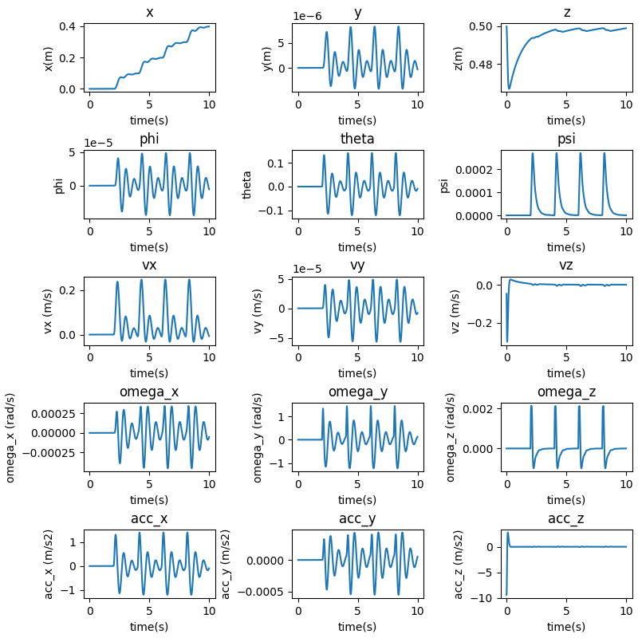
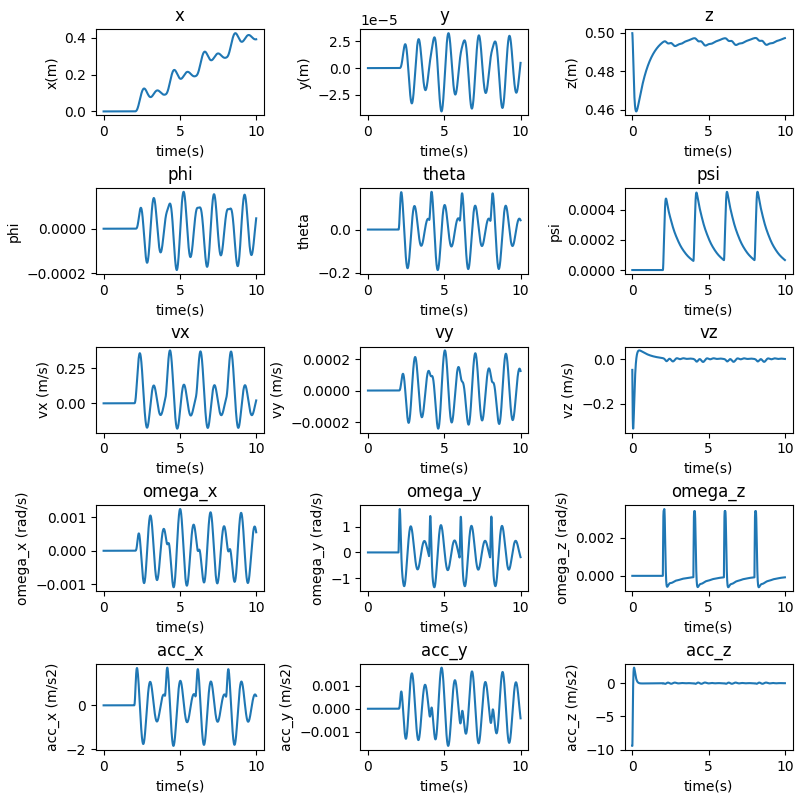

### Question 2


```
Gains: 
kXatt = [Kp_phi, Kp_theta, Kp_psi]
kXpos = [Kp_x, Kp_y, Kp_z]
"kpatt": [  190,    190,    70],
"kdatt": [    30,    30,    18],
"kppos": [    20,    20,    18],
"kdpos": [    8,    8,    9],
```
The actual poses of the drone are as follows:


<p style="page-break-after: always;">&nbsp;</p>


The error plots for the requested scenario are as follows:


- We can see that the drone converges to each waypoint sufficiently before the next waypoint is fed into the system. The new waypoints are fed into the system at $t = 2s, 4s, 6s, 8s$. 

- The system oscillates about the given waypoints since we are using a PD controller and damping is not sufficient to completely remove all oscillations (underdamped system).

<p style="page-break-after: always;">&nbsp;</p>


Ensuring that the performance is physically plausible using the thrust to weight plot for this scenario:
 


We can see that the performance is well within physical limits.

<p style="page-break-after: always;">&nbsp;</p>

The trajectory in 3D can be seen like this:


Disclaimer: I have changed the initial state of the drone such that it starts at hover. Previously the drone was given the starting location of z = 0 which causes a sudden jerk in the desired trajectory which I have removed. 

<p style="page-break-after: always;">&nbsp;</p>

#### Variational study on PD Controller gains

##### Modifying Kd_positions (Outer Loop)
Here the Kd of the outer loop has been increased.

```
Gains: 
kXatt = [Kp_phi, Kp_theta, Kp_psi]
kXpos = [Kp_x, Kp_y, Kp_z]
params['kpatt'] = [190, 190, 70]
params['kdatt'] = [30, 30, 18]
params['kppos'] = [20, 20, 10]
params['kdpos'] = [12, 12, 12]
```

The actual poses of the drone are as follows:



The error plots for the requested scenario are as follows:


- We can see that the overshoot has been significantly reduced and the drone reaches the desired x-location slowly.

- We can also notice that the convergence time for z coordinate is slightly worse as the damping has been increased.

<p style="page-break-after: always;">&nbsp;</p>


Ensuring that the performance is physically plausible using the thrust to weight plot for this scenario:
 


We can see that the performance is well within physical limits.

<p style="page-break-after: always;">&nbsp;</p>


##### Modifying Kp_positions (Outer Loop)

Here, the Kp of the outer loop has been increased.

```
Gains: 
kXatt = [Kp_phi, Kp_theta, Kp_psi]
kXpos = [Kp_x, Kp_y, Kp_z]
params['kpatt'] = [190, 190, 20]
params['kdatt'] = [30, 30, 18]
params['kppos'] = [25, 25, 10]
params['kdpos'] = [8, 8, 9]
```
The actual poses of the drone are as follows:


The error plots for the requested scenario are as follows:


- We can see that the overshoot has been increased and the drone reaches the desired x-location much quicker than previously. This is because the proportional gain has been increased. This behaviour is as expected. 

Ensuring that the performance is physically plausible using the thrust to weight plot for this scenario:
 


We can see that the performance is well within physical limits.


<p style="page-break-after: always;">&nbsp;</p>


##### Modifying Kp_attitude (Inner Loop)

Here the Kp of the attitude controller has been increased

```
Gains: 
kXatt = [Kp_phi, Kp_theta, Kp_psi]
kXpos = [Kp_x, Kp_y, Kp_z]
params['kpatt'] = [220, 220, 20]
params['kdatt'] = [30, 30, 18]
params['kppos'] = [25, 25, 10]
params['kdpos'] = [8, 8, 9]
        
```
The actual poses of the drone are as follows:


The error plots for the requested scenario are as follows:


- We can see that the overshoot in the attitude has been increased significantly, but the system responds faster.

Ensuring that the performance is physically plausible using the thrust to weight plot for this scenario:
 


We can see that the performance is well within physical limits.

<p style="page-break-after: always;">&nbsp;</p>


##### Modifying Kd_attitude (Inner Loop)

Here the Kd of the attitude controller has been increased

```
Gains: 
kXatt = [Kp_phi, Kp_theta, Kp_psi]
kXpos = [Kp_x, Kp_y, Kp_z]
params['kpatt'] = [190, 190, 20]
params['kdatt'] = [35, 35, 20]
params['kppos'] = [25, 25, 10]
params['kdpos'] = [8, 8, 9]
        
```
The actual poses of the drone are as follows:


The error plots for the requested scenario are as follows:


- We can see that the overshoot in the attitude has been decreased, and the drone is smoother in its response.

Ensuring that the performance is physically plausible using the thrust to weight plot for this scenario:
 


We can see that the performance is well within physical limits.
