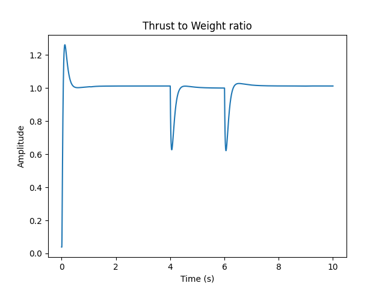
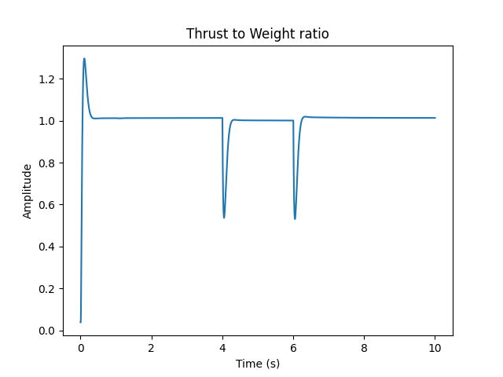
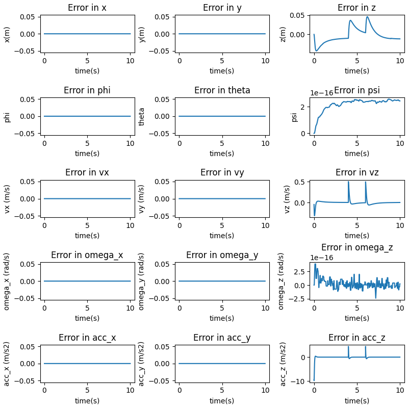

## Air Mobility Project
### Praveen Venkatesh (pvenkat2)


### Question 2

```
Gains: 
KXatt = [Kp_phi, Kp_theta, Kp_psi]
KXpos = [Kp_x, Kp_y, Kp_z]
"kpatt": [  190,    190,    70],
"kdatt": [    30,    30,    18],
"kppos": [    20,    20,    18],
"kdpos": [    8,    8,    9],
```

The actual poses of the drone are as follows:


The error plots for the requested scenario are as follows:


- Since the waypoints are provided at extremely small intervals, the drone is able to track a very smooth trajectory

- There is no oscillation in the waypoints due to the smoothness and density of the trajectory that is being provided.

Ensuring that the performance is physically plausible using the thrust to weight plot for this scenario:
 


We can see that the performance is well within physical limits.

The trajectory in 3D can be seen like this:


#### Ablation study 

##### Modifying Kd_positions (Outer Loop)
Here the Kd of the outer loop has been increased.

```
Gains: 
KXatt = [Kp_phi, Kp_theta, Kp_psi]
KXpos = [Kp_x, Kp_y, Kp_z]
params['kpatt'] = [190, 190, 20]
params['kdatt'] = [30, 30, 18]
params['kppos'] = [20, 20, 10]
params['kdpos'] = [13, 13, 19]
```
The error plots for the requested scenario are as follows:


- We can see that the overshoot has been significantly reduced and the drone reaches the desired x-location slowly.

Ensuring that the performance is physically plausible using the thrust to weight plot for this scenario:
 


We can see that the performance is well within physical limits.

##### Modifying Kp_positions (Outer Loop)

Here, the Kp of the outer loop has been increased.

```
Gains: 
KXatt = [Kp_phi, Kp_theta, Kp_psi]
KXpos = [Kp_x, Kp_y, Kp_z]
params['kpatt'] = [190, 190, 20]
params['kdatt'] = [30, 30, 18]
params['kppos'] = [25, 25, 10]
params['kdpos'] = [8, 8, 9]
```
The error plots for the requested scenario are as follows:


- We can see that the overshoot has been increased and the drone reaches the desired x-location much quicker than previously.

Ensuring that the performance is physically plausible using the thrust to weight plot for this scenario:
 


We can see that the performance is well within physical limits.


##### Modifying Kp_attitude (Inner Loop)

Here the Kp of the attitude controller has been increased

```
Gains: 
KXatt = [Kp_phi, Kp_theta, Kp_psi]
KXpos = [Kp_x, Kp_y, Kp_z]
params['kpatt'] = [220, 220, 20]
params['kdatt'] = [30, 30, 18]
params['kppos'] = [25, 25, 10]
params['kdpos'] = [8, 8, 9]
        
```
The error plots for the requested scenario are as follows:


- We can see that the overshoot in the attitude has been increased significantly, but the system responds faster.

Ensuring that the performance is physically plausible using the thrust to weight plot for this scenario:
 


We can see that the performance is well within physical limits.


##### Modifying Kd_attitude (Inner Loop)

Here the Kd of the attitude controller has been increased

```
Gains: 
KXatt = [Kp_phi, Kp_theta, Kp_psi]
KXpos = [Kp_x, Kp_y, Kp_z]
params['kpatt'] = [190, 190, 20]
params['kdatt'] = [35, 35, 20]
params['kppos'] = [25, 25, 10]
params['kdpos'] = [8, 8, 9]
        
```
The error plots for the requested scenario are as follows:



- We can see that the overshoot in the attitude has been decreased, and the drone is smoother in its response.

Ensuring that the performance is physically plausible using the thrust to weight plot for this scenario:
 


We can see that the performance is well within physical limits.
