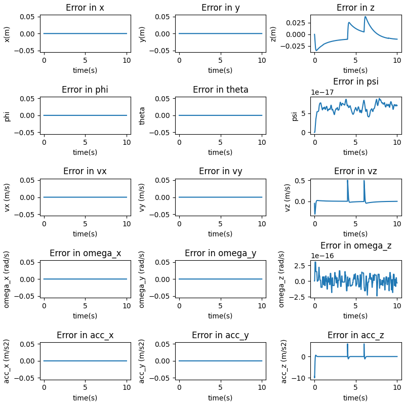
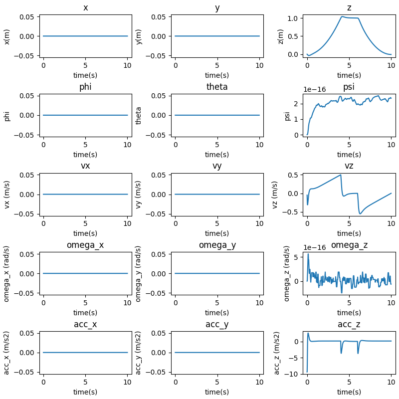

### Question 2

```
Gains: 
KXatt = [Kp_phi, Kp_theta, Kp_psi]
KXpos = [Kp_x, Kp_y, Kp_z]
"kpatt": [  190,    190,    70],
"kdatt": [    30,    30,    18],
"kppos": [    20,    20,    18],
"kdpos": [    8,    8,    9],
```
The actual poses of the drone are as follows:


<p style="page-break-after: always;">&nbsp;</p>

The error plots for the requested scenario are as follows:


- The notion of convergence to a waypoint gets tricky in this scenario as the waypoints are provided in an extremely dense manner. The robot sufficiently converges to the desired trajectory as can be seen in the error plots.
- There is no oscillation between waypoints as the provided trajectory is extremely smooth and dense (timestep level trajectory). This means that there is no room for oscillation except at sudden jumps in the input trajectory.


<p style="page-break-after: always;">&nbsp;</p>


Ensuring that the performance is physically plausible using the thrust to weight plot for this scenario:
 


We can see that the performance is well within physical limits.

<p style="page-break-after: always;">&nbsp;</p>

The trajectory in 3D can be seen like this:


<p style="page-break-after: always;">&nbsp;</p>

#### Ablation study 

##### Modifying Kd_positions (Outer Loop)
Here the Kd of the outer loop has been increased.

```
Gains: 
KXatt = [Kp_phi, Kp_theta, Kp_psi]
KXpos = [Kp_x, Kp_y, Kp_z]
params['kpatt'] = [190, 190, 70]
params['kdatt'] = [30, 30, 18]
params['kppos'] = [20, 20, 10]
params['kdpos'] = [12, 12, 12]
```

The actual poses of the drone are as follows:


The error plots for the requested scenario are as follows:



- We can see that the system reaches the steady state value in a much more delayed fashion - it takes a lot more time for the drone to converge to the desired height. This can more readily be seen in the error plots. 

<p style="page-break-after: always;">&nbsp;</p>


Ensuring that the performance is physically plausible using the thrust to weight plot for this scenario:
 


We can see that the performance is well within physical limits.

<p style="page-break-after: always;">&nbsp;</p>


##### Modifying Kp_positions (Outer Loop)

Here, the Kp of the outer loop has been increased.

```
Gains: 
KXatt = [Kp_phi, Kp_theta, Kp_psi]
KXpos = [Kp_x, Kp_y, Kp_z]
params['kpatt'] = [190, 190, 20]
params['kdatt'] = [30, 30, 18]
params['kppos'] = [25, 25, 10]
params['kdpos'] = [8, 8, 9]
```
The actual poses of the drone are as follows:


The error plots for the requested scenario are as follows:


- We can see that the overshoot has been increased and the drone reaches the desired x-location much quicker than previously.

Ensuring that the performance is physically plausible using the thrust to weight plot for this scenario:
 


We can see that the performance is well within physical limits.


<p style="page-break-after: always;">&nbsp;</p>
