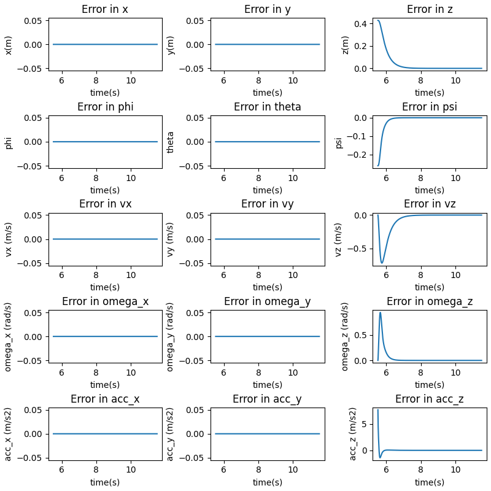

### Question 5
```
Gains: 
KXatt = [Kp_phi, Kp_theta, Kp_psi]
KXpos = [Kp_x, Kp_y, Kp_z]
"kpatt": [  190,    190,    70],
"kdatt": [    30,    30,    18],
"kppos": [    20,    20,    18],
"kdpos": [    8,    8,    9],
```
The actual poses of the drone are as follows:


<p style="page-break-after: always;">&nbsp;</p>

The error plots for the requested scenario are as follows:


The rise and settling times are shown:


```
-------System Statistics--------
[Z] Settling time =  0.9999999999999787
[Z] Rise time =  0.9099999999999806
[Z] Steady State values =  0.10000003323214719
[Vz] Settling time =  0.8949999999999809
[Vz] Rise time =  0.794999999999983
[Vz] Steady State values =  0.10000003323214719
[psi] Settling time =  0.0
[psi] Rise time =  0.0
[psi] Steady State values =  4.002280801119769e-15
```
- From the plots it is evident that all the overshoots are 0% as the system is overdamped.
The code automatically saves these values to the output folder.

Note: Since the starting and ending velocities of the drone is set as the same value of 0, the notions of settling and rise time do not have much meaning. Here, the start duration is computed from the peak value of the velocity as it is a measure of the performance of the drone.

<p style="page-break-after: always;">&nbsp;</p>


Ensuring that the performance is physically plausible using the thrust to weight plot for this scenario:
 


We can see that the performance is well within physical limits.

<p style="page-break-after: always;">&nbsp;</p>

The trajectory in 3D can be seen like this:


<p style="page-break-after: always;">&nbsp;</p>

#### Including Variation in yaw.

The actual poses of the drone are as follows:


<p style="page-break-after: always;">&nbsp;</p>

The error plots for the requested scenario are as follows:



The rise and settling times are shown:


```
-------System Statistics--------
[Z] Settling time =  1.0099999999999785
[Z] Rise time =  0.9099999999999806
[Z] Steady State values =  0.1000000342445711
[Vz] Settling time =  0.889999999999981
[Vz] Rise time =  0.794999999999983
[Vz] Steady State values =  0.1000000342445711
[psi] Settling time =  0.5099999999999891
[psi] Rise time =  0.42499999999999094
[psi] Steady State values =  14.999999999999153
```
- From the plots it is evident that all the overshoots are 0% as the system is overdamped.

- When including yaw, the settling time increases by an extremely small margin (this can be attributed to numerical precision). This does make sense since the drone is simply altering the moments in the z direction which does not affect the upward thrust. This makes the two motions independent meaning that the settling and rise times will be the same.


#### Modifying Gains

```
Gains: 
KXatt = [Kp_phi, Kp_theta, Kp_psi]
KXpos = [Kp_x, Kp_y, Kp_z]
params['kpatt'] = [190, 190, 20]
params['kdatt'] = [30, 30, 18]
params['kppos'] = [20, 20, 10]
params['kdpos'] = [8, 8, 19]
```

The actual poses of the drone are as follows:


The error plots for the requested scenario are as follows:


<p style="page-break-after: always;">&nbsp;</p>

The rise and settling times are shown:


```
-------System Statistics--------
[Z] Settling time =  4.495000000000703
[Z] Rise time =  4.300000000000672
[Z] Steady State values =  0.11766625984130827
[Vz] Settling time =  3.4900000000005456
[Vz] Rise time =  3.430000000000536
[Vz] Steady State values =  0.11766625984130827
[psi] Settling time =  1.990000000000311
[psi] Rise time =  1.8500000000002892
[psi] Steady State values =  14.987203888210878
```
- From the plots it is evident that all the overshoots are 0% as the system is overdamped.

- With the new set of gains, we note that the settling time and rise time has increased drastically for yaw, the z-position and the velocity in the z-direction. This is to be expected as :
    - The Kp for yaw has been reduced significantly causing the drone to respond slower in yaw.
    - The Kp_z has also been decreased significantly causing the drone to respond slowly in velocity and position in the z-direction.

Ensuring that the performance is physically plausible using the thrust to weight plot for this scenario:
 


We can see that the performance is well within physical limits.

<p style="page-break-after: always;">&nbsp;</p>

