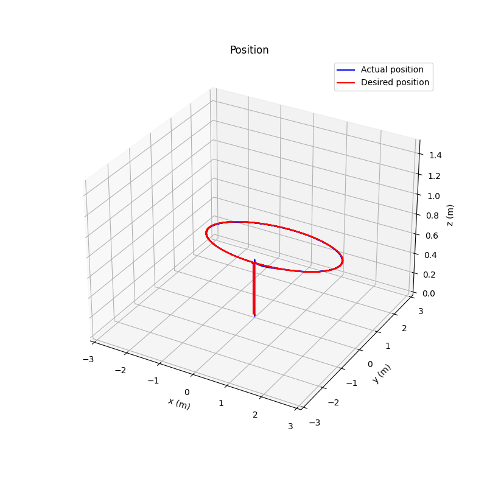
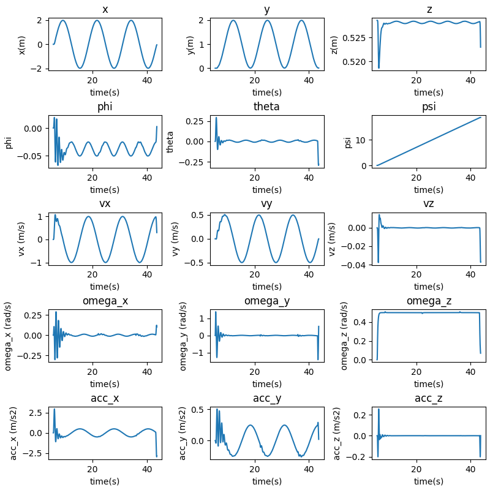
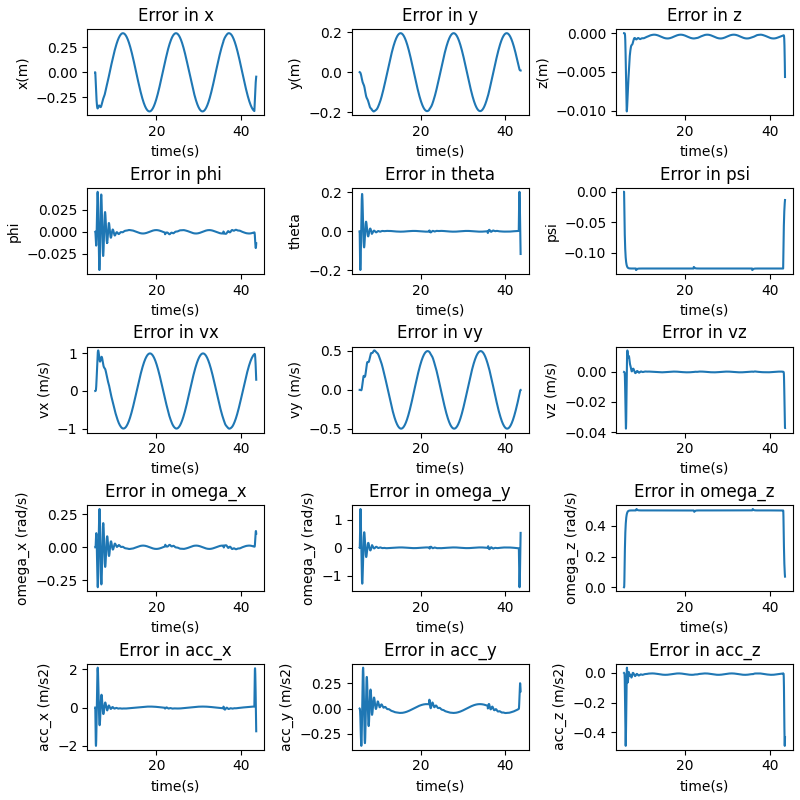

### Question 9

As seen in the above graph, the drone is able to track the trajectory appropriately.

The states are plotted here:

The error response is plotted here:

Here, we can see that the performance becomes slightly worse with higher errors in all plots. Although the tracking is still completely successful with the heading changing with time such that the drone always points at the center of the ellipse.

